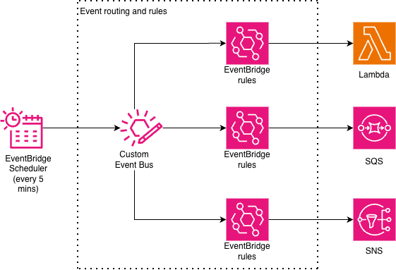

# EventBridge fan-out pattern in Terraform

This Terraform pattern demonstrates schedule fan-out using Amazon EventBridge Scheduler. A single schedule puts an event onto a custom EventBridge Event Bus, which routes it to three downstream targets simultaneously which includes an AWS Lambda function for processing, an Amazon SNS topic for notifications, and an Amazon SQS queue for archival. Each target is matched by its own EventBridge Rule on the bus, so new targets can be added without modifying the schedule itself. Every target is fully decoupled and if one fails, the others are unaffected.

Learn more about this pattern at Serverless Land Patterns: https://serverlessland.com/patterns/eventbridge-fanout-pattern

Important: this application uses various AWS services and there are costs associated with these services after the Free Tier usage - please see the [AWS Pricing page](https://aws.amazon.com/pricing/) for details. You are responsible for any AWS costs incurred. No warranty is implied in this example.

## Requirements

* [Create an AWS account](https://portal.aws.amazon.com/gp/aws/developer/registration/index.html) if you do not already have one and log in. The IAM user that you use must have sufficient permissions to make necessary AWS service calls and manage AWS resources.
* [AWS CLI](https://docs.aws.amazon.com/cli/latest/userguide/install-cliv2.html) installed and configured
* [Git Installed](https://git-scm.com/book/en/v2/Getting-Started-Installing-Git)
* [Terraform](https://learn.hashicorp.cxom/tutorials/terraform/install-cli?in=terraform/aws-get-started) installed

## Deployment Instructions

1. Create a new directory, navigate to that directory in a terminal and clone the GitHub repository:
    ``` 
    git clone https://github.com/aws-samples/serverless-patterns
    ```
1. Change directory to the pattern directory:
    ```
    cd eventbridge-fanout-pattern
    ```
1. From the command line, initialize terraform to downloads and installs the providers defined in the configuration:
    ```
    terraform init
    ```
1. From the command line, apply the configuration in the main.tf file:
    ```
    terraform apply -auto-approve
    ```
1. During the prompts:
    #var.aws_region
    - Enter a value: {enter the region for deployment}

    #var.prefix
    - Enter a value: {enter any prefix to associate with resources}

1. Note the outputs from the Terraform deployment process. These contain the resource names and/or ARNs which are used for testing.

## How it works



Amazon EventBridge Scheduler runs a single schedule on a five minute rate and targets a custom EventBridge Event Bus which is the core of the fan-out pattern. Because Scheduler only supports one target per schedule, the bus acts as a routing hub. Three EventBridge Rules sit on that bus, each matching the same event pattern and forwarding the event simultaneously to three independent targets namely an AWS Lambda function that processes the payload, an Amazon SNS topic that delivers notifications to subscribers, and an Amazon SQS queue that stores the event for archival or downstream consumption. If one target fails or is removed, the others continue to work without interruption.

## Testing

The scheduler fires once every five minutes and puts an event onto a custom EventBridge Event Bus. Three rules on that bus match the event and fan it out simultaneously to a Lambda function, an SNS topic, and an SQS queue. 

To test the full flow without waiting for the next five-minute trigger, you can publish the same event to the bus manually using the AWS CLI put-events command and verify within seconds that Lambda logs the event, a message appears in the SQS queue, and SNS delivers to any confirmed subscribers.

1. After deploying the stack, create a Subscriber for your Amazon SNS topic (For ex, your email) and confirm the subscription.
    https://docs.aws.amazon.com/sns/latest/dg/sns-create-subscribe-endpoint-to-topic.html

1. Publish the event in the custom bus using the following CLI command:
    ```
    PREFIX=$(terraform output -raw prefix)
    ```
    
    ```
    aws events put-events --entries '[
        {
            "Source": "'$PREFIX'.scheduler.fan-out",
            "DetailType": "ScheduledTask",
            "EventBusName": "'$PREFIX'-scheduled-bus",
            "Detail": "{\"taskId\":\"manual-testing\",\"message\":\"manual-test-message-1\"}"
        }
    ]'
    ```

1. Now check the CloudWatch logs for the Lambda function to see if the message has been processed
    ```
    aws logs tail /aws/lambda/$PREFIX-scheduled-processor --since 2m --format short
    ```
    You should see an output like this:
    ```
    {
        "statusCode": 200,
        "taskId": "manual-test",
        "result": {
            "echo": {
                "taskId": "manual-testing",
                "message": "manual-test-message-1"
            }
        },
        "processedAt": "2026-03-09TXXXXX",
        "requestId": "a730a9b9-fbXXXXXX"
    }
    ```
    This means that the message has been processed by the Lambda function

1. Check the SQS queue to see if the message has been received
    ```
    aws sqs receive-message --queue-url $(terraform output -raw sqs_queue_url) --wait-time-seconds 5
    ```
    You should see an output in this format:
    ```
    {
    "Messages": [
        {
            "MessageId": "e6be124b-XXXX",
            "ReceiptHandle": "AQEBXXXX",
            "MD5OfBody": "dff96eXXXXX",
            "Body": {
                "version": "0",
                "id": "417a39aXXXXX",
                "detail-type": "ScheduledTask",
                "source": "<prefix>.scheduler.fan-out",
                "account": "123456789012",
                "time": "2025-01-15TXXXX",
                "region": "<region>",
                "resources": [],
                "detail": {
                    "taskId": "manual-testing",
                    "message": "manual-test-message-1"
                }
            }
        }
    ]}
    ```

1. The SNS topic will send the message to the confirmed subscriber so check the subscriber (for ex, email) to see the message.
    ```
    {
        "version": "0",
        "id": "df58af75-xxxx-xxxx-xxxx-xxxxxxxxxxxx",
        "detail-type": "ScheduledTask",
        "source": "<prefix>.scheduler.fan-out",
        "account": "123456789012",
        "time": "2025-01-15T10:30:00Z",
        "region": "<region>",
        "resources": [],
        "detail": {
            "taskId": "manual-testing",
            "message": "manual-test-message-1"
        }     
    }
    ```

## Cleanup

1. Change directory to the pattern directory:
    ```
    cd serverless-patterns/eventbridge-fanout-pattern
    ```

1. Delete all created resources
    ```
    terraform destroy -auto-approve
    ```
    
1. During the prompts:
    ```
    Enter all details as entered during creation.
    ```

1. Confirm all created resources has been deleted
    ```
    terraform show
    ```
----
Copyright 2026 Amazon.com, Inc. or its affiliates. All Rights Reserved.

SPDX-License-Identifier: MIT-0