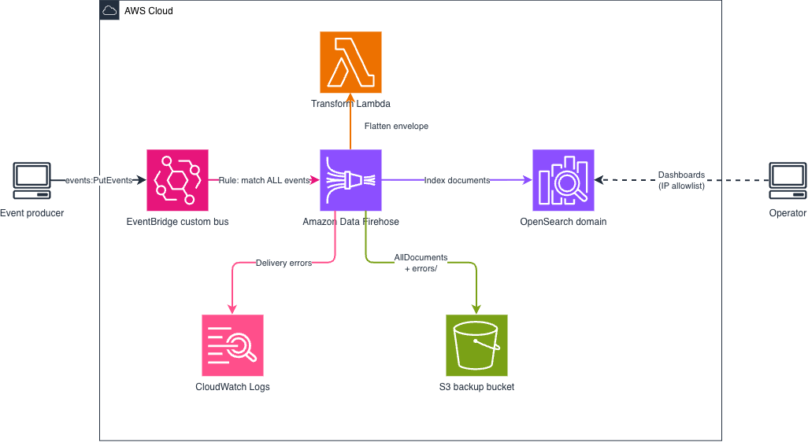

# Amazon EventBridge to Amazon OpenSearch via Amazon Data Firehose

This pattern gives you **full-text search over every event on an EventBridge bus**, usually within about 60 seconds of emission. A catch-all rule captures all events on a custom bus and streams them to an OpenSearch domain through Amazon Data Firehose, where OpenSearch Dashboards makes them searchable, filterable, and chartable.

CloudWatch metrics tell you *how many* events flowed. This tells you *what was in them*.



```
Any event producer
    │
    ▼
EventBridge custom bus
    │  Rule: matches ALL events
    ▼
Amazon Data Firehose  ──────► Transform Lambda (flattens the envelope)
    │                            60s / 1MB buffer
    ├──────► OpenSearch domain      index: events-YYYY-MM-DD
    └──────► S3 bucket              all documents + delivery failures
```

Learn more about this pattern at Serverless Land Patterns: https://serverlessland.com/patterns/

Important: this application uses various AWS services and there are costs associated with these services after the Free Tier usage - please see the [AWS Pricing page](https://aws.amazon.com/pricing/) for details. You are responsible for any AWS costs incurred. No warranty is implied in this example.

## Why this pattern

In an event-driven architecture you eventually need answers to questions metrics cannot give you:

- What events flowed through the bus in the last five minutes?
- Which producer emitted the most events today?
- Show me every event related to claim `CLM-12345`.
- Is event volume anomalous compared to yesterday?

Because the rule is a catch-all, you get this for every event on the bus without touching any producer.

## How it works

1. A producer calls `PutEvents` on the `event-monitor-bus` custom bus.
2. A catch-all rule matches the event. The pattern is `{"source": [{"prefix": ""}]}` — every EventBridge event carries a `source`, so an empty prefix matches all of them. An entirely empty pattern is rejected by EventBridge.
3. The rule's IAM role calls `firehose:PutRecord` on the delivery stream.
4. Firehose buffers for **60 seconds or 1 MB**, whichever comes first. This is the minimum Firehose allows and it defines the latency of the pattern.
5. A Lambda transform flattens each EventBridge envelope (see below).
6. Firehose signs its request with SigV4 using its delivery role and indexes each document into `events-YYYY-MM-DD`.
7. Every document is also written to the S3 bucket under `events/`. Records that fail to transform or deliver land under `errors/`.

### What the transform does

EventBridge delivers a nested envelope. Two things make that awkward to query:

- `detail-type` contains a hyphen, so it needs escaping in DQL and Lucene queries.
- Business fields sit one level down under `detail`, so every filter reads `detail.claimId`.

[`src/transform/handler.py`](src/transform/handler.py) renames `detail-type` to `detail_type` and promotes the `detail` keys to the top level:

```jsonc
// in
{ "source": "agent.claims", "detail-type": "ClaimApproved", "time": "2026-08-17T10:00:00Z",
  "detail": { "claimId": "CLM-001", "decision": "approved" } }

// out
{ "source": "agent.claims", "detail_type": "ClaimApproved", "time": "2026-08-17T10:00:00Z",
  "claimId": "CLM-001", "decision": "approved" }
```

Envelope fields win on collision: a payload carrying its own `source` key is indexed as `detail_source` rather than masking the real event source. Records that cannot be parsed are returned as `ProcessingFailed`, which routes that one record to the S3 error prefix and lets the rest of the batch through.

Disable the transform with `-c enableTransform=false` to index the raw envelope instead.

### Authentication between components

| Hop | Mechanism |
|---|---|
| Rule → Firehose | Rule target IAM role with `firehose:PutRecord`, `firehose:PutRecordBatch`, scoped to the stream |
| Firehose → OpenSearch | SigV4 with the delivery role, granted on **both** sides: an identity policy on the role and a domain access policy naming it as principal |
| Firehose → Lambda / S3 / Logs | Same delivery role |
| Operator → Dashboards | Anonymous, restricted to the CIDR passed as `dashboardAccessIp` |

Two details are easy to get wrong here. A managed domain authorizes every request against its own access policy, so an identity policy alone is not enough. And Firehose needs `es:DescribeDomain`, `es:DescribeDomainConfig`, and `es:DescribeDomains` to resolve the domain endpoint before it can deliver anything — `grantIndexWrite()` does not include those.

## Prerequisites

- [AWS account](https://portal.aws.amazon.com/gp/aws/developer/registration/index.html) with sufficient permissions
- [AWS CLI](https://docs.aws.amazon.com/cli/latest/userguide/install-cli.html) installed and configured
- [Node.js 20+](https://nodejs.org/en/download/) and npm
- [AWS CDK CLI](https://docs.aws.amazon.com/cdk/v2/guide/getting_started.html) (`npm i -g aws-cdk`), bootstrapped in the target account and Region
- Your public IP, to reach OpenSearch Dashboards: `curl -s https://checkip.amazonaws.com`

## Deployment

```bash
git clone https://github.com/aws-samples/serverless-patterns
cd serverless-patterns/eventbridge-firehose-opensearch-cdk/cdk
npm install
cdk deploy -c dashboardAccessIp=$(curl -s https://checkip.amazonaws.com)/32
```

Creating the OpenSearch domain takes 10 to 20 minutes; the rest of the stack is quick.

Omit `dashboardAccessIp` and the domain stays closed to everything except Firehose. Delivery still works, but you will not be able to open Dashboards.

Context values:

| Value | Default | Effect |
|---|---|---|
| `dashboardAccessIp` | none | CIDR(s) granted Dashboards access, e.g. `1.2.3.4/32`. Comma-separate for several: `1.2.3.4/32,5.6.7.8/32` |
| `enableTransform` | `true` | Set `false` to index the raw EventBridge envelope |

Changing the allowed CIDRs later is cheap. It updates only the domain access policy, so the redeploy takes seconds rather than rebuilding the domain.

## Testing

Emit a test event onto the bus:

```bash
aws events put-events --entries '[{
  "Source": "demo.test",
  "DetailType": "TestEvent",
  "Detail": "{\"message\": \"Hello OpenSearch\", \"claimId\": \"CLM-001\"}",
  "EventBusName": "event-monitor-bus"
}]'
```

A successful call returns `"FailedEntryCount": 0`. Wait 60 to 90 seconds for the Firehose buffer to flush.

Then query the domain directly from the allowlisted IP, using `DomainEndpoint` from the stack outputs:

```bash
ENDPOINT="<DomainEndpoint from stack outputs>"
curl -s "https://$ENDPOINT/events-*/_search?pretty" -H 'Content-Type: application/json' \
  -d '{"query": {"match": {"claimId": "CLM-001"}}}'
```

You should see the flattened document, with `detail_type` set to `TestEvent` and `claimId` at the top level.

Confirm the backup copy reached S3:

```bash
aws s3 ls "s3://<BackupBucketName from stack outputs>/events/" --recursive
```

### If nothing arrives

Delivery failures are invisible unless you look for them, which is why the stack creates a log group for them. Check `FirehoseLogGroup` from the stack outputs:

```bash
aws logs tail "<FirehoseLogGroup>" --since 15m
```

| Symptom | Likely cause |
|---|---|
| `403` `User: anonymous is not authorized` on your own queries | The address you are calling from is not covered by `dashboardAccessIp` |
| `AccessDeniedException` on the domain | Domain access policy missing the Firehose role, or the role lacks the `es:Describe*` actions |
| Records in S3 under `errors/` but nothing in OpenSearch | Mapping conflict, usually a field indexed as two different types across events |
| Nothing anywhere, `FailedEntryCount: 0` on `put-events` | Rule not matching, or the rule's target role lacks `firehose:PutRecord` |
| Transform errors | Check the `event-monitor-transform` Lambda log group |

## Setting up OpenSearch Dashboards

1. Open `DashboardsUrl` from the stack outputs.
2. **Dashboards Management → Index patterns → Create index pattern**.
3. Index pattern name: `events-*`. Time field: `time`.
4. Go to **Discover** to browse events, or **Visualize** to chart them. Useful starting points: event count by `source` as a pie chart, events over time as a line chart, `detail_type` breakdown as a bar chart.

### Optional: apply an index template

Without a template, OpenSearch infers mappings dynamically. That works, with two rough edges: string fields become `text` with a `.keyword` subfield, so aggregations need `source.keyword` rather than `source`; and new indices default to one replica, which leaves a single-node cluster permanently yellow because the replica shard can never be assigned.

Applying a template fixes both. Paste this into **Dev Tools** in Dashboards before sending events:

```json
PUT _index_template/events
{
  "index_patterns": ["events-*"],
  "template": {
    "settings": {
      "number_of_shards": 1,
      "number_of_replicas": 0
    },
    "mappings": {
      "properties": {
        "id":          { "type": "keyword" },
        "source":      { "type": "keyword" },
        "detail_type": { "type": "keyword" },
        "time":        { "type": "date"    },
        "account":     { "type": "keyword" },
        "region":      { "type": "keyword" },
        "claimId":     { "type": "keyword" },
        "status":      { "type": "keyword" },
        "agentId":     { "type": "keyword" }
      }
    }
  }
}
```

The field names here match the flattened output of the transform. If you deploy with `-c enableTransform=false`, map `detail-type` and `detail.*` instead.

## Cleanup

```bash
cd cdk
cdk destroy
```

The domain, the S3 bucket and its contents, and all log groups are removed. Deleting the domain takes several minutes.

## Cost considerations

For a low-volume demo the domain dominates the bill:

- OpenSearch `t3.small.search`, 1 node: ~$26/month, plus ~$1.60/month for 20 GB gp3
- Data Firehose: $0.029 per GB ingested
- Lambda transform, EventBridge, and S3: negligible at demo volume

Destroy the stack when you are done. For production, size the domain to your retention and query load, move to Multi-AZ with a dedicated master, and consider UltraWarm for older indices.

---

Copyright 2026 Amazon.com, Inc. or its affiliates. All Rights Reserved.

SPDX-License-Identifier: MIT-0
