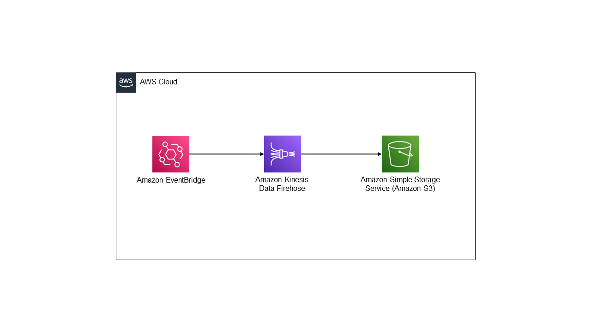

# Amazon EventBridge to Amazon Firehose Delivery Stream to Amazon S3 using Java CDK

This pattern creates an event-driven data pipeline using AWS services such as Amazon EventBridge, Amazon Kinesis Data Firehose, and Amazon S3. It is implemented using the AWS Cloud Development Kit (CDK) V2 in Java.



Learn more about this pattern at Serverless Land Patterns: https://serverlessland.com/patterns.

Important: this application uses various AWS services and there are costs associated with these services after the Free Tier usage - please see the [AWS Pricing page](https://aws.amazon.com/pricing/) for details. You are responsible for any AWS costs incurred. No warranty is implied in this example.

## Requirements

- [Create an AWS account](https://portal.aws.amazon.com/gp/aws/developer/registration/index.html) if you do not already have one and log in. The IAM user that you use must have sufficient permissions to make necessary AWS service calls and manage AWS resources.
- [AWS CLI](https://docs.aws.amazon.com/cli/latest/userguide/install-cliv2.html) installed and configured
- [AWS CDK](https://docs.aws.amazon.com/cdk/v2/guide/cli.html) installed and configured
- [Git Installed](https://git-scm.com/book/en/v2/Getting-Started-Installing-Git)

## Deployment Instructions

1. Create a new directory, navigate to that directory in a terminal and clone the GitHub repository:
   ```
   git clone https://github.com/aws-samples/serverless-patterns
   ```
1. Change directory to the pattern directory:
   ```
   cd eventbridge-firehose-s3-cdk-java
   ```
1. From the command line, use AWS CDK to deploy the AWS resources for the pattern as specified in CdkStack.cs file:
   ```
   cdk deploy
   ```
1. Note the S3BucketName in the deployment output. Use this S3 bucket for the testing

## How it works

When a user sends a message to the EventBridge bus, the message gets routed to the EventBridge rule based on the "DetailType". Then, the EventBridge rule sends the "Detail" field value from the message to the rule target Firehose delivery stream. Once the message reaches the Firehose delivery stream, the JsonParsingEngine processes the message to read the "Department" field value, which is used for the S3 prefix. After message processing, the message gets delivered to the targeted S3 bucket by following the calculated S3 prefix based on the "Department" field value.
## Testing

1. Send message to EventBridge by using command at project root level - 
   ```
   aws events put-events --entries file://SampleEvent.json
   ```
2. Navigate to S3 bucket created by CDK and confirm message has saved at path {department}/{event message file}
3. Please note: Firehose delivery stream buffer is configured for 60secs (default time), so please wait for 1-2 mins after event send command to get the message in S3 bucket

## Cleanup

Run the following commands at eventbridge-firehose-s3-cdk folder level

1. Delete the stack
   ```bash
   cdk destroy
   ```

---

Copyright 2021 Amazon.com, Inc. or its affiliates. All Rights Reserved.

SPDX-License-Identifier: MIT-0
