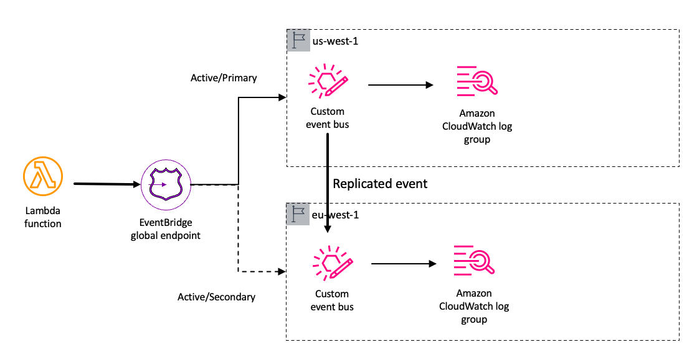

# Amazon EventBridge Global Endpoints Pattern

This pattern showscase the usage of EventBridge Global Endpoints. It will create 2 event buses in two regions (a main region and secondary region) and the buses each bus is connected to a CloudWatch Log. The client that is a Lambda function will put messages to the Global Endpoint and depending on the health of the main region bus it will shift the traffic to the correct region. This pattern also creates an alarm and health check to validate the health of the main region event bus.

Learn more about this pattern at Serverless Land Patterns: https://serverlessland.com/patterns/eventbridge-global-endpoints-cdk

Important: this application uses various AWS services and there are costs associated with these services after the Free Tier usage - please see the [AWS Pricing page](https://aws.amazon.com/pricing/) for details. You are responsible for any AWS costs incurred. No warranty is implied in this example.

## Requirements

- [Create an AWS account](https://portal.aws.amazon.com/gp/aws/developer/registration/index.html) if you do not already have one and log in. The IAM user that you use must have sufficient permissions to make necessary AWS service calls and manage AWS resources.
- [AWS CLI](https://docs.aws.amazon.com/cli/latest/userguide/install-cliv2.html) installed and configured
- [Git Installed](https://git-scm.com/book/en/v2/Getting-Started-Installing-Git)
- [AWS Cloud Development Kit (AWS CDK) installed](https://docs.aws.amazon.com/cdk/v2/guide/cli.html)

## Deployment Instructions

1. Create a new directory, navigate to that directory in a terminal and clone the GitHub repository:
   ```
   git clone https://github.com/aws-samples/serverless-patterns
   ```
1. Change directory to the pattern directory:
   ```
   cd eventbridge-global-endpoints-cdk/cdk
   ```
1. Install the project dependencies
   ```
   npm i
   ```
1. From the command line, use AWS CDK to deploy the AWS resources for the pattern:
   ```
   cdk deploy -all
   ```

## How it works

This pattern deploys many stacks to achieve this architecture.

- There is a testing stack that deploys a Lambda function that puts an event to the EventBridge Global Endpoint
- There are 2 identical stacks deployed in different regions that have a EventBridge custom bus and a Amazon CloudWatch Log group that recieves the event sent by the Lambda function.
- There is a boiler plate stack that deploys all the necesary infrastructure to set up the Global Endpoint.
- And finally there is Global Endpoint stack that creates the global endpoint given all the information before.



## Testing

To test this demo you need to open in 2 different browsers tabs CloudWatch Logs Insights.

In each of the regions you need to select the right log group. You can get the name from the CloudFormation output after deploying each of the testing stacks.

Eg: EventBusStackMainRegion-cloudwatchlogXXXX and EventBusStackSecondaryRegion-cloudwatchlogXXXXX

Type the following query in each of the browsers:

```
fields region, detail.eventId, time
| sort detail.eventId desc
```

Now you can invoke the Lambda function. This function will send many messages during 15 minutes, it will send messages to the Global Endpoint.

```
aws lambda invoke --function-name NAME response.json
```

First, the Global Endpoint will use the the secondary region custom bus, as the main region is unhealthy due the lack of data in the metric.

Then it will start using the primary region.

Finally, you can invert the HealthCheck and the events will start appearing from the secondary region again.

You can validate all this checking those log groups from the Log Insights dashboards.

## Learn more about this pattern and about multi-region serverless applications

In [this blog post](https://blog.marcia.dev/global-event-driven-applications) you will find many resources to help you out in setting up a multi-region serverless application. You will also find more information about EventBridge Global Endpoints.

## Cleanup

1. Delete the stack
   ```bash
   cdk destroy -all
   ```

---

Copyright 2023 Amazon.com, Inc. or its affiliates. All Rights Reserved.

SPDX-License-Identifier: MIT-0
