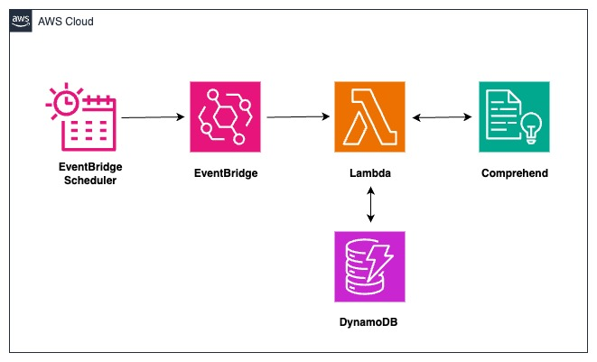
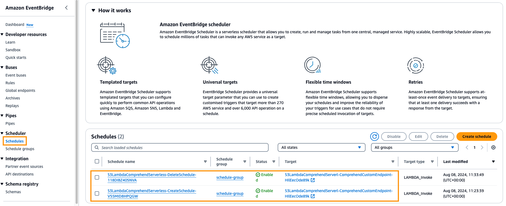
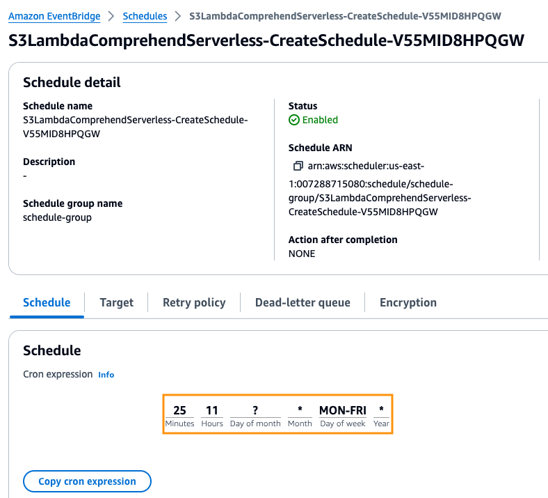
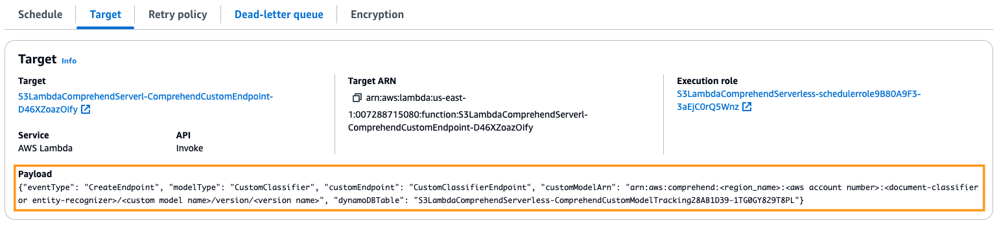
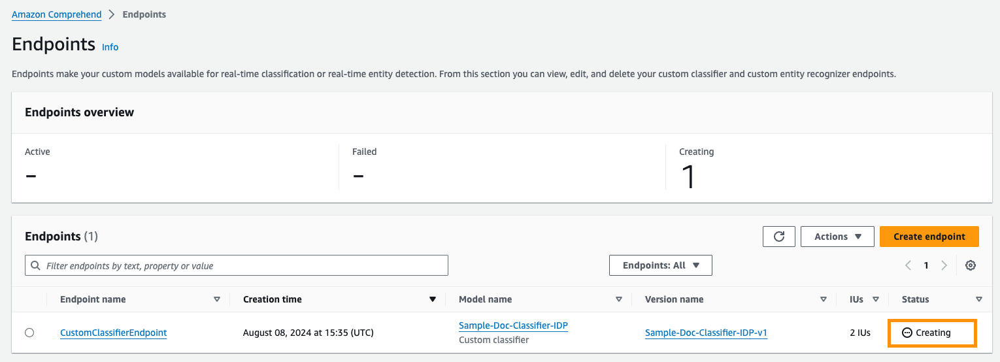
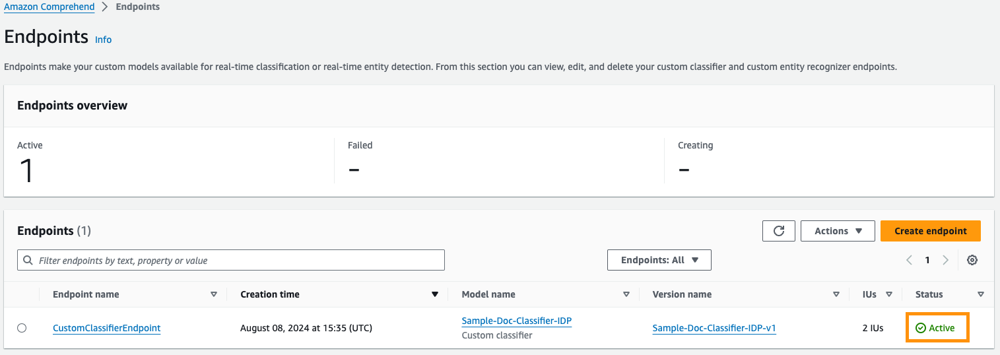
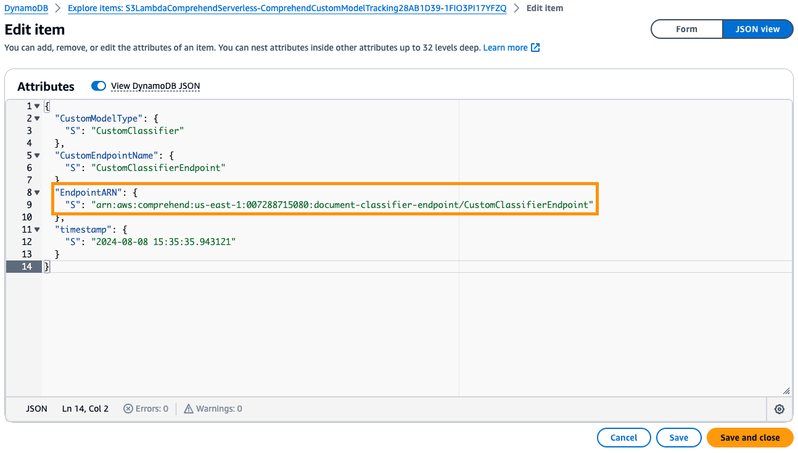
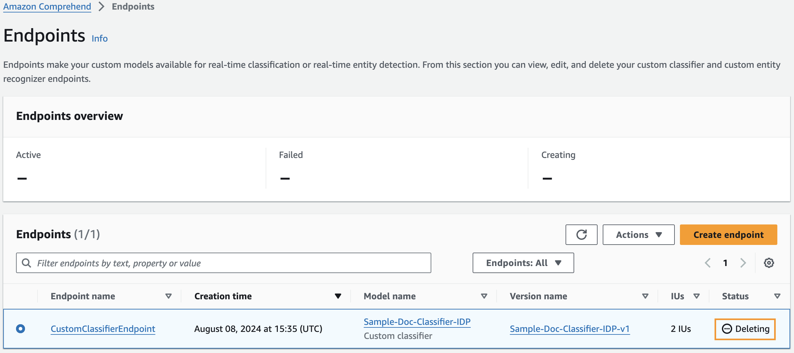

# EventBridge -> Lambda -> Translate
This patterns shows CDK deployment on how to leverage Amazon EventBridge, AWS Lambda, and Amazon Comprehend to automate the creation & deletion of an endpoint in Amazon Comprehend, to host a custom-trained model for document classification or entity recognition. 

## Pre-requisities
The pattern assumes that a custom model has already been created in Amazon Comprehend.
For more details on custom trained models, please refer to the below:
* [Custom classification](https://docs.aws.amazon.com/comprehend/latest/dg/how-document-classification.html)
* [Custom entity recognition](https://docs.aws.amazon.com/comprehend/latest/dg/custom-entity-recognition.html)

Users are recommended to refer to the AWS Workshop to create a custom model for classification or entity recognition. 
* [Custom classification](https://catalog.workshops.aws/intelligent-document-processing/en-US/02-getting-started/module-1-doc-classification)
* [Custom entity recognition](https://catalog.workshops.aws/intelligent-document-processing/en-US/02-getting-started/module-3-doc-enrichment)

For the demonstration of the below pattern, any custom model would be sufficient.

## Architecture


### What resources will be created?
This CDK code will create the following:
   - Two EventBridge Scheduled rule (for creation and deletion of endpoints on a pre-defined schedule)
   - One Schedule group to group the schedules
   - One IAM role (for the Lambda function to invoke Comprehend service) and another IAM role (for the Scheduler to invoke Lambda function)
   - One DynamoDB to track the endpoints
   - One Lambda function to create and delete the endpoint (Comprehend endpoint (to host custom model)

## Requirements

### Development Environment
**Cloud 9**

This demonstration for this pattern is executed in an AWS Cloud9 environment. The EC2 instance used is t2.micro (1 GiB RAM + 1 vCPU). However, users have an option to deploy the application using CDK from local environment as well.

### AWS setup
**Region**

If you have not yet run `aws configure` and set a default region, you must do so, or you can also run `export AWS_DEFAULT_REGION=<your-region>`. The region used in the demonstration is us-east-1. Please make sure the region selected supports Comprehend service.

**Authorization**

You must use a role that has sufficient permissions to create IAM roles, as well as CloudFormation resources

#### Python >=3.9
Make sure you have [python3](https://www.python.org/downloads/) installed at a version >=3.9.x in the CDK environment. The demonstration uses python 3.10.

#### AWS CDK
Make sure you have the [AWS CDK](https://docs.aws.amazon.com/cdk/v2/guide/getting_started.html#getting_started_install) installed in the Cloud9 environment.


## Setup

### Set up environment and gather packages

```
cd eventbridge-lambda-comprehend-custom-cdk-python
```

Install the required dependencies (aws-cdk-lib and constructs) into your Python environment 
```
pip install -r requirements.txt
```

### Gather and deploy resources with the CDK


Then synthesize the CDK environment, which executes the application, defines which resources will be created, and translates this into a CloudFormation template
```
cdk synth
```
All AWS CDK v2 deployments use dedicated AWS resources to hold data during deployment. Therefore, your AWS account and Region must be bootstrapped to create these resources before you can deploy. If you haven't already bootstrapped execute the below command
```
cdk bootstrap
```
and deploy with
```
cdk deploy
```

The deployment will create two EventBridge Schedules, a Schedule group, two IAM roles, a DynamoDB, and a Lambda function (to create/delete the Comprehend endpoint on a pre-defined schedule).

## How it works
The deployment creates two EventBridge scheduled rules and based on the time schedule, the EventBridge Scheduler triggers a Lambda function, which invokes the Comprehend's `CreateEndpoint` API  and expects `Inference Units` (set the default value as 2 in Lambda environment variables) along with `Custom Model` ARN as inputs (retrieved from the EventBridge Schedule payload). The provisioning of the endpoint takes ~10 minutes and once the endpoint is in `Active` state, endpoint can be used to run real-time analysis using the custom mode.

As part of the scheduled rule, the Lambda function also invokes the `DeleteEndpoint` API to delete the endpoint from Comprehend.


## Testing

Upon successful deployment of the stack, go to `EventBridge` and under the `Scheduler` click `Schedules`. You can see two schedules for Create and Delete operations.



Click on record for `CreateSchedule`. Edit the record to modify the cron expression under the `Schedule` section to the current time + 5 minutes in UTC. 


And modify the `payload` in `Target` section to add the ARN of the custom model. The `customModelArn` can be retrieved from `Comprehend` -> `Custom classification` or `Custom entity recognition` -> `Model name` -> relevant `version` -> `ARN`, the `modelType` is to  uniquely identify Custom classification or entity recognition model, `customEndpoint` to uniquely identify the endpoint).


Repeat the activity for `DeleteSchedule` to update the `modelType` and `customEndpoint` values in the Target section along with cron expression in `Schedule` section.

At the scheduled UTC time, the Lambda function is triggered. Go to `Comprehend` console to check the endpoint creation. 


Once the status changes to `Active`, the endpoint can be used to perform analysis.


From the stack output section, retrieve the DynamoDB table name and for the `CustomModelType`, `CustomEndpointName` combination entered in the payload for `CreateSchedule` target section, an entry would be present which shows the ARN of the newly created endpoint.


Based on the time schedule setup for `DeleteSchedule`, the Lambda function is triggered and the `Comprehend` console shows that the endpoint is getting deleted.


## Cleanup
To clean up the resources created as part of this demonstration, run the command `cdk destroy` in the directory `eventbridge-lambda-comprehend-custom-cdk-python`. In addition, users are advised to terminate the DynamoDB table manually, if the `cdk destroy` command has not deleted the DynamoDB table.
