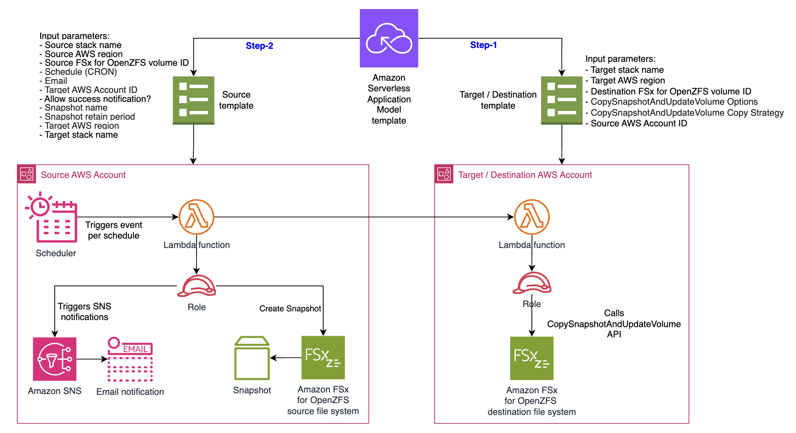

# Cross-account cross-region replication for FSx for OpenZFS volumes with AWS Lambda
Amazon EventBridge triggers an AWS Lambda function to replicate FSx for OpenZFS volumes across file systems located in the same account and region, or across different accounts and regions.



The [AWS Serverless Application Model](https://docs.aws.amazon.com/serverless-application-model/latest/developerguide/serverless-sam-cli-install.html) (AWS SAM) template deploys an Amazon EventBridge Scheduler to trigger an AWS Lambda function based on a user-defined schedule. This function copies the snapshot of a volume and transfers it to the target FSx system, which can be located in the same or a different AWS account and/or region.

For FSx for OpenZFS periodic volume replication in same account and same region, please refer to the Serverless Land Pattern <https://serverlessland.com/patterns/eventbridge-lambda-fsx-openzfs-periodic-replication>

The template contains a sample Lambda function that creates a snapshot of the source FSx Volume ID. Once the snapshot becomes available, it invokes another Lambda function in the destination AWS account and/or region, which initiates the replication by calling the copy_snapshot_and_update_volume API. This solution also notifies users via an Amazon SNS topic of any errors and snapshot creation details.

Important: this application uses various AWS services and there are costs associated with these services after the Free Tier usage - please see the [AWS Pricing page](https://aws.amazon.com/pricing/) for details. You are responsible for any AWS costs incurred. No warranty is implied in this example.

## Requirements

* [Create two AWS accounts for cross account setup](https://portal.aws.amazon.com/gp/aws/developer/registration/index.html) if you do not already have, create them and log in. The IAM user that you use must have sufficient permissions to make necessary AWS service calls and manage AWS resources.

* [AWS CLI](https://docs.aws.amazon.com/cli/latest/userguide/install-cliv2.html) installed and configure two profiles with credentials for the individual accounts as below:

    ```
    [default]
    [crossaccount]
    ```


- [AWS CLI](https://docs.aws.amazon.com/cli/latest/userguide/install-cliv2.html) installed and configured
- [Git Installed](https://git-scm.com/book/en/v2/Getting-Started-Installing-Git)
- [AWS Serverless Application Model](https://docs.aws.amazon.com/serverless-application-model/latest/developerguide/serverless-sam-cli-install.html) (AWS SAM) installed
- Make sure that you have the ID of the source and destination volumes that you would like to initiate the replication between. For more information on these resources, see [Creating FSx for OpenZFS file systems](https://docs.aws.amazon.com/fsx/latest/OpenZFSGuide/creating-file-systems.html), [Creating a volume](https://docs.aws.amazon.com/fsx/latest/OpenZFSGuide/creating-volumes.html), [Creating a snapshot](https://docs.aws.amazon.com/fsx/latest/OpenZFSGuide/snapshots-openzfs.html#creating-snapshots), and [Using on-demand data replication](https://docs.aws.amazon.com/fsx/latest/OpenZFSGuide/on-demand-replication.html#how-to-use-data-replication).

## Deployment Instructions

1. Create a new directory, navigate to that directory in a terminal and clone the GitHub repository:
   ```
   git clone https://github.com/aws-samples/serverless-patterns
   ```
2. Change directory to the pattern directory:
   ```
   cd eventbridge-lambda-fsx-openzfs-cross-account-region-periodic-replication
   ```
3. From the command line, use the AWS SAM command listed below to deploy the AWS resources in the destination AWS account as specified in the destination-template.yaml file. Note that an AWS CLI profile named crossaccount must be configured with AWS credentials for the destination/target AWS account.
   ```
   sam deploy --guided --capabilities CAPABILITY_AUTO_EXPAND CAPABILITY_IAM CAPABILITY_NAMED_IAM -t destination-template.yaml --profile crossaccount
   ```
4. During the prompts:
   - Enter a target stack name
   - Enter the desired AWS Region
   - Enter a TargetVolumeID
   - Enter a CopySnapshotAndUpdateVolume - "Options" parameter. Comma (,) separated values
   - Enter a CopySnapshotAndUpdateVolume - "CopyStrategy" parameter (Default = INCREMENTAL_COPY)
   - Enter source AWS account Id
   - Allow SAM CLI to create IAM roles with the required permissions.
   - Save arguments to configuration file [Y/n]: N
5. Once the above stack is deployed in the target account/region, use the AWS SAM command listed below to deploy the resources in the source AWS account using the source-template.yaml file.
   ```
   sam deploy --guided --capabilities CAPABILITY_AUTO_EXPAND CAPABILITY_IAM CAPABILITY_NAMED_IAM -t source-template.yaml
   ```
6. During the prompts:
   - Enter a source stack name
   - Enter the desired AWS Region
   - Enter a SourceVolumeID
   - Enter a CRON schedule for snapshots (Default = [0 0/6 * * ? *] every six hours)
   - Enter a value of snapshot Name (Default = fsx_scheduled_snapshot)
   - Enter an Email for notifications
   - Allow Success Notification (Default = Yes)
   - Enter number of days to retain custom-scheduled snapshots (Default = 7 days)
   - Enter target AWS account Id
   - Enter target region
   - Enter target stack name used previously
   - Save arguments to configuration file [Y/n]: N
7. Note the outputs from the previous SAM deploy commands. These contain the resource names and/or ARNs which will be used for later review.

## How it works

This pattern sets up the following resources:

- An Amazon EventBridge Scheduler that triggers a Lambda function based on the schedule defined by you to create snapshots of the provided FSx Source Volume ID.
- A sample [Lambda](https://docs.aws.amazon.com/lambda/latest/dg/welcome.html) function that creates snapshots of the source FSx Volume ID and invokes another Lambda function in the destination AWS account and/or region, which will initiate the replication by calling the [CopySnapshotAndUpdateVolume](https://docs.aws.amazon.com/fsx/latest/APIReference/API_CopySnapshotAndUpdateVolume.html) API.
- The function also deletes the older snapshots in the source and target AWS account/region based on the configured retention period.
- An SNS topic that sends notifications for any success or failure events while creating or replicating snapshots.

## Testing
1. Based on the provided schedule, monitor the CloudWatch logs and the FSx snapshots that are created.
2. The Lambda function will send various success and failure notifications to the configured email address via an SNS topic.

## Cleanup
1. Change directory to the pattern directory:
    ```
    cd serverless-patterns/eventbridge-lambda-fsx-openzfs-cross-account-region-periodic-replication
    ```
2. Delete resources from the source account.
    ```
    sam delete --stack-name <source-stack-name>
    ```
    
3. Delete resources from the destination/target account.
    ```
    sam delete --stack-name <target-stack stackname> --profile crossaccount --config-env crossacct
   ``````
3. During the prompts:
    * Enter all details as per requirement.

---

Copyright 2025 Amazon.com, Inc. or its affiliates. All Rights Reserved.

SPDX-License-Identifier: MIT-0

