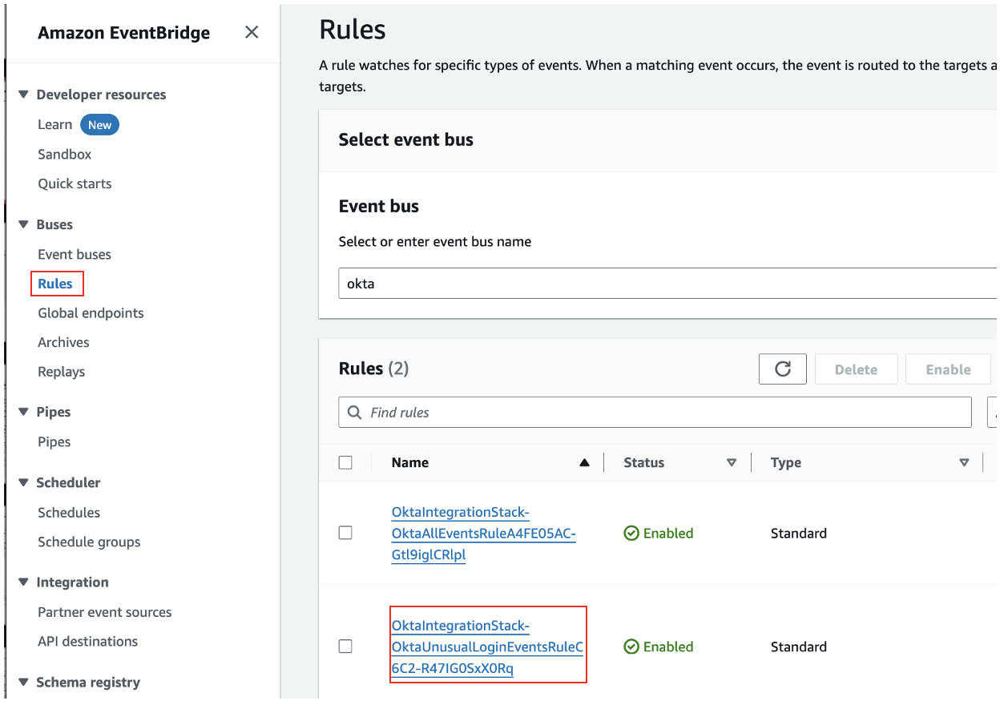
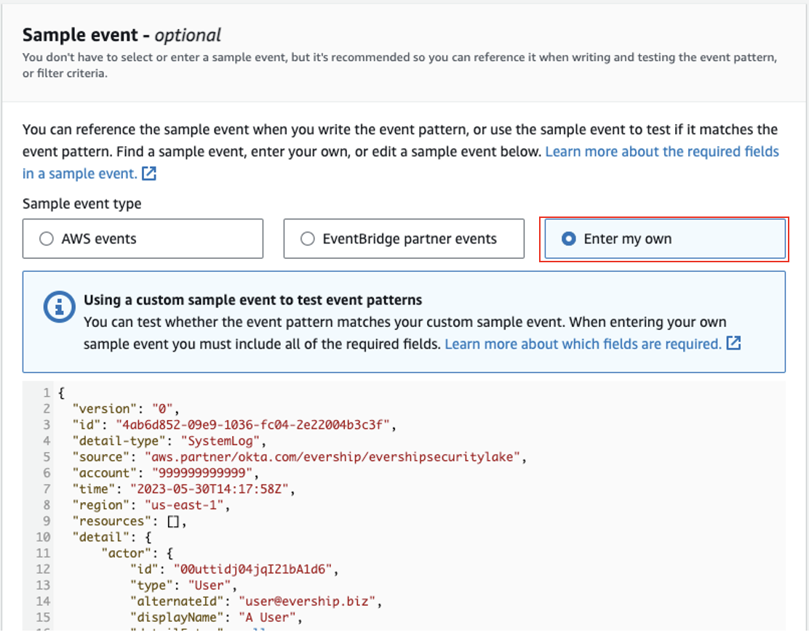
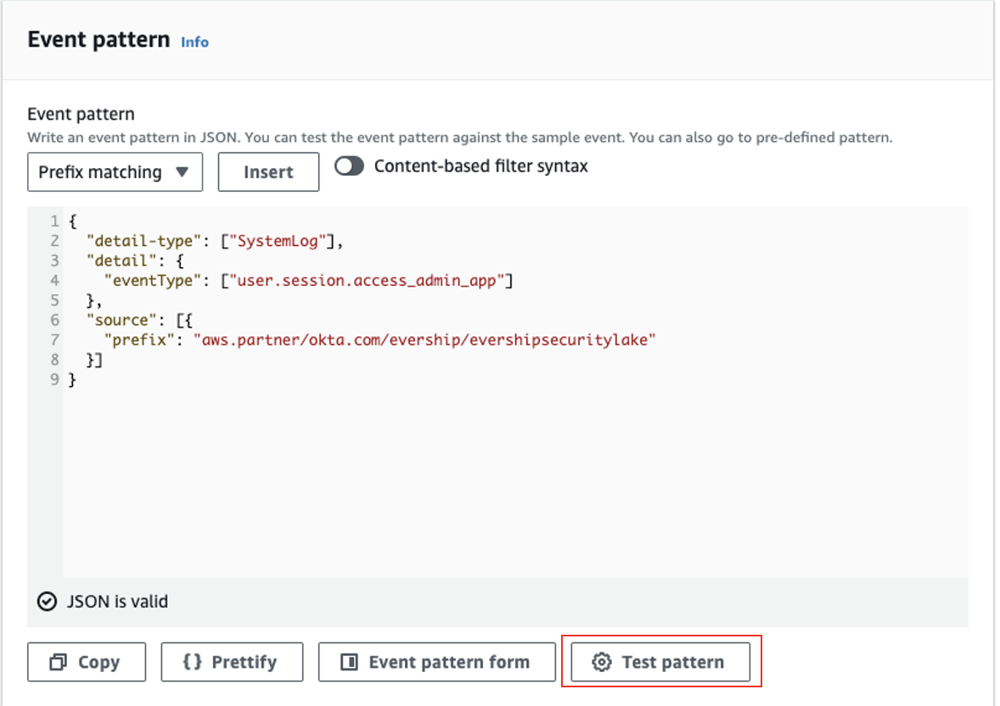
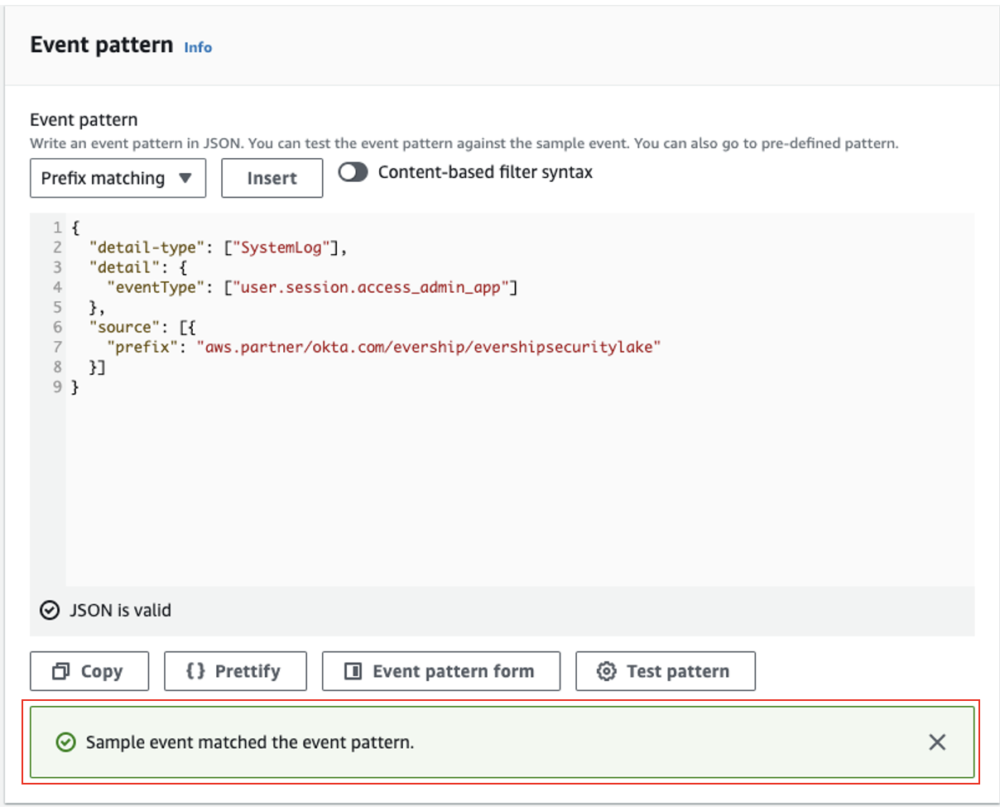

# Okta Amazon EventBridge Partner Integration to AWS Lambda

This pattern demonstrates how to use the Okta Amazon EventBridge integration and AWS Lambda to process events from Okta. This pattern is leveraging the Okta Amazon EventBridge integration to send Okta System Log events from the customer's Okta account to their AWS account, via an Amazon EventBridge Partner event bus. Once the Okta events are in the customer's account, an Amazon EventBridge rule routes unusual location user login events to a downstream Lambda function. In production cases, the Lambda function could transform the event, send it to a downstream application, archive it in a warehouse service, or send a notification email to a customer using SES. Amazon CloudWatch Log Groups are provisioned for debugging and auditing. This pattern deploys two EventBridge rules, one Lambda function, and two CloudWatch Log Groups.
    
Learn more about this pattern at Serverless Land Patterns: https://serverlessland.com/patterns/okta-eventbridge-lambda

Important: this application uses various AWS services and there are costs associated with these services after the Free Tier usage - please see the [AWS Pricing page](https://aws.amazon.com/pricing/) for details. You are responsible for any AWS costs incurred. No warranty is implied in this example.

## Requirements

* [Create an AWS account](https://portal.aws.amazon.com/gp/aws/developer/registration/index.html) if you do not already have one and log in. The IAM user that you use must have sufficient permissions to make necessary AWS service calls and manage AWS resources.
* [AWS CLI](https://docs.aws.amazon.com/cli/latest/userguide/install-cliv2.html) installed and configured
* [Git Installed](https://git-scm.com/book/en/v2/Getting-Started-Installing-Git)
* [AWS CDK CLI](https://docs.aws.amazon.com/cdk/v2/guide/getting_started.html) (AWS CDK) installed
* [Create an Okta Organization](https://www.okta.com/okta-advantage/?utm_source=google&utm_campaign=amer_mult_usa_all_wf-all_dg-ao_a-wf_search_google_text_kw_workforce-OktaBrand-exact_utm2&utm_medium=cpc&utm_id=aNK4z0000004DlbGAE&utm_term=okta&utm_page={url}&utm_content=679261513163&gad_source=1&gclid=CjwKCAjwnK60BhA9EiwAmpHZwy2ms0vms2fFPJZr0aECIlwkSs6Qs3U03pzFghn_wajg7chitFT1cRoCRKwQAvD_BwE) if you do not already have one and log in. 
* [Set up the Okta Amazon EventBridge integration](https://help.okta.com/en-us/content/topics/reports/log-streaming/add-aws-eb-log-stream.htm) if you have not already configured the integration.


## Deployment Instructions

1. Create a new directory, navigate to that directory in a terminal and clone the GitHub repository:
    ``` 
    git clone https://github.com/aws-samples/serverless-patterns
    ```
2. Change directory to the pattern directory:
    ```
    cd eventbridge-partner-sources/1-okta/cdk-python
    ```
3. From the command line, use AWS CDK to deploy the AWS resources for the pattern as specified in the app.py file. A command-line argument is needed to deploy the CDK stack, "oktaEventBusName". This argument is the name of the **SaaS event bus** associated with your Okta [partner event source](https://docs.aws.amazon.com/eventbridge/latest/userguide/eb-saas.html).
    ```
    cdk deploy --parameters oktaEventBusName=SAAS_EVENT_BUS_NAME_HERE
    ```

4. Note the outputs from the CDK deployment process. These contain the resource names and/or ARNs which are used for testing. This stack will output the name of the Lambda function deployed for testing to the CLI. See the example below. 

```
Outputs:
OktaIntegrationStack.OktaProcessUserLoginUnusualLocationLambdaOutput = OktaIntegrationStack-OktaProcessUserLoginUnusualLocationLambd....
```

## How it works

This service interaction uses an existing Okta System integration in the customer's AWS account. If you do not have the Okta System integration set up in your AWS account, please set it up before deploying this pattern. View the [integration on Okta's site](https://help.okta.com/en-us/content/topics/reports/log-streaming/add-aws-eb-log-stream.htm).

This pattern demonstrates how to:
1. Write EventBridge rules that match Okta's event pattern
2. Send events from Okta's EventBridge integration to Amazon CloudWatch for logging and debugging
3. Transform Okta events using AWS Lambda and allows you to connect to other services going forward

See the below architecture diagram from the data flow of this pattern. 


## Testing

### Test the AWS Lambda Function

The event.json file included in this pattern is a sample EventBridge event from Okta. This event can be used to test the Lambda function and EventBridge rules deployed by this pattern.

To test the Lambda function via the CLI, copy and paste the following command, replacing the variables in <> with your own values:
```
aws lambda invoke --function-name <OktaIntegrationStack-OktaProcessUserLoginUnusual-....> --payload file://event.json --cli-binary-format raw-in-base64-out response.json
```

You should receive a response that looks like: 
```
{
    "StatusCode": 200,
    "ExecutedVersion": "$LATEST"
}
```

The command creates a response.json file in your directory. If you open this file, you see the output of the Lambda function.  

### Test the EventBridge Rule

Only Okta can publish events to the event bus. To test the EventBridge rules deployed by this pattern, follow these instructions: 

1. Navigate to the Amazon EventBridge console. Select "Rules". 

2. From the Event bus list, choose the SaaS event bus associated with your Okta partner event source. 

3. From the Rules list, select the "OktaIntegrationStack-OktaSpecficEventsRule54D..." 



4. Choose "Edit" to enter the rule editor. Click through to "Step 2. Build Event Pattern." 


5. Scroll down to "Sample event - optional." Select "Enter my own," and delete the pre-populated event. Copy the contents of event.json into the event editor. 



6. Scroll down to "Event pattern." Choose "Test Pattern." 



A successful test results in a  "Sample event matched the event pattern." message. This means that the rule will successfully route incoming events to the AWS Lambda function. 




## Cleanup
 
1. Delete the stack
    ```bash
    cdk destroy
    ```

----
Copyright 2024 Amazon.com, Inc. or its affiliates. All Rights Reserved.

SPDX-License-Identifier: MIT-0