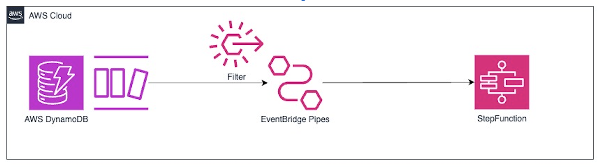

# DynamoDB Stream to Step Functions with EventBridge Pipes

This pattern shows how to use Amazon EventBridge Pipes to connect Amazon DynamoDB streams with AWS Step Functions and launch a state machine.



Learn more about this pattern at Serverless Land Patterns: https://serverlessland.com/patterns/eventbridge-pipes-ddbstream-sfn-terraform

Important: this application uses various AWS services and there are costs associated with these services after the Free Tier usage - please see the [AWS Pricing page](https://aws.amazon.com/pricing/) for details. You are responsible for any AWS costs incurred. No warranty is implied in this example.

* [Create an AWS account](https://portal.aws.amazon.com/gp/aws/developer/registration/index.html) if you do not already have one and log in. The IAM user that you use must have sufficient permissions to make necessary AWS service calls and manage AWS resources.
* [AWS CLI](https://docs.aws.amazon.com/cli/latest/userguide/install-cliv2.html) installed and configured
* [Git Installed](https://git-scm.com/book/en/v2/Getting-Started-Installing-Git)
* [AWS Serverless Application Model](https://docs.aws.amazon.com/serverless-application-model/latest/developerguide/serverless-sam-cli-install.html) (AWS SAM) installed
* [Terraform](https://learn.hashicorp.com/tutorials/terraform/install-cli?in=terraform/aws-get-started) installed

## Deployment Instructions

1. Create a new directory, navigate to that directory in a terminal and clone the GitHub repository:
    ``` 
    git clone https://github.com/aws-samples/serverless-patterns
    ```
2. Change directory to the pattern directory:
    ```
    cd eventbridge-pipes-ddbstream-sfn-terraform
    ```
3. From the command line, initialize Terraform to download and install the providers defined in the configuration:
    ```
    terraform init
    ```
4. From the command line, apply the configuration in the main.tf file:
    ```
    terraform apply
    ```
5. During the prompts:
    * Enter yes
6. Note the outputs from the deployment process. These contain the resource names and/or URLs which are used for testing.

## How it works

Previously, whenever you needed to send DynamoDB record changes through DynamoDB streams to Step Functions, you had to implement an AWS Lambda function to invoke a state machine because Amazon DynamoDB streams did not support AWS Step Functions as a direct target.

Now, you can directly integrate DynamoDB streams with AWS Step Functions.

## Testing

1. Stream logs from the Step Functions log group. Replace `<LogGroup Name>` with the `SFNLog` output value.

```
sam logs --cw-log-group <LogGroup Name> --tail
```

2. The EventBridge Pipe is configured to filter on the NationalTeam value of "Argentina"
In another terminal, add an item to the DynamoDB stream which does match the filter.

```bash
aws dynamodb put-item \
    --table-name WorldCup-DB \
    --item PlayerName={S="Lionel Messi"},Nationality={S="Argentina"},GoalsScored={S="1"}
```

The Step Functions state machine is invoked and you should see the logs for the new execution.

Now add an item to the DynamoDB stream which doesn't match the filter.
```bash
aws dynamodb put-item \
    --table-name WorldCupTable \
    --item PlayerName={S="Sergy Gnabry"},Nationality={S="Germany"},GoalsScored={S="1"}
```

No Step Function state machine is invoked and you will not see any new logs.

## Cleanup
1. Change directory to the pattern directory:
    ```
    cd eventbridge-pipes-ddbstream-sfn-terraform
    ```
2. Delete all created resources by terraform
    ```bash
    terraform destroy
    ```
3. During the prompts:
    * Enter yes
4. Confirm all created resources has been deleted
    ```bash
    terraform show
    ```

----
Copyright 2024 Amazon.com, Inc. or its affiliates. All Rights Reserved.

SPDX-License-Identifier: MIT-0

