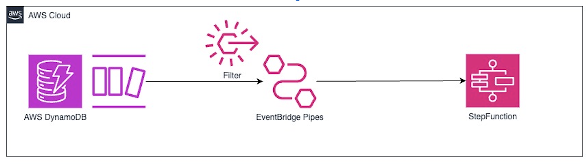

# DynamoDB Stream to Step Functions with EventBridge Pipes

This pattern shows how to use Amazon EventBridge Pipes to launch a AWS Step Functions state machine with a message coming from an Amazon DynamoDB stream



Learn more about this pattern at Serverless Land Patterns: 

Important: this application uses various AWS services and there are costs associated with these services after the Free Tier usage - please see the [AWS Pricing page](https://aws.amazon.com/pricing/) for details. You are responsible for any AWS costs incurred. No warranty is implied in this example.

## Requirements

* [Create an AWS account](https://portal.aws.amazon.com/gp/aws/developer/registration/index.html) if you do not already have one and log in. The IAM user that you use must have sufficient permissions to make necessary AWS service calls and manage AWS resources.
* [AWS CLI](https://docs.aws.amazon.com/cli/latest/userguide/install-cliv2.html) installed and configured
* [Git Installed](https://git-scm.com/book/en/v2/Getting-Started-Installing-Git)
* [AWS Serverless Application Model](https://docs.aws.amazon.com/serverless-application-model/latest/developerguide/serverless-sam-cli-install.html) (AWS SAM) installed

## Deployment Instructions

1. Create a new directory, navigate to that directory in a terminal and clone the GitHub repository:
    ``` 
    git clone https://github.com/aws-samples/serverless-patterns
    ```
1. Change directory to the pattern directory:
    ```
    cd eventbridge-pipes-ddbstream-sfn
    ```
1. From the command line, use AWS SAM to deploy the AWS resources for the pattern as specified in the template.yml file:
    ```
    sam deploy --guided
    ```
1. During the prompts:
    * Enter a stack name
    * Enter the desired AWS Region
    * Allow SAM CLI to create IAM roles with the required permissions.

    Once you have run `sam deploy --guided` mode once and saved arguments to a configuration file (samconfig.toml), you can use `sam deploy` in future to use these defaults.

1. Note the outputs from the SAM deployment process. These contain the resource names and/or ARNs which are used for testing.

## How it works

Previously, whenever we needed DynamoDB Streams to send messages to Step Functions based on changes made to your DynamoDB table, we had to implement a Lambda function in between DynamoDB and Step Functions because Amazon DynamoDB streams did not support AWS Step Functions as a target directly.

But at re:Invent 2022, AWS launched a new feature for Amazon EventBridge known as EventBridge Pipes.

Now, we can directly integrate DynamoDB streams with AWS Step Functions without the need for having an additional Lambda function.

## Testing

1. Stream logs from the Step Functions log group

```
sam logs --cw-log-group <LogGroup Name> --tail
```

2. The EventBridge Pipe is configured to filter on the NationalTeam value of "Argentina"
In another terminal, add an item to the DynamoDB stream which does match the filter.

```bash
aws dynamodb put-item \
    --table-name WorldCupTable \
    --item PlayerName={S="Lionel Messi"},Nationality={S="Argentina"},GoalsScored={S="1"}
```

The Step Functions workflow should be invoked and you should see the logs for the new execution.

Now add an item to the DynamoDB stream which doesn't match the filter.
```bash
aws dynamodb put-item \
    --table-name WorldCupTable \
    --item PlayerName={S="Sergy Gnabry"},Nationality={S="Germany"},GoalsScored={S="1"}
```

No Step Function workflow should be invoked and you should not see any new logs.

## Cleanup
 
1. Delete the stack
    ```bash
    aws cloudformation delete-stack --stack-name STACK_NAME
    ```
1. Confirm the stack has been deleted
    ```bash
    aws cloudformation list-stacks --query "StackSummaries[?contains(StackName,'STACK_NAME')].StackStatus"
    ```
----
Copyright 2023 Amazon.com, Inc. or its affiliates. All Rights Reserved.

SPDX-License-Identifier: MIT-0
