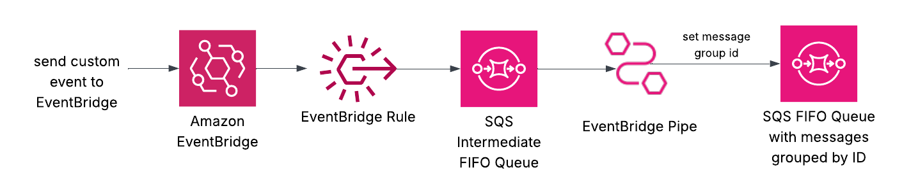
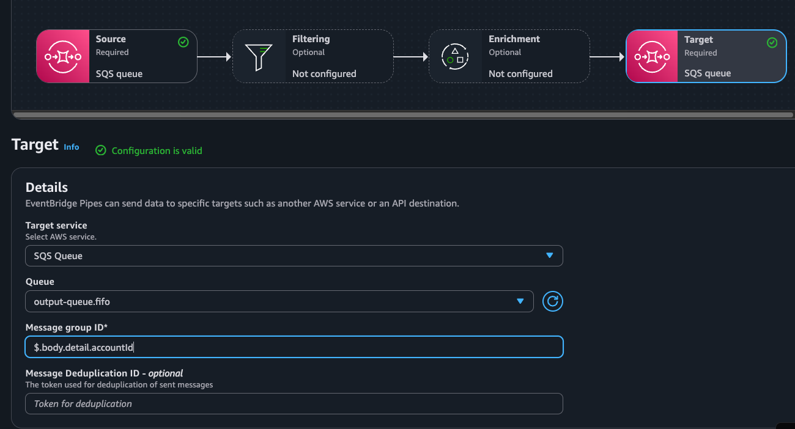

# Assigning a dynamic message group ID from the message body using EventBridge Pipes

EventBridge, a serverless event bus service, and SQS, a managed message queuing service, work together in event-driven architectures to route and process messages between AWS services and applications. While EventBridge routes messages to SQS queues for processing by microservices, FIFO queues can be used for strict message ordering. Although EventBridge cannot directly set message group IDs for organizing related messages, EventBridge Pipes provides a solution by allowing dynamic message group ID assignment based on event properties, enabling ordered processing for specific users, applications, or locations without additional coding.

Learn more about this pattern at Serverless Land Patterns: https://serverlessland.com/patterns/eventbridge-pipes-dynamic-message-group-id

> [!Important]
> This application uses various AWS services and there are costs associated with these services after the Free Tier usage - please see the [AWS Pricing page](https://aws.amazon.com/pricing/) for details. You are responsible for any AWS costs incurred. No warranty is implied in this example.

## Requirements
* [Create an AWS account](https://portal.aws.amazon.com/gp/aws/developer/registration/index.html) if you do not already have one and log in. The IAM user that you use must have sufficient permissions to make necessary AWS service calls and manage AWS resources.
* [AWS CLI](https://docs.aws.amazon.com/cli/latest/userguide/install-cliv2.html) installed and configured
* [Git Installed](https://git-scm.com/book/en/v2/Getting-Started-Installing-Git)
* [AWS Serverless Application Model](https://docs.aws.amazon.com/serverless-application-model/latest/developerguide/serverless-sam-cli-install.html) (AWS SAM) installed


## Deployment

1. Create a new directory, navigate to that directory in a terminal and clone the GitHub repository:
    ``` 
    git clone https://github.com/aws-samples/serverless-patterns
    ```
2. Change directory to the pattern directory:
    ```
    cd eventbridge-pipes-dynamic-message-group-id
    ```

3. Build and deploy the SAM application
```bash
sam build && sam deploy --guided
```

During the prompts:
* Enter a stack name
* Enter the desired AWS Region
* Allow SAM CLI to create IAM roles with the required permissions.

You can accept all other defaults.  Copy down the SQS Output Queue URL.  You'll use this later in testing.  

Once you have run `sam deploy --guided` mode once and saved arguments to a configuration file (samconfig.toml), you can use `sam deploy` in future to use these defaults.

## How it works


This project implements an event processing pipeline using AWS EventBridge and SQS FIFO queues. The pipeline consists of:

- An EventBridge rule that captures events from "my-custom-app" source
- An input SQS FIFO queue that receives events from the EventBridge rule
- An EventBridge pipe that processes messages from the input queue and dynamically sets the message group ID for the target SQS FIFO queue
- An output SQS FIFO queue that receives processed messages

A key component of this pattern is the syntax in the EventBrige Pipe Target to obtain the correct property value to set the message group id.  The following shows an example in the AWS Console.  You can also view this configuration in the SAM template under the CustomEventPipe resource.


## Testing

To test, you'll send an event from a custom source to EventBridge, which will trigger the EventBridge rule to send the event to an SQS FIFO Queue.  You'll then wait for the EventBridge pipe to process and finally verify the message within the destination SQS FIFO queue with the message group ID set.  

1. Send a test event to EventBridge.  Take a look at the event structure and attributes.  The account attribute will be used as the message group ID.  
```bash
aws events put-events --entries file://events/test-event.json
```

2. Wait for a couple seconds for the EventBridge pipe to process the message, then check the output queue.  Make sure you replace the queue-url value with the correct output queue URL from deployment. 
```bash
aws sqs receive-message \
  --queue-url <OUTPUT_QUEUE_URL> \
  --attribute-names All \
  --message-attribute-names All \
  --max-number-of-messages 10
```

You should see a list of messages.  View the event and take note of the MessageGroupID under the Attributes section.  This originally came from your event input "accountId" property.  The EventBridge Pipe is what allows us to perform this modification.  Feel free to modify the event, send additional events to EventBridge and review the output queue messages.    

## Cleanup

To remove all resources:

```bash
sam delete
```

----
Copyright 2025 Amazon.com, Inc. or its affiliates. All Rights Reserved.

SPDX-License-Identifier: MIT-0