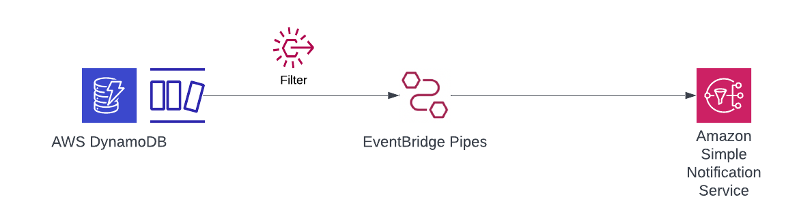

# DynamoDB Stream to AWS SNS without Lambda using EventBridge Pipes

This pattern demonstrates sending DynamoDB Streams directly to AWS SNS using EventBridge Pipes with filtering.




Learn more about this pattern at Serverless Land Patterns:https://serverlessland.com/patterns/eventbridge-pipes-dynamodbstream-sns

Important: this application uses various AWS services and there are costs associated with these services after the Free Tier usage - please see the [AWS Pricing page](https://aws.amazon.com/pricing/) for details. You are responsible for any AWS costs incurred. No warranty is implied in this example.

## Requirements

* [Create an AWS account](https://portal.aws.amazon.com/gp/aws/developer/registration/index.html) if you do not already have one and log in. The IAM user that you use must have sufficient permissions to make necessary AWS service calls and manage AWS resources.
* [AWS CLI](https://docs.aws.amazon.com/cli/latest/userguide/install-cliv2.html) installed and configured
* [Git Installed](https://git-scm.com/book/en/v2/Getting-Started-Installing-Git)
* [AWS Serverless Application Model](https://docs.aws.amazon.com/serverless-application-model/latest/developerguide/serverless-sam-cli-install.html) (AWS SAM) installed

## Deployment Instructions

1. Create a new directory, navigate to that directory in a terminal and clone the GitHub repository:
    ``` 
    git clone https://github.com/aws-samples/serverless-patterns
    ```
1. Change directory to the pattern directory:
    ```
    cd eventbridge-pipes-dynamodbstream-sns
    ```
1. From the command line, use AWS SAM to deploy the AWS resources for the pattern as specified in the template.yml file:
    ```
    sam deploy --guided
    ```
1. During the prompts:
    * Enter a stack name: eg. eventbridge-pipes-dynamodbstream-sns
    * Enter the desired AWS Region
    * Enter Email ID for SNS to create a topic and subscription.
    * Enter NationalTeam(This is configurable, you can create any parameter name).: eg. Argentina
    * Allow SAM CLI to create IAM roles with the required permissions.

    Once you have run `sam deploy --guided` mode once and saved arguments to a configuration file (samconfig.toml), you can use `sam deploy` in future to use these defaults.

1. Note the outputs from the SAM deployment process. These contain the resource names and/or ARNs which are used for testing.

## How it works

Previously, whenever we needed DynamoDB Streams to send messages to SNS based on changes made to your DynamoDB table, we had to implement a Lambda function in between DynamoDB and SNS because DynamoDB streams only supported Lambda as its destination.

But at re:invent 2022, AWS launched a new feature for AWS EventBridge known as EventBridge Pipes.

Now, we can directly integrate DynamoDB streams with AWS SNS without the need for having an additional Lambda function.

## Testing

Once the deployment has completed, you will receive an email to confirm the SNS subscription. CLick on the link to confirm before testing.

The Pipe is configured to filter on the NationalTeam value of "Argentina"
Add an item to the DynamoDB stream which does match the filter.

```bash
aws dynamodb put-item \
    --table-name WorldCupTable \
    --item PlayerName={S="Lionel Messi"},Nationality={S="Argentina"},GoalsScored={S="1"}
```

You should receive an email notification from SNS.

Now add an item to the DynamoDB stream which doesn't match the filter.
```bash
aws dynamodb put-item \
    --table-name WorldCupTable \
    --item PlayerName={S="Sergy Gnabry"},Nationality={S="Germany"},GoalsScored={S="1"}
```

You should not receive an email notification from SNS.

## Cleanup
 
1. Delete the stack
    ```bash
    sam delete
    ```

----
Copyright 2022 Amazon.com, Inc. or its affiliates. All Rights Reserved.

SPDX-License-Identifier: MIT-0
