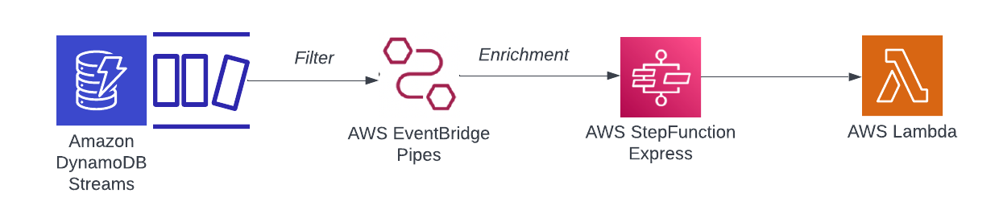

# DynamoDB Stream to AWS Lambda with Stepfunction Enrichment using EventBridge Pipes

This pattern demonstrates sending DynamoDB Stream to AWS Lambda with Stepfunction Enrichment using EventBridge Pipes.




Learn more about this pattern at Serverless Land Patterns:https://serverlessland.com/patterns/eventbridge-pipes-dynamodbstream-to-lambda-with-stepfunction-enrichment

Important: this application uses various AWS services and there are costs associated with these services after the Free Tier usage - please see the [AWS Pricing page](https://aws.amazon.com/pricing/) for details. You are responsible for any AWS costs incurred. No warranty is implied in this example.

## Requirements

* [Create an AWS account](https://portal.aws.amazon.com/gp/aws/developer/registration/index.html) if you do not already have one and log in. The IAM user that you use must have sufficient permissions to make necessary AWS service calls and manage AWS resources.
* [AWS CLI](https://docs.aws.amazon.com/cli/latest/userguide/install-cliv2.html) installed and configured
* [Git Installed](https://git-scm.com/book/en/v2/Getting-Started-Installing-Git)
* [AWS Serverless Application Model](https://docs.aws.amazon.com/serverless-application-model/latest/developerguide/serverless-sam-cli-install.html) (AWS SAM) installed

## Deployment Instructions

1. Create a new directory, navigate to that directory in a terminal and clone the GitHub repository:
    ``` 
    git clone https://github.com/aws-samples/serverless-patterns
    ```
1. Change directory to the pattern directory:
    ```
    cd eventbridge-pipes-dynamodbstream-to-lambda-with-stepfunction-enrichment
    ```
1. From the command line, use AWS SAM to deploy the AWS resources for the pattern as specified in the template.yml file:
    ```
    sam deploy --guided
    ```
1. During the prompts:
    * Enter a stack name: eg. eventbridge-pipes-ddb-lambda-sfn-enrich
    * Enter the desired AWS Region
    * Allow SAM CLI to create IAM roles with the required permissions.

    Once you have run `sam deploy --guided` mode once and saved arguments to a configuration file (samconfig.toml), you can use `sam deploy` in future to use these defaults.

1. Note the outputs from the SAM deployment process. These contain the resource names and/or ARNs which are used for testing.

## How it works

Amazon DynamoDB is integrated with AWS Lambda so that you can create triggers, pieces of code that automatically respond to events in DynamoDB Streams. With triggers, you can build applications that react to data modifications in DynamoDB tables. We can also filter the event with the help of lambda event source mapping. But if we want to enrich the event from DynamoDB streams before it gets sent to AWS Lambda, then previously we have to implement some additional logic which would take care of the enrichment. 

But at re:invent 2022, AWS launched a new feature for AWS EventBridge known as EventBridge Pipes.

Now, we can directly integrate DynamoDB streams with AWS Lambda and can have enrichment which is provided out of the box with eventbridge pipes.

This architecture pattern also has the input transformer enabled which will modify the event payload.

## Testing

Once the deployment has completed, you can test by


```bash
aws dynamodb put-item \
    --table-name SampleTable \
    --item PK={S="Message#1234"},SK={S="Channel#1231"},messageId={S="3"}
```

To check logs if the payload has been logged, you can use the below command

```bash
sam logs --stack-name <stack_name> --tail
```

This will help to monitor the lambda function logs and will wait for new logs and you can see them as they arrive from the terminal. 

## Cleanup
 
1. Delete the stack
    ```bash
    sam delete
    ```

----
Copyright 2023 Amazon.com, Inc. or its affiliates. All Rights Reserved.

SPDX-License-Identifier: MIT-0
