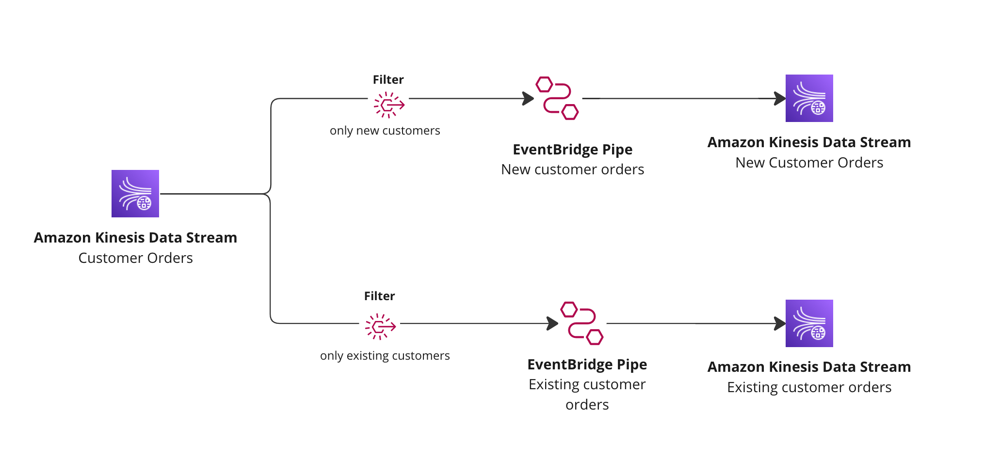

# Kinesis to Kinesis with filtering using EventBridge Pipes



This pattern will connect Kinesis streams together with EventBridge Pipes. The source stream is filtered into multiple Kinesis streams downstream.

Learn more about this pattern at Serverless Land Patterns: https://serverlessland.com/patterns/eventbridge-pipes-kinesis-to-kinesis-with-filtering

Important: this application uses various AWS services and there are costs associated with these services after the Free Tier usage - please see the [AWS Pricing page](https://aws.amazon.com/pricing/) for details. You are responsible for any AWS costs incurred. No warranty is implied in this example.

## Requirements

- [Create an AWS account](https://portal.aws.amazon.com/gp/aws/developer/registration/index.html) if you do not already have one and log in. The IAM user that you use must have sufficient permissions to make necessary AWS service calls and manage AWS resources.
- [AWS CLI](https://docs.aws.amazon.com/cli/latest/userguide/install-cliv2.html) installed and configured
- [Git Installed](https://git-scm.com/book/en/v2/Getting-Started-Installing-Git)
- [AWS Serverless Application Model](https://docs.aws.amazon.com/serverless-application-model/latest/developerguide/serverless-sam-cli-install.html) (AWS SAM) installed

## Deployment Instructions

1. Create a new directory, navigate to that directory in a terminal and clone the GitHub repository:
   ```
   git clone https://github.com/aws-samples/serverless-patterns
   ```
1. Change directory to the pattern directory:
   ```
   cd eventbridge-pipes-kinesis-to-kinesis-with-filtering
   ```
1. From the command line, use AWS SAM to deploy the AWS resources for the pattern as specified in the template.yml file:
   ```
   sam deploy --guided
   ```
1. During the prompts:

   - Enter a stack name
   - Enter the desired AWS Region
   - Allow SAM CLI to create IAM roles with the required permissions.

   Once you have run `sam deploy -guided` mode once and saved arguments to a configuration file (samconfig.toml), you can use `sam deploy` in future to use these defaults.

1. Note the outputs from the SAM deployment process. These contain the resource names and/or ARNs which are used for testing.

## How it works

This template will create three Kinesis streams and two EventBridge pipes. One for the source and two for targets.

When records are sent to the source Kinesis stream, filters are used to filter the records to downstream Kinesis streams.

This example uses `orders` as records and filtered by orders places by customers (New customer vs Exisiting Customers).

Once deployed you will need to run the following command to put information into the stream.

**Payload that is sent (base 64 encoded)**
```json
[{
    "orderId": "527a5b8b-78bc-4477-8620-022e9c1b3ed4",
    "customerId": "8d18e7d1-80d1-4cf8-ad17-765fc8ca5305",
    "type": "NEW_CUSTOMER"
},
{
    "orderId": "527a5b8b-78bc-4477-8620-022e9c1b3eda",
    "customerId": "8d18e7d1-80d1-4cf8-ad17-765fc8ca5304",
    "type": "EXISTING_CUSTOMER"
}]

```

```sh
# Put message onto the stream for a new customer
aws kinesis put-record --stream-name <StackName>-source --data '{ "orderId": "527a5b8b-78bc-4477-8620-022e9c1b3ed4", "customerId": "8d18e7d1-80d1-4cf8-ad17-765fc8ca5305", "type": "NEW_CUSTOMER" }' --partition-key "x" 

# Put message onto the stream for an existing customer
aws kinesis put-record --stream-name <StackName>-source --data '{ "orderId": "527a5b8b-78bc-4477-8620-022e9c1b3eda", "customerId": "8d18e7d1-80d1-4cf8-ad17-765fc8ca5304", "type": "EXISTING_CUSTOMER" }' --partition-key "x" 

```

## Delete stack

```bash
sam delete
```

---

Copyright 2022 Amazon.com, Inc. or its affiliates. All Rights Reserved.

SPDX-License-Identifier: MIT-0
