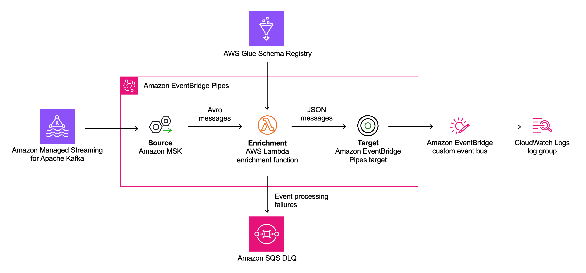

# AWS Evenbridge Pipes using Glue Schema Registry to deserialize AVRO messages

This pattern uses AWS Glue Schema Registry to deserialize AVRO messages into JSON messages with Eventbridge pipes and a Lambda transformer.

Learn more about this pattern at Serverless Land Patterns: << Add the live URL here >>

Important: this application uses various AWS services and there are costs associated with these services after the Free Tier usage - please see the [AWS Pricing page](https://aws.amazon.com/pricing/) for details. You are responsible for any AWS costs incurred. No warranty is implied in this example.

## Requirements

* [Create an AWS account](https://portal.aws.amazon.com/gp/aws/developer/registration/index.html) if you do not already have one and log in. The IAM user that you use must have sufficient permissions to make necessary AWS service calls and manage AWS resources.
* [AWS CLI](https://docs.aws.amazon.com/cli/latest/userguide/install-cliv2.html) installed and configured
* [Git Installed](https://git-scm.com/book/en/v2/Getting-Started-Installing-Git)
* [AWS Cloud Development Kit (AWS CDK)](https://aws.amazon.com/cdk/) installed
* [Java 17](https://openjdk.org/projects/jdk/17/) installed
* [Maven](https://maven.apache.org/) installed
* [MSK Serverless](https://docs.aws.amazon.com/msk/latest/developerguide/serverless.html) running and a topic to produce test messages

## Deployment Instructions

### Deploy with CDK

1. Create a new directory, navigate to that directory in a terminal and clone the GitHub repository:

   ```bash
   git clone https://github.com/aws-samples/serverless-patterns
   ```

1. Change directory to the pattern directory:

   ```bash
   cd pipes-schema-validation-glue
   ```

1. Create a `virtualenv`:

   ```bash
   python3 -m venv .venv
   ```

1. Activate the `virtualenv`:

   ```bash
   source .venv/bin/activate
   ```

1. Once the `virtualenv` is activated, install the required dependencies:

   ```bash
   pip install -r requirements.txt
   ```

1. You can now synthesize the CloudFormation template for this code:

   ```bash
   cdk synth
   ```

1. Deploy the CDK stack and provide the necessary parameters:

   - `clusterarn`: your MSK serverless arn
   - `topicname`: name of the Kafka topic that EventBridge Pipes should poll events from.

```bash
   cdk deploy --parameters clusterarn=<Your arn goes here> --parameters topicname=<Your topicname goes here>
   ```




This pattern sets up an EventBridge pipe with the following key elements:

1. The **source** of the pipe is a topic provided from a MSK serverless Kafka cluster. EventBridge Pipes reads events from the Kafka topic in batches and provides these to the enrichment function as an event payload.

1. The **enrichment** step of the pipe consists of a Lambda function that validates the incoming events against Glue Schema Registry, deserializes them from Avro, and trasnforms them to JSON before returning.

1. The **target** of this pattern is an EventBridge custom event bus which is synchronously invoked by EventBridge Pipes with the events returned by the enrichment Lambda function. EventBridge Pipes supports a variety of other targets, including Lambda, AWS Step Functions, Amazon API Gateway, API destinations, and more.

The Java enrichment function uses the [`AWS Glue Schema Registry Library`](https://github.com/awslabs/aws-glue-schema-registry) library for schema validation and Avro deserialization.

The function performs the following tasks:

1. In the events polled by the EventBridge pipe from the Kafka topic, the `value` of the message is `base64` encoded. Therefore, for each message contained in the batch passed to the function, the function decodes both the `key` and the `value`.

1. The message `value` is deserialized using the `Glue Schema Registry Deserialization Facade` [`AvroDeserializer`](https://github.com/awslabs/aws-glue-schema-registry/blob/master/serializer-deserializer/src/main/java/com/amazonaws/services/schemaregistry/deserializers/GlueSchemaRegistryDeserializerImpl.java).

1. The function returns a list of deserialized events to the EventBridge pipe, which will then invoke the target for each of them.

1. Messages for which processing failed are sent to an Amazon SQS dead letter queue.

## Testing

1. Set up a MSK serverless cluster. 

1. Set up a Kafka producer that serializes messages using the Customer schema using AWS Glue Schema registry. We have created this Schema for you, already. You can use a simple Java application or even a Flink appliction to send test message. You can find the schema here: shared/customer_schema.avsc. You can use the codesample below for Flink application to produce test messages.
```java
public class DataStreamJob {

	private static final Logger LOG = LoggerFactory.getLogger(DataStreamJob.class);

	public static final String BOOTSTRAP_SERVERS = "BOOTSTRAP_SERVERS";
	public static final String SCHEMA_NAME = "SCHEMA_NAME";
	public static final String REPOSITORY_NAME = "REPOSITORY_NAME";
	public static final String TOPIC = "TOPIC";
	public static final String GROUP_ID = "GROUP_ID";
	public static final String NUMBER_MESSAGES = "NUMBER_MESSAGES";

	private static final List<String> MANDATORY_PARAMETERS = Arrays.asList(BOOTSTRAP_SERVERS, SCHEMA_NAME, REPOSITORY_NAME, TOPIC, GROUP_ID, NUMBER_MESSAGES);


	public static void main(String[] args) throws Exception {

		final StreamExecutionEnvironment env = StreamExecutionEnvironment.getExecutionEnvironment();

		Properties flinkProperties = KinesisAnalyticsRuntime.getApplicationProperties().get("FlinkApplicationProperties");

		if (flinkProperties == null) {
			LOG.error("Unable to load FlinkApplicationProperties properties from the Kinesis Analytics Runtime. Exiting.");

			return;
		}

		if (! flinkProperties.keySet().containsAll(MANDATORY_PARAMETERS)) {
			LOG.error("Missing mandatory parameters. Expected '{}' but found '{}'. Exiting.",
					String.join(", ", MANDATORY_PARAMETERS),
					flinkProperties.keySet());
			return;
		}

		Properties kafkaConfig = new Properties();
		kafkaConfig.setProperty(ConsumerConfig.BOOTSTRAP_SERVERS_CONFIG, flinkProperties.getProperty(BOOTSTRAP_SERVERS));
		kafkaConfig.setProperty(ConsumerConfig.GROUP_ID_CONFIG,flinkProperties.getProperty("GroupId", GROUP_ID));
		kafkaConfig.setProperty(CommonClientConfigs.SECURITY_PROTOCOL_CONFIG, "SASL_SSL");
		kafkaConfig.setProperty(SaslConfigs.SASL_MECHANISM, "AWS_MSK_IAM");
		kafkaConfig.setProperty(SaslConfigs.SASL_JAAS_CONFIG, "software.amazon.msk.auth.iam.IAMLoginModule required;");
		kafkaConfig.setProperty(SaslConfigs.SASL_CLIENT_CALLBACK_HANDLER_CLASS, "software.amazon.msk.auth.iam.IAMClientCallbackHandler");

		Map<String, Object> schemaRegistryConfigs = new HashMap<>();
		schemaRegistryConfigs.put(AWSSchemaRegistryConstants.AWS_REGION, flinkProperties.getProperty("Region", Regions.getCurrentRegion().getName()));
		schemaRegistryConfigs.put(AWSSchemaRegistryConstants.AVRO_RECORD_TYPE, AvroRecordType.SPECIFIC_RECORD.getName());
		schemaRegistryConfigs.put(AWSSchemaRegistryConstants.REGISTRY_NAME, flinkProperties.getProperty(REPOSITORY_NAME));
		schemaRegistryConfigs.put(AWSSchemaRegistryConstants.SCHEMA_NAME, flinkProperties.get(SCHEMA_NAME));

		String topic = flinkProperties.getProperty(TOPIC);

		FlinkKafkaProducer<Customer> producer = new FlinkKafkaProducer<>(
				topic,
				GlueSchemaRegistryAvroSerializationSchema.forSpecific(Customer.class, topic, schemaRegistryConfigs),
				kafkaConfig);


		int numberOfMessages = Integer.parseInt(flinkProperties.getProperty(NUMBER_MESSAGES));

		DataStream<Customer> stream = env.addSource(new SourceFunction<Customer>() {
			@Override
			public void run(SourceContext<Customer> ctx) throws Exception {

				for (int i=0;i<numberOfMessages;i++){
					Customer customer = Customer.newBuilder().
							setCustomerAccountNo((int) (Math.random() * 100))
							.setCustomerAddress(RandomStringUtils.randomAlphabetic(10))
							.setEmailAddresses(Arrays.asList(RandomStringUtils.randomAlphabetic(10)))
							.setFirstName(RandomStringUtils.randomAlphabetic(10))
							.setLastName(RandomStringUtils.randomAlphabetic(10)).build();

					LOG.info(customer.toString());
					Thread.sleep(100);
					ctx.collect(customer);
				}
			}

			@Override
			public void cancel() {

			}
		});

		stream.addSink(producer);
		env.execute();


		env.execute("Send Messages");
	}
}
```

1. Deploy this pattern using the above deployment instructions. The EventBridge pipe will start polling messages from the Kafka topic.

   Polled message batches are passed to the enrichment Lambda function and have the following format. Note that the `key` field is `base64`-encoded and the `value` field is serialized in [Apache Avro](https://avro.apache.org/) as well as `base64`-encoded at this point.

   ```json
   [{"partition":0,
   "offset":20192,
   "timestamp":1699282778691,
   "timestampType":"CREATE_TIME",
   "value":"AwCTpTSK4StOq6M+06m3n5Q2GBRsZkNtUVZCallOABRibG5GTG9TRHVZAgIUWVhlWmVWZVFjdgAUQ0FITHBlb3h3RgAA",
   "eventSourceArn":"arn:aws:kafka:eu-central-1:12345:cluster/demo-cluster/123455",
   "bootstrapServers":"boot-1234.c3.kafka-serverless.eu-central-1.amazonaws.com:9098",
   "eventSource":"aws:kafka",
   "eventSourceKey":"messages2-0"
   }]
   ```

1. You can confirm the successful deserialization of messages by the enrichment Lambda function in CloudWatch Logs (see [Accessing Amazon CloudWatch logs for AWS Lambda](https://docs.aws.amazon.com/lambda/latest/dg/monitoring-cloudwatchlogs.html) for instructions):

   ```json
   {
    "version": "0",
    "id": "69041bec-5137-603e-fbf5-38c053508c0f",
    "detail-type": "Event from aws:kafka",
    "source": "Pipe pipe-sPZ8f6EbiLuq",
    "account": "00000000000",
    "time": "2023-11-06T15:16:15Z",
    "region": "eu-central-1",
    "resources": [],
    "detail": {
        "customer_account_no": 91,
        "first_name": "XAOZogrzqk",
        "middle_name": null,
        "last_name": "psogpAFqIC",
        "email_addresses": {
            "array": [
                "ssYLhsTniw"
            ]
        },
        "customer_address": "IRACoMieGq",
        "mode_of_payment": "CARD",
        "customer_rating": null
    }
   }
   ```


## Cleanup

Delete the CDK stack:

```bash
cdk destroy
```

---

Copyright 2023 Amazon.com, Inc. or its affiliates. All Rights Reserved.

SPDX-License-Identifier: MIT-0