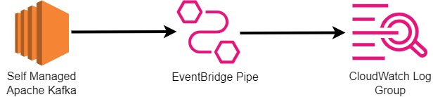

# EventBridge Pipes with Self Managed Apache Kafka as source and CloudWatch Log Group as target

This pattern shows how to use EventBridge Pipes which polls events from a Self Managed Apache Kafka which are then sent to and stored in a CloudWatch Log Group. 



Important: This application uses various AWS services and there are costs associated with these services after the Free Tier usage - please see the [AWS Pricing page](https://aws.amazon.com/pricing/) for details. You are responsible for any AWS costs incurred. No warranty is implied in this example.

## Requirements

* [Create an AWS account](https://portal.aws.amazon.com/gp/aws/developer/registration/index.html) if you do not already have one and log in. The IAM user that you use must have sufficient permissions to make necessary AWS service calls and manage AWS resources.
* [AWS CLI](https://docs.aws.amazon.com/cli/latest/userguide/install-cliv2.html) installed and configured
* [Git Installed](https://git-scm.com/book/en/v2/Getting-Started-Installing-Git)
* [AWS Serverless Application Model](https://docs.aws.amazon.com/serverless-application-model/latest/developerguide/serverless-sam-cli-install.html) (AWS SAM) installed

## Deployment Instructions

1. Create a new directory, navigate to that directory in a terminal and clone the GitHub repository:
    ``` 
    git clone https://github.com/aws-samples/serverless-patterns
    ```
1. Change directory to the pattern directory:
    ```
    cd eventbridge-pipes-self-managed-apache-kafka-to-log-group
    ```
1. From the command line, use AWS SAM to deploy the AWS resources for the pattern as specified in the template.yml file:
    ```
    sam deploy --guided  --capabilities CAPABILITY_NAMED_IAM
    ```
1. During the prompts:
    * Enter a stack name
    * Enter the Primary and Secondary IP's of the Self Managed Kafka Cluster
    * Enter SMK Topic Name
    * Allow SAM CLI to create IAM roles with the required permissions.

    Once you have run `sam deploy --guided` mode once and saved arguments to a configuration file (samconfig.toml), you can use `sam deploy` in future to use these defaults.

2. Note the outputs from the SAM deployment process. These contain the resource names and/or ARNs which are used for testing.

## How it works

Apache Kafka is a distributed event store and stream-processing platform. It is an open-source system developed by the Apache Software Foundation written in Java and Scala. EventBridge internally polls for new messages from the Self Managed Apache Kafka source and then invokes the target. EventBridge reads the messages in batches and provides these to your CloudWatch Log Group as an event payload. 

## Testing

In order for EventBridge Pipe to receive events from the SMK Topic, If you do not already have a Apache Kafka Cluster provisioned, refer to the following quick start guide provided by Apache - https://kafka.apache.org/quickstart

You can provision this on a EC2 Instance, providing the Instance is reachable from the EventBridge VPC provisioned by this Template. 

## Cleanup

**Note**: EventBridge Pipes utilizes a AWS backed Lambda ENI to Poll events from the Self Managed Kafka. Due to the creation of this resource, it can take up to 20 minutes to delete the attached Hyperplane ENI. Upon deletion of the stack the following resources will be retained as to allow the deletion of the stack to succeed;

* VPC
* Security Group
* Private Subnet

In order to delete the retained resources, once the ENI is no longer visible on the "EC2 > Network Interfaces" Section of the EC2 Console in the applicable region you can then manually delete the VPC, Security Group and Private Subnet to avoid any additional costs.
 
1. Delete the stack
    ```bash
    sam delete
    ```
----
Copyright 2023 Amazon.com, Inc. or its affiliates. All Rights Reserved.

SPDX-License-Identifier: MIT-0