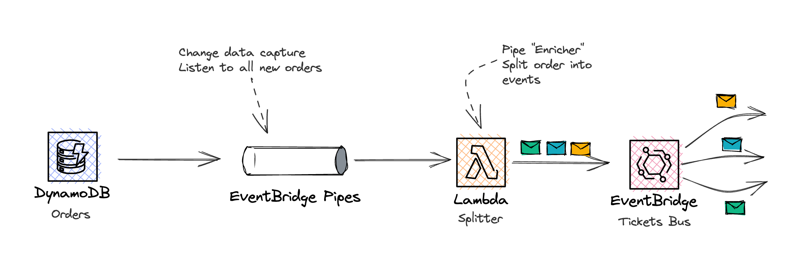

# EventBridge Pipes Splitter Pattern using DynamoDB and EventBridge as an example.



This pattern demonstrates the [Splitter pattern](https://www.enterpriseintegrationpatterns.com/patterns/messaging/Sequencer.html). It takes an event from DynamoDB and splits the event into many events using a Lambda enrichment function and sends them to EventBridge.

Learn more about this pattern at Serverless Land Patterns: https://serverlessland.com/patterns/eventbridge-pipes-splitter-pattern

Important: this application uses various AWS services and there are costs associated with these services after the Free Tier usage - please see the [AWS Pricing page](https://aws.amazon.com/pricing/) for details. You are responsible for any AWS costs incurred. No warranty is implied in this example.

## Requirements

- [Create an AWS account](https://portal.aws.amazon.com/gp/aws/developer/registration/index.html) if you do not already have one and log in. The IAM user that you use must have sufficient permissions to make necessary AWS service calls and manage AWS resources.
- [AWS CLI](https://docs.aws.amazon.com/cli/latest/userguide/install-cliv2.html) installed and configured
- [Git Installed](https://git-scm.com/book/en/v2/Getting-Started-Installing-Git)

## Deployment Instructions

1. Create a new directory, navigate to that directory in a terminal and clone the GitHub repository:
   ```bash
   git clone https://github.com/aws-samples/serverless-patterns
   ```
2. Change directory to the pattern's `cdk` directory:
   ```bash
   cd serverless-patterns/eventbridge-pipes-splitter-pattern/cdk
   ```
3. Install dependencies:
   ```bash
   npm install
   ```
4. From the command line, configure AWS CDK:
   ```bash
   cdk bootstrap ACCOUNT-NUMBER/REGION # e.g.
   cdk bootstrap 1111111111/us-east-1
   cdk bootstrap --profile test 1111111111/us-east-1
   ```
5. From the command line, use AWS CDK to deploy the AWS resources for the pattern as specified in the `lib/cdk-stack.ts` file:
   ```bash
   npm run build && cdk deploy
   ```

## How it works

This pattern creates a DDB table and EventBridge Pipe to split Orders inserted into the table into one event per ticket and sends them to EventBridge (target). For illustration purposes, the EventBridge simply routes the events to a CloudWatch log. To see the Splitter in action, insert a new record into DDB.

```sh
 # Insert a new order with three tickets into orders table
aws dynamodb put-item \
--table-name=Orders-Table \
--item '{"id":{"S":"905fa520-4d4a-4850-97c5-1d429f8c23ba"},"userId":{"S":"user123"},"tickets":{"L":[{"M":{"id":{"S":"ticket1"}}},{"M":{"id":{"S":"ticket2"}}},{"M":{"id":{"S":"ticket3"}}}]}}'
```

You can see the split events in the CloudWatch logstreams (output reduced for readability):
```sh
aws logs tail /aws/events/tickets
{"id":"04f8c52a-b70b-a0ed-deb0-fbf5ea5ecb17","detail-type":"TicketPurchased","source":"trains.tickets","time":"2023-03-10T03:26:24Z","detail":{"id":"ticket3","orderId":"905fa520-4d4a-4850-97c5-1d429f8c23ba","userId":"user123"}}
{"id":"763cdb2f-a0d5-4fb2-d39a-ceff74bb0c63","detail-type":"TicketPurchased","source":"trains.tickets","time":"2023-03-10T03:26:24Z","detail":{"id":"ticket2","orderId":"905fa520-4d4a-4850-97c5-1d429f8c23ba","userId":"user123"}}
{"id":"ee230a02-34b8-b8dd-dcbb-a7d741fb2ac3","detail-type":"TicketPurchased","source":"trains.tickets","time":"2023-03-10T03:26:24Z","detail":{"id":"ticket1","orderId":"905fa520-4d4a-4850-97c5-1d429f8c23ba","userId":"user123"}}
```

If you want to repeat this action, change the `id` field so that the command results in a new `INSERT`.

## Delete stack

```bash
cdk destroy
```

---

Copyright 2023 Amazon.com, Inc. or its affiliates. All Rights Reserved.

SPDX-License-Identifier: MIT-0
