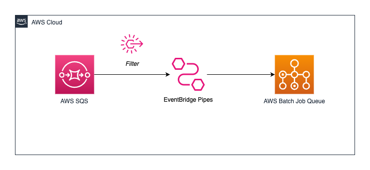

# SQS to AWS Batch Job Queue using EventBridge Pipes



This pattern demonstrates sending SQS messages directly to AWS Batch Job Queue using EventBridge Pipes with filtering.

Learn more about this pattern at Serverless Land Patterns: https://serverlessland.com/patterns/eventbridge-pipes-sqs-to-batch-sam

Important: this application uses various AWS services and there are costs associated with these services after the Free Tier usage - please see the [AWS Pricing page](https://aws.amazon.com/pricing/) for details. You are responsible for any AWS costs incurred. No warranty is implied in this example.

## Requirements

- [Create an AWS account](https://portal.aws.amazon.com/gp/aws/developer/registration/index.html) if you do not already have one and log in. The IAM user that you use must have sufficient permissions to make necessary AWS service calls and manage AWS resources.
- [AWS CLI](https://docs.aws.amazon.com/cli/latest/userguide/install-cliv2.html) installed and configured
- [Git Installed](https://git-scm.com/book/en/v2/Getting-Started-Installing-Git)
- [AWS Serverless Application Model](https://docs.aws.amazon.com/serverless-application-model/latest/developerguide/serverless-sam-cli-install.html) (AWS SAM) installed

## Deployment Instructions

1. Create a new directory, navigate to that directory in a terminal and clone the GitHub repository:
   ```
   git clone https://github.com/aws-samples/serverless-patterns
   ```
1. Change directory to the pattern directory:
   ```
   cd eventbridge-pipes-sqs-to-aws-batch-with-filters
   ```
1. From the command line, use AWS SAM to deploy the AWS resources for the pattern as specified in the template.yml file:
   ```
   sam deploy --guided
   ```
1. During the prompts:

   - Enter a stack name
   - Enter the desired AWS Region
   - Enter existing VPC ID
   - Enter private subnet 1
   - Enter private subnet 2
   - Allow SAM CLI to create IAM roles with the required permissions.

   `Note: Ensure that you have a Nat Gateway configured.`

   Once you have run `sam deploy -guided` mode once and saved arguments to a configuration file (samconfig.toml), you can use `sam deploy` in future to use these defaults.

1. Note the outputs from the SAM deployment process. These contain the resource names and/or ARNs which are used for testing.

## How it works

The template will create an SQS queue, AWS Batch Compute Environment with Fargate, Job Queue, Job Definition and pipe. Sending messages to the SQS queue will trigger the pipe to forward the messages onto the AWS Batch Job Queue.

Filtering is used to only listen to `OrderCreated` order messages from SQS (as an example to showcase filtering with pipes) and input transforms are used to map the SQS message into an AWS Batch Job Queue that can be used downstream.

Send SQS message that will sent event payload as parameter to AWS Batch Job Queue

```sh
 # Send SQS message to be sent to AWS Batch Job Queue using the filter.
 aws sqs send-message \
 --queue-url=SQS_URL \
 --message-body '{"orderId":"125a2e1e-d420-482e-8008-5a606f4b2076, "customerId": "a48516db-66aa-4dbc-bb66-a7f058c5ec24", "type": "OrderCreated"}'
```

Send SQS message that will will not sent event payload as parameter to AWS Batch Job Queue

```sh
 # Send SQS message to be sent to AWS Batch Job Queue using the filter.
 aws sqs send-message \
 --queue-url=SQS_URL \
 --message-body '{"orderId":"125a2e1e-d420-482e-8008-5a606f4b2076, "customerId": "a48516db-66aa-4dbc-bb66-a7f058c5ec24", "type": "OrderUpdated"}'
```

## Delete stack

```bash
sam delete
```

---

Copyright 2023 Amazon.com, Inc. or its affiliates. All Rights Reserved.

SPDX-License-Identifier: MIT-0
