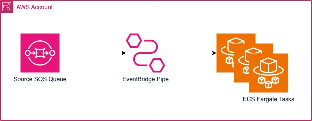

# Amazon SQS integration With Amazon Elastic Container Service Task using Amazon EventBridge Pipes 

This pattern demonstrates how to invoke an Amazon Elastic Container Service (ECS) Tasks based on selective messages from an Amazon SQS queue using Amazon EventBridge Pipes.

Learn more about this pattern at Serverless Land Patterns: https://serverlessland.com/eventbridge-pipes-sqs-to-ecs-task-cdk-typescript

Important: this application uses various AWS services and there are costs associated with these services after the Free Tier usage - please see the [AWS Pricing page](https://aws.amazon.com/pricing/) for details. You are responsible for any AWS costs incurred. No warranty is implied in this example.

## Requirements

* [Create an AWS account](https://portal.aws.amazon.com/gp/aws/developer/registration/index.html) if you do not already
  have one and log in. The IAM user that you use must have sufficient permissions to make necessary AWS service calls
  and manage AWS resources.
* [AWS CLI](https://docs.aws.amazon.com/cli/latest/userguide/install-cliv2.html) installed and configured
* [Git](https://git-scm.com/book/en/v2/Getting-Started-Installing-Git) installed
* [Node and NPM](https://nodejs.org/en/download/) installed
* [AWS Cloud Development Kit](https://docs.aws.amazon.com/cdk/latest/guide/cli.html) (AWS CDK) installed

## Getting Started
This pattern is built using the AWS Cloud Development Kit (CDK) in Typescript. The instructions below show how the pattern works, the deployment instructions, testing steps and cleanup.

### How it works
The pattern creates an Amazon SQS queue and a DLQ, an Elastic Container Service cluster and task definition, and an EventBridge Pipe to connect it all.
- the EventBridge pipe polls for new messages from the source queue. 
- the EventBridge pipe filters SQS messages matching a specific pattern and then invokes an Amazon ECS task with the message payload.

For more informations: [Amazon EventBridge Pipes with SQS ](https://docs.aws.amazon.com/eventbridge/latest/userguide/eb-pipes-sqs.html) and  [Amazon Elastic Container Service Task](https://docs.aws.amazon.com/eventbridge/latest/userguide/eb-pipes-event-target.html#pipes-targets-specifics-ecs-task)

### Architecture


### Deployment Instructions

1. Create a new directory, navigate to that directory in a terminal and clone the GitHub repository:
    ``` 
    git clone https://github.com/aws-samples/serverless-patterns
    ```

2. Change directory to the pattern directory:
    ```
    cd serverless-patterns/eventbridge-pipes-sqs-to-ecs-task-cdk-typescript
    ```
    
3. Install dependencies:

    ```
    npm install
    ```
    
4. From the command line, configure AWS CDK (unless already done):

   ```
   # cdk bootstrap <ACCOUNT-NUMBER/REGION>
   cdk bootstrap 1111111111/us-east-1
   ```

5. From the command line, use AWS CDK to deploy the AWS resources for the pattern:
   
    ```
    cdk deploy 
    ```

## Testing Steps
For testing, you will be using AWS CLI commands to send a message source SQS queue.

1. Send a test message to source SQS queue, run the below CLI command and replace the Update `--queue-url` with source SQS queue url from CDK deployment output  
    ```
    aws sqs send-message --queue-url <Source SQS Queue URL:> --message-body '{"partnerId" : "1234"}'
    ```

    Output sample response:
    ```
    {
        "MD5OfMessageBody": "f4b39404be17d540c9d76e08be475eac",
        "MessageId": "6574d665-3091-4fc6-b8a1-ea66de973f3f"
    }
    ```
2. Check the execution logs of the most recent tasks here:
    ```
    https://<region>.console.aws.amazon.com/cloudwatch/home?region=<region>#logsV2:log-groups/log-group/SQSEventBridgePipeTargetLogGroup
    ```    

## Cleanup 

1. To cleanup/delete resources created while deploying the solution, go to the root folder of the project repository and run 
    ```
    cdk destroy
    ```

You will then be prompted to confirm that you want to proceed with deleting all the stacks. This will begin the process of decommissioning the resources.

### Useful commands

 * `cdk ls`          list all stacks in the app
 * `cdk synth`       emits the synthesized CloudFormation template
 * `cdk deploy`      deploy this stack to your default AWS account/region
 * `cdk diff`        compare deployed stack with current state
 * `cdk docs`        open CDK documentation
----
Copyright 2024 Amazon.com, Inc. or its affiliates. All Rights Reserved.

SPDX-License-Identifier: MIT-0
