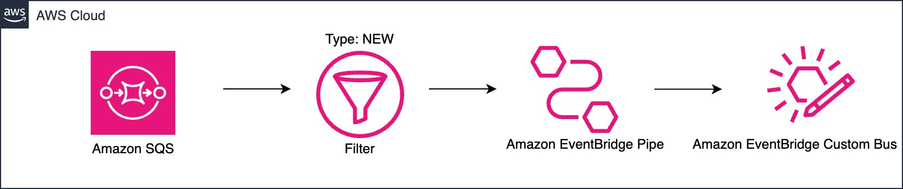

# Amazon SQS queue to Amazon EventBridge custom event bus using Amazon EventBridge Pipe

This pattern sends messages from an SQS queue to an EventBridge event bus using an EventBridge pipe.

Learn more about this pattern at Serverless Land Patterns: https://serverlessland.com/patterns/eventbridge-pipes-sqs-to-eventbus-terraform

Important: this application uses various AWS services and there are costs associated with these services after the Free Tier usage - please see the [AWS Pricing page](https://aws.amazon.com/pricing/) for details. You are responsible for any AWS costs incurred. No warranty is implied in this example.

## Requirements

* [Create an AWS account](https://portal.aws.amazon.com/gp/aws/developer/registration/index.html) if you do not already have one and log in. The IAM user that you use must have sufficient permissions to make necessary AWS service calls and manage AWS resources.
* [AWS CLI](https://docs.aws.amazon.com/cli/latest/userguide/install-cliv2.html) installed and configured
* [Git](https://git-scm.com/book/en/v2/Getting-Started-Installing-Git) installed and configured
* [Terraform](https://learn.hashicorp.com/tutorials/terraform/install-cli)  installed

## Deployment Instructions

1. Create a new directory, navigate to that directory in a terminal and clone the GitHub repository:
    ``` 
    git clone https://github.com/aws-samples/serverless-patterns
    ```
2. Change directory to the pattern directory:
    ```
    cd serverless-patterns/eventbridge-pipes-sqs-to-eventbus-terraform
    ```
3. Run the follow command to initialize, download, and install the defined providers. If you are unfamiliar with the Terraform CLI, refer Terraform [documentation](https://www.terraform.io/cli/commands) to learn more about the available commands.
    ```
    terraform init
    ```
4.  Deploy the AWS resources for the pattern as specified in the `main.tf` file. 

    Use the below command to review the changes before deploying.
    ```
    terraform plan
    ```
    Deploy:
    ```
    terraform apply --auto-approve
    ```
5. Note the output from the Terraform deployment process. These contain the resource names and/or ARNs which are used for testing.

## How it works

Please refer to the architecture diagram below:


## Testing

Once this stack is deployed in your AWS account, copy the SQS_url value from the output. Then, insert two messages to the SQS Queue as follows:

Message1:
```sh
    aws sqs send-message --queue-url <SQS_url> --message-body '{"orderId":"125a2e1e-d420-482e-8008-5a606f4b2076", "customerId": "a48516db-66aa-4dbc-bb66-a7f058c5ec24", "type": "NEW"}'

```

Message2:
```sh
    aws sqs send-message --queue-url <SQS_url> --message-body '{"orderId":"125a2e1e-d420-482e-8008-5a606f4b2076", "customerId": "a48516db-66aa-4dbc-bb66-a7f058c5ec24", "type": "OLD"}'

```

Optional: You could create an EventBridge rule with the below event pattern on the custom bus and add relevant targets. With this setup, Message2 would be filtered out by the Pipe, and only Message1 would invoke the configured EventBridge target. Ensure to delete the EventBridge rule before the clean up process.

```
{
  "source": ["myapp.demo"]
}
```

## Cleanup
 
1. Change to the below directory inside the cloned git repo:
    ```
    cd serverless-patterns/eventbridge-pipes-dynamodbstream-to-sqs-terraform
    ```
2. Delete the resources
    ```bash
    terraform destroy
    ```
3. Enter 'yes' when prompted.

4. Check if all the resources were deleted successfully.
    ```bash
    terraform show
    ```
----
Copyright 2024 Amazon.com, Inc. or its affiliates. All Rights Reserved.

SPDX-License-Identifier: MIT-0
