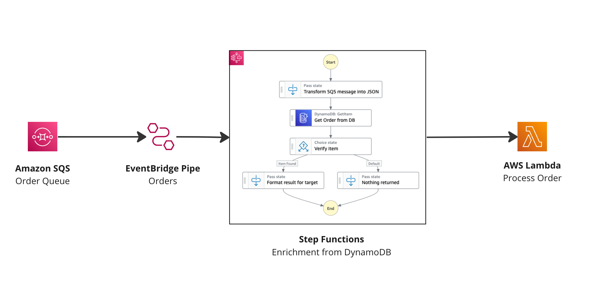

# SQS to Lambda with Step functions enrichment using EventBridge Pipes



This pattern demonstrates sending SQS messages directly to Lambda function using EventBridge Pipes with Step functions workflow to enrich the data from DynamoDB.

Learn more about this pattern at Serverless Land Patterns: https://serverlessland.com/patterns/eventbridge-pipes-sqs-to-lambda-with-stepfunction-enrichment

Important: this application uses various AWS services and there are costs associated with these services after the Free Tier usage - please see the [AWS Pricing page](https://aws.amazon.com/pricing/) for details. You are responsible for any AWS costs incurred. No warranty is implied in this example.

## Requirements

- [Create an AWS account](https://portal.aws.amazon.com/gp/aws/developer/registration/index.html) if you do not already have one and log in. The IAM user that you use must have sufficient permissions to make necessary AWS service calls and manage AWS resources.
- [AWS CLI](https://docs.aws.amazon.com/cli/latest/userguide/install-cliv2.html) installed and configured
- [Git Installed](https://git-scm.com/book/en/v2/Getting-Started-Installing-Git)
- [AWS Serverless Application Model](https://docs.aws.amazon.com/serverless-application-model/latest/developerguide/serverless-sam-cli-install.html) (AWS SAM) installed

## Deployment Instructions

1. Create a new directory, navigate to that directory in a terminal and clone the GitHub repository:
   ```
   git clone https://github.com/aws-samples/serverless-patterns
   ```
1. Change directory to the pattern directory:
   ```
   cd eventbridge-pipes-sqs-to-lambda-with-stepfunction-enrichment
   ```
1. From the command line, use AWS SAM to deploy the AWS resources for the pattern as specified in the template.yml file:
   ```
   sam deploy --guided
   ```
1. During the prompts:

   - Enter a stack name
   - Enter the desired AWS Region
   - Allow SAM CLI to create IAM roles with the required permissions.

   Once you have run `sam deploy -guided` mode once and saved arguments to a configuration file (samconfig.toml), you can use `sam deploy` in future to use these defaults.

1. Note the outputs from the SAM deployment process. These contain the resource names and/or ARNs which are used for testing.

## How it works

The template will create an SQS queue, Lambda function, Step function workflow (for enrichment) and an EventBridge Pipe to connect it all.

The Step function workflow will enrich events before they reach the Lambda function. Any events that cannot be enriched (not found in the database in this example) will be ignored and will not trigger the Lambda function.

First make sure you have some data in the DDB table you created.

```sh
aws dynamodb put-item \
--table-name=sqs-lambda-enrichment2-orders \
--item '{"Id": {"S": "905fa520-4d4a-4850-97c5-1d429f8c23ba"}, "CustomerId": {"S": "50a69138-f04c-4080-8c86-da34853563bfy"}, "OrderStatus": {"S": "CREATED"}, "OrderTotal": {"N": "85"}}'
```

Next send an SQS message to your SQS queue you created as part of this pattern. This will trigger the Pipe and your Lambda will be triggered with enriched data.

```sh
 # Send SQS message to be sent to EventBridge using the filter.
 # Trigger SQS message
 aws sqs send-message \
 --queue-url=QUEUE_URL \
 --message-body '{"order_id":"905fa520-4d4a-4850-97c5-1d429f8c23ba"}'
```

## Delete stack

```bash
sam delete
```

---

Copyright 2022 Amazon.com, Inc. or its affiliates. All Rights Reserved.

SPDX-License-Identifier: MIT-0
