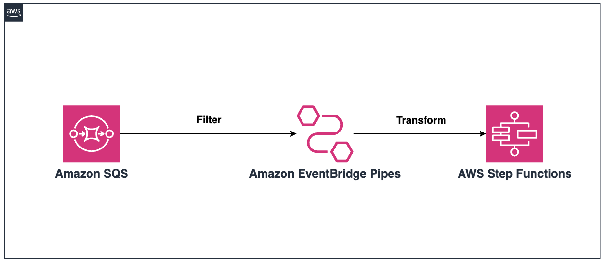

# Amazon EventBridge Pipes: SQS to Step Functions with Filtering and Transformation (Terraform)

The purpose of this pattern is to demonstrate how to use Amazon EventBridge Pipes to connect an Amazon SQS queue with an AWS Step Functions state machine. The pipe applies a filter and transformation before triggering the Step Functions workflow.

In this architecture, EventBridge Pipes receives messages from the SQS queue, filters them based on a specific condition, transforms the message format, and then invokes the Step Functions state machine.

The pipe will filter messages where the status is "COMPLETE" and transform the message structure before sending it to Step Functions.

Learn more about this pattern at [Serverless Land Patterns](https://serverlessland.com/patterns/eventbridge-pipes-sqs-to-stepfunctions-terraform).

Important: this application uses various AWS services and there are costs associated with these services after the Free Tier usage - please see the [AWS Pricing page](https://aws.amazon.com/pricing/) for details. You are responsible for any AWS costs incurred. No warranty is implied in this example.

## Requirements

* [Create an AWS account](https://portal.aws.amazon.com/gp/aws/developer/registration/index.html) if you do not already have one and log in. The IAM user that you use must have sufficient permissions to make necessary AWS service calls and manage AWS resources.
* [AWS CLI](https://docs.aws.amazon.com/cli/latest/userguide/install-cliv2.html) installed and configured
* [Git Installed](https://git-scm.com/book/en/v2/Getting-Started-Installing-Git)
* [Terraform](https://learn.hashicorp.com/tutorials/terraform/install-cli?in=terraform/aws-get-started) installed

## Deployment Instructions

1. Clone the project to your local working directory

   ```sh
   git clone https://github.com/aws-samples/serverless-patterns/ 
   ```

2. Change the working directory to this pattern's directory

   ```sh
   cd serverless-patterns/eventbridge-pipes-sqs-to-stepfunctions-terraform
   ```

3. From the command line, initialize terraform to  to downloads and installs the providers defined in the configuration:
    ```
    terraform init
    ```

4. From the command line, apply the configuration in the main.tf file:
    ```
    terraform apply
    ```

5. During the prompts:
   - Enter yes

## How it works



This pattern deploys an Amazon SQS queue, an AWS Step Functions state machine, an Amazon EventBridge Pipe, and all of the necessary IAM roles and policies.

The EventBridge Pipe connects the SQS queue to the Step Functions state machine. It filters messages from the SQS queue where the status is "COMPLETE". The pipe then transforms the message using a specified input template before invoking the Step Functions state machine.

Note: The default region is `us-west-2`, it can also be changed using the variable `region`.

**Note:** Variables can be supplied in different options, check the [Terraform documentation](https://developer.hashicorp.com/terraform/language/values/variables) for more details.

## Testing


To test this pattern, follow these steps:

1. Use the AWS CLI or AWS Management Console to send messages to the SQS queue. Ensure some messages have a status of "COMPLETE".

   Example message:

    {
      "id": "12345",
      "team": "Red Team",
      "status": "COMPLETE"
    }

    # Message that should trigger the pipe (status: COMPLETE)
    aws sqs send-message --queue-url YOUR_QUEUE_URL --message-body '{"id": "12345", "team": "Red Team", "status": "COMPLETE"}'

    # Message that should not trigger the pipe (status: PENDING)
    aws sqs send-message --queue-url YOUR_QUEUE_URL --message-body '{"id": "67890", "team": "Blue Team", "status": "PENDING"}'

    Replace YOUR_QUEUE_URL with the URL of your SQS queue, which you can find in the Terraform outputs or the AWS Console.

2. Check the Step Functions executions:

    a. Go to the AWS Step Functions console.

    b. Find your state machine (the name should be "target-state-machine" if you used the provided Terraform code).

    c. Check the "Executions" tab. You should see new executions for messages with status "COMPLETE", but not for other statuses.

3. Verify that only messages with status "COMPLETE" triggered the state machine, and that the input to the state machine matches the transformed format specified in the pipe configuration.

## Cleanup

1. Change directory to the pattern directory:
    ```sh
    cd serverless-patterns/eventbridge-pipes-sqs-to-stepfunctions-terraform
    ```

2. Delete all created resources
    ```sh
    terraform destroy
    ```

3. During the prompts:
    * Enter yes

4. Confirm all created resources has been deleted
    ```sh
    terraform show
    ```

## Reference
- [Amazon EventBridge Pipes](https://docs.aws.amazon.com/eventbridge/latest/userguide/eb-pipes.html)
- [Amazon SQS](https://docs.aws.amazon.com/AWSSimpleQueueService/latest/SQSDeveloperGuide/welcome.html)
- [AWS Step Functions](https://docs.aws.amazon.com/step-functions/latest/dg/welcome.html)

----
Copyright 2023 Amazon.com, Inc. or its affiliates. All Rights Reserved.

SPDX-License-Identifier: MIT-0