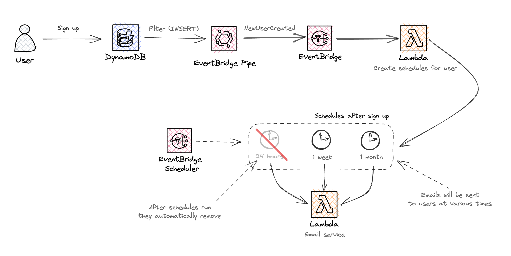

# Dynamic schedules with auto deletion with Amazon EventBridge Scheduler
Event-driven pattern that creates three schedules when records get added to a DynamoDB table. These schedules trigger an email service and are automatically deleted.



Learn more about this pattern at Serverless Land Patterns: https://serverlessland.com/patterns/eventbridge-schedule-dynamic-with-auto-deletion.

Important: this application uses various AWS services and there are costs associated with these services after the Free Tier usage - please see the [AWS Pricing page](https://aws.amazon.com/pricing/) for details. You are responsible for any AWS costs incurred. No warranty is implied in this example.


## Requirements

- [Create an AWS account](https://portal.aws.amazon.com/gp/aws/developer/registration/index.html) if you do not already have one and log in. The IAM user that you use must have sufficient permissions to make necessary AWS service calls and manage AWS resources.
- [AWS CLI](https://docs.aws.amazon.com/cli/latest/userguide/install-cliv2.html) installed and configured
- [Git Installed](https://git-scm.com/book/en/v2/Getting-Started-Installing-Git)
- [AWS CDK](https://docs.aws.amazon.com/cdk/latest/guide/cli.html) installed and configured

## Deployment Instructions

1. Create a new directory, navigate to that directory in a terminal and clone the GitHub repository:
   ```bash
   git clone https://github.com/aws-samples/serverless-patterns
   ```
2. Change directory to the pattern directory:
   ```bash
   cd serverless-patterns/eventbridge-schedule-dynamic-with-auto-deletion/src
   ```
3. Install dependencies:
   ```bash
   npm install
   ```
4. From the command line, configure AWS CDK:
   ```bash
   cdk bootstrap ACCOUNT-NUMBER/REGION # e.g.
   cdk bootstrap 1111111111/us-east-1
   cdk bootstrap --profile test 1111111111/us-east-1
   ```
5. From the command line, use AWS CDK to deploy the AWS resources for the pattern as specified in the `lib/src-stack.ts` file:
   ```bash
   npm run build && cdk deploy
   ```

## How it works

- New record is inserted into DynamoDB (new user signs up)
- EventBridge Pipes is used to connect the DynamoDB stream to EventBridge.
- Every time an `INSERT` happens, a new EventBridge event is raised `NewUserCreated`
- ScheduleCreator Lambda function is then triggered, creating three schedules for the user using Amazon EventBridge Scheduler.
- All schedules are removed once they run (auto deletion).
- Each schedule triggers the `Email Service` Lambda function. (Placeholder of what an email service could be.)

## Testing

Deploy the stack and run the script:

```sh
sh src/insert-record.sh
```

This script will insert a new record into your new database `ServerlessLandUsers`. Then open the console and go to EventBridge Schedules. You will see three schedules created for each user (2 minutes from creation, 24 hours and 1 week).

## Cleanup

1. Delete the stack
   ```bash
   cdk destroy
   ```

---

Copyright 2023 Amazon.com, Inc. or its affiliates. All Rights Reserved.

SPDX-License-Identifier: MIT-0