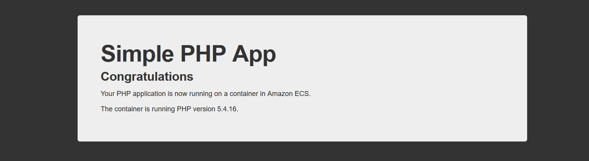

# # Amazon EventBridge Schedule to Amazon Elastic Container Service(ECS)

This pattern will create an [EventBridge Scheduler](https://docs.aws.amazon.com/scheduler/latest/UserGuide/getting-started.html) to run a task in Amazon [Elastic Container Service](https://docs.aws.amazon.com/AmazonECS/latest/developerguide/getting-started.html) cluster every 5 minutes. The pattern is deployed using the Terraform. The pattern uses a sample image from docker public registry (https://hub.docker.com/r/amazon/amazon-ecs-sample).  

Important: this application uses various AWS services and there are costs associated with these services after the Free Tier usage - please see the AWS Pricing page for details. You are responsible for any AWS costs incurred. No warranty is implied in this example.

## Requirements

* [Create an AWS account](https://portal.aws.amazon.com/gp/aws/developer/registration/index.html) if you do not already have one
  and log in. The IAM user that you use must have sufficient permissions to make necessary AWS service calls and manage AWS
  resources.
* [AWS CLI](https://docs.aws.amazon.com/cli/latest/userguide/install-cliv2.html) installed and configured
* [Git Installed](https://git-scm.com/book/en/v2/Getting-Started-Installing-Git)
* [Terraform](https://learn.hashicorp.com/tutorials/terraform/install-cli?in=terraform/aws-get-started) installed

## Deployment Instructions

1. Create a new directory, navigate to that directory in a terminal and clone the GitHub repository:
    ``` 
    git clone https://github.com/aws-samples/serverless-patterns
    ```
2. Change directory to the pattern directory:
    ```
    cd eventbridge-schedule-ecs-terraform
    ```
3. Make the following changes in the [terraform script](main.tf):
    - Line 11 - Replace the placeholder "REPLACE_ME_WITH_AWS_REGION" with the AWS region where the script will deploy resources
    - Line 13 - Replace the placeholder "REPLACE_ME_WITH_AWS_VPC_CIDRS" with the AWS VPC CIDRs that will be associated with the vpc
    - Line 14 - Replace the placeholder "REPLACE_ME_WITH_AWS_AVAILABILITY_ZONES" with the AWS availability zones where the script will deploy resources. It can be an array of availability zones
    - Line 15 - Replace the placeholder "REPLACE_ME_WITH_AWS_PUBLIC_SUBNETS" with the AWS subnets that will be public and associated with the vpc. It can be an array of subnets
    - Line 16 - Replace the placeholder "REPLACE_ME_WITH_AWS_PRIVATE_SUBNETS" with the AWS private subnets that will be associated with the vpc. It can be an array of subnets

     ``` 
    #Sample Configuration
        locals{
           region        = "us-east-1"
           container_image = "amazon/amazon-ecs-sample"
           vpc_cidr = "10.10.0.0/16"
           availability_zones = ["us-east-1a", "us-east-1b"]
           public_subnets     = ["10.10.100.0/24", "10.10.101.0/24"]
           private_subnets    = ["10.10.0.0/24", "10.10.1.0/24"]
        }

    ``` 
4. From the command line, initialize terraform:
    ```
    terraform init
    ```
5. From the command line, apply the configuration in the main.tf file and follow the prompts:
    ```
    terraform apply
    ```

## How it works

An Amazon EventBridge Schedule is created that run the sample task in an Amazon ECS cluster every 5 minutes. Along with a schedule, the Terraform stack creates VPC, ECS Cluster, Fargate Task Definition, Container Definition, an IAM role and policy for Amazon EventBridge scheduler to assume and run task in Amazon ECS cluster

## Testing

1. After deployment, a new schedule will be created in the Amazon EventBridge. Check the Amazon EventBridge console and go to the schedule section
2. The schedule will trigger a new Amazon ECS task in every 5 minutes. The tasks are visible in the Amazon Elastic Container Service clusters section
2. Open any running task from Amazon Elastic Container Service console and click on the public IP listed there. A sample php page will open in a new browser window or tab
     


## Cleanup
 
1. Change directory to the pattern directory:
    ```
    cd eventbridge-schedule-ecs-terraform
    ```
2. Delete all created resources and follow prompts:
    ```
    terraform destroy
    ```
   Note sometimes Terraform will timeout if active tasks are running on the Amazon Elastic Container Service cluster. Please stop the tasks from Amazon ECS cluser console before running terraform destroy command
----
Copyright 2023 Amazon.com, Inc. or its affiliates. All Rights Reserved.

SPDX-License-Identifier: MIT-0
