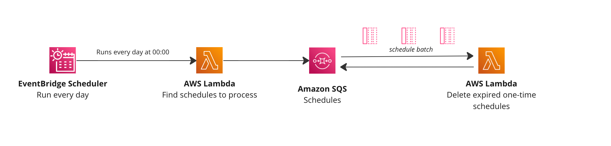

# EventBridge Scheduler Sweaper: Remove one-time schedules 



Pattern that will run every day at 00:00 and will delete any one-time schedules that have expired (2 days after they run).

## The Problem

EventBridge Scheduler supports one-time schedules, after they run it is up to the developer to remove them from their account. These schedules are included in your account quota even if they have run/expired.

The EventBridge team are aware of this and are looking to add some updates in the future, but in the mean time this pattern was created to help you.

## How it works

1. Schedule is run every day at 00:00
2. Schedules are scanned for processing
3. Schedules are processed at one-time schedules are picked out
4. One-time schedules dates are checked. 
5. If the one-time schedule is over 2 days old the schedule is removed from your account.

## How to run

You have a couple of options to run the pattern

1. Wait until 0:00 and the pattern will run
2. Manually trigger the `FindSchedules` function

Triggering the `FindSchedules` function will trigger and start the process.

Try running with Node Version 18.x

## Important things to know

Your one-time schedules might still be in your account, and might not have processed (failure). This pattern does not check if your schedule has run or not, it just removes them based on the timesamp of the schedule.

If you have 10000s of one-time schedules this pattern may not work.

---
---

Important: this application uses various AWS services and there are costs associated with these services after the Free Tier usage - please see the [AWS Pricing page](https://aws.amazon.com/pricing/) for details. You are responsible for any AWS costs incurred. No warranty is implied in this example.

## Requirements

* [Create an AWS account](https://portal.aws.amazon.com/gp/aws/developer/registration/index.html) if you do not already have one and log in. The IAM user that you use must have sufficient permissions to make necessary AWS service calls and manage AWS resources.
* [AWS CLI](https://docs.aws.amazon.com/cli/latest/userguide/install-cliv2.html) installed and configured
* [Git Installed](https://git-scm.com/book/en/v2/Getting-Started-Installing-Git)
* [AWS Serverless Application Model](https://docs.aws.amazon.com/serverless-application-model/latest/developerguide/serverless-sam-cli-install.html) (AWS SAM) installed

## Deployment Instructions

1. Create a new directory, navigate to that directory in a terminal and clone the GitHub repository:
    ``` 
    git clone https://github.com/aws-samples/serverless-patterns
    ```
1. Change directory to the pattern directory:
    ```
    cd eventbridge-schedule-remove-one-time-schedules
    ```
1. From the command line, use AWS SAM to deploy the AWS resources for the pattern as specified in the template.yml file:
    ```
    sam deploy --guided
    ```
1. During the prompts:
    * Enter a stack name
    * Enter the desired AWS Region
    * Allow SAM CLI to create IAM roles with the required permissions.

    Once you have run `sam deploy --guided` mode once and saved arguments to a configuration file (samconfig.toml), you can use `sam deploy` in future to use these defaults.

1. Note the outputs from the SAM deployment process. These contain the resource names and/or ARNs which are used for testing.

## Cleanup
 
1. Delete the stack
    ```bash
    sam delete
    ```
----
Copyright 2022 Amazon.com, Inc. or its affiliates. All Rights Reserved.

SPDX-License-Identifier: MIT-0
