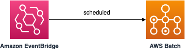
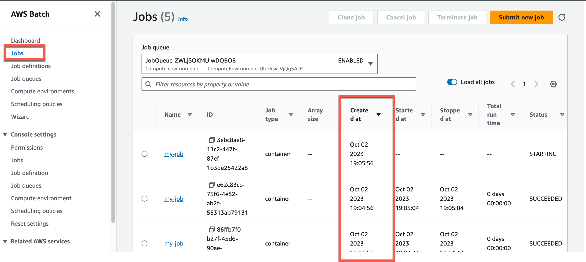
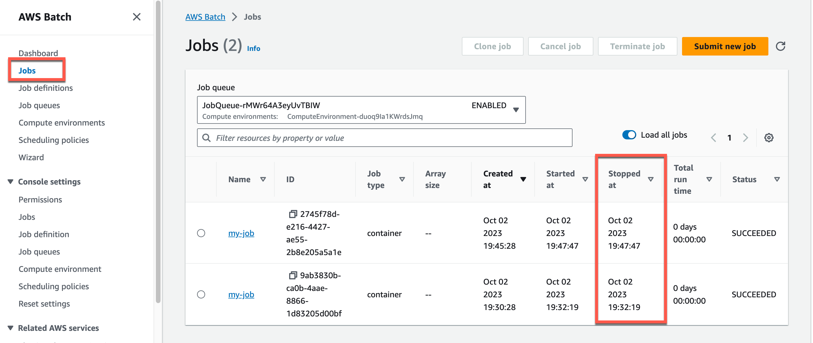

# Amazon EventBridge Scheduled invocation to AWS Batch using SAM

This SAM template creates an Amazon EventBus, EventRule with scheduluer having target as AWS Batch and IAM Role with the required permission to invoke AWS Batch periodically from Amazon EventBridge.

Learn more about this pattern at Serverless Land Patterns: https://serverlessland.com/patterns/eventbridge-scheduled-batch-sam.


Important: this application uses various AWS services and there are costs associated with these services after the Free Tier usage - please see the [AWS Pricing page](https://aws.amazon.com/pricing/) for details. You are responsible for any AWS costs incurred. No warranty is implied in this example.

## Requirements

* [Create an AWS account](https://portal.aws.amazon.com/gp/aws/developer/registration/index.html) if you do not already have one and log in. The IAM user that you use must have sufficient permissions to make necessary AWS service calls and manage AWS resources.
* [AWS CLI](https://docs.aws.amazon.com/cli/latest/userguide/install-cliv2.html) installed and configured
* [Git Installed](https://git-scm.com/book/en/v2/Getting-Started-Installing-Git)
* [AWS Serverless Application Model](https://docs.aws.amazon.com/serverless-application-model/latest/developerguide/serverless-sam-cli-install.html) (AWS SAM) installed

## Deployment Instructions

1. Create a new directory, navigate to that directory in a terminal and clone the GitHub repository:
    ``` 
    git clone https://github.com/aws-samples/serverless-patterns
    ```
1. Change directory to the pattern directory:
    ```
    cd serverless-patterns/eventbridge-scheduled-batch-sam
    ```
1. From the command line, use AWS SAM to deploy the AWS resources for the pattern as specified in the template.yml file:
    ```
    sam deploy --guided
    ```
1. During the prompts:
    * Enter a stack name
    * Enter the desired AWS Region
    * Allow SAM CLI to create IAM roles with the required permissions.

    Once you have run `sam deploy --guided` mode once and saved arguments to a configuration file (samconfig.toml), you can use `sam deploy` in future to use these defaults.

1. Note the outputs from the SAM deployment process. These contain the resource names and/or ARNs which are used for testing.

## How it works

The AWS SAM template deploys the resources and the IAM permissions required to run the application.

The EventBridge rule specified in `template.yaml` used default Event Bus to schedule trigger for AWS Batch. There are two ways to schedule the trigger - using cron expression or using rate. The template has examples for both. Please uncomment the want you want to test. AWS Batch job is triggered based on the specified schedule. Please refer to the architecture diagram below:


## Testing

Use the [AWS CLI](https://aws.amazon.com/cli/) to send a test event to EventBridge and observe that it triggers AWS Batch Job:


1. Go to [AWS Batch console](https://console.aws.amazon.com/batch/home), navigate to `Jobs`, select the correct `Job queue`. It should show the Job that got invoked from EventBridge.
Scheduled using rate():

Scheduled using cron():


## Cleanup
 
1. Delete the stack
    ```bash
    sam delete
    ```

----
Copyright 2023 Amazon.com, Inc. or its affiliates. All Rights Reserved.

SPDX-License-Identifier: MIT-0
