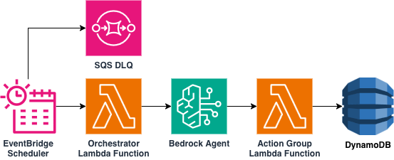

# Amazon EventBridge Scheduler to Amazon Bedrock AI Agent

This pattern demonstrates how to trigger an Amazon Bedrock AI Agent on a recurring schedule using Amazon EventBridge Scheduler. An orchestrator AWS Lambda function, invoked by the scheduler, sends a task payload to the Bedrock Agent, which processes the input, generates an execution summary, and persists the result to a Amazon DynamoDB table via an action group Lambda.

Learn more about this pattern at Serverless Land Patterns: https://serverlessland.com/patterns/eventbridge-scheduler-ai-agent-trigger

Important: this application uses various AWS services and there are costs associated with these services after the Free Tier usage - please see the [AWS Pricing page](https://aws.amazon.com/pricing/) for details. You are responsible for any AWS costs incurred. No warranty is implied in this example.

## Requirements

* [Create an AWS account](https://portal.aws.amazon.com/gp/aws/developer/registration/index.html) if you do not already have one and log in. The IAM user that you use must have sufficient permissions to make necessary AWS service calls and manage AWS resources.
* [AWS CLI](https://docs.aws.amazon.com/cli/latest/userguide/install-cliv2.html) installed and configured
* [Git Installed](https://git-scm.com/book/en/v2/Getting-Started-Installing-Git)
* [Terraform](https://www.terraform.io/downloads.html) >= 1.0 installed

## Architecture



The pattern deploys the following resources:

1. **Amazon EventBridge Scheduler** – Triggers the orchestrator Lambda on a recurring schedule (default: `rate(1 hour)`).
2. **Orchestrator Lambda** (Python 3.14) – Receives the scheduler event and invokes the Bedrock Agent with a task payload.
3. **Amazon Bedrock Agent** – Processes the task payload, generates an execution summary using a foundation model (default: Claude 3 Haiku), and calls the action group.
4. **Action Group Lambda** (Python 3.14) – Persists execution records to DynamoDB.
5. **Amazon DynamoDB Table** – Stores task execution records.
6. **Amazon SQS Dead-Letter Queue** – Captures failed scheduler invocations after retries are exhausted.

## Deployment Instructions

1. Clone the repository:
    ```
    git clone https://github.com/aws-samples/serverless-patterns
    ```
1. Change directory to the pattern directory:
    ```
    cd serverless-patterns/eventbridge-scheduler-ai-agent-trigger
    ```
1. Initialize Terraform:
    ```
    terraform init
    ```
1. Deploy the infrastructure:
    ```
    terraform apply -auto-approve
    ```
    During the prompts, provide values for:
    * `aws_region` – AWS region (e.g. `us-east-1`)
    * `prefix` – Unique prefix for all resource names

1. Note the outputs from the deployment. These contain the resource names and ARNs used for testing.

## How it works

1. EventBridge Scheduler fires on the configured schedule and invokes the orchestrator Lambda with a JSON payload containing `taskType`, `scheduleName`, and `scheduledTime`.
2. The orchestrator Lambda calls `bedrock-agent-runtime:InvokeAgent` with the payload, targeting the agent alias.
3. The Bedrock Agent parses the payload, generates an executive summary using the foundation model, and calls the `recordTaskExecution` action group.
4. The action group Lambda writes the execution record (task ID, type, scheduled time, summary, and recorded timestamp) to the DynamoDB table.
5. If the scheduler invocation fails after 3 retries, the event is sent to the SQS dead-letter queue.

## Testing

1. Replace `<prefix>` with the prefix chosen during deployment and invoke the orchestrator Lambda function manually:
    ```
    aws lambda invoke \
      --function-name <prefix>-agent-orchestrator \
      --payload '{"taskType":"scheduled-report","scheduleName":"manual-test","scheduledTime":"2026-03-13T10:00:00Z"}' \
      --cli-binary-format raw-in-base64-out \
      output.json
    ```
2. Check the DynamoDB table for the new execution record:
    ```
    aws dynamodb scan --table-name <prefix>-agent-task-executions
    ```

## Cleanup

1. Destroy the stack:
    ```
    terraform destroy --auto-approve
    ```
1. Confirm all resources have been removed:
    ```
    terraform show
    ```
----
Copyright 2026 Amazon.com, Inc. or its affiliates. All Rights Reserved.

SPDX-License-Identifier: MIT-0
