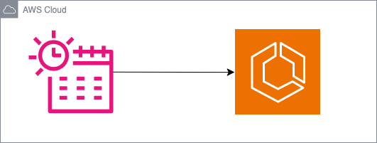

# Amazon EventBridge to ECS Cron Pattern

This pattern demonstrates how to use Amazon EventBridge to schedule and trigger Amazon ECS tasks on a cron schedule using Terraform. The pattern provides a serverless, cost-effective solution for running scheduled containerized workloads.

**What the sample job does:**
- Fetches data from a public API (JSONPlaceholder)
- Processes the data (calculates statistics like average word count, longest/shortest posts)
- Generates a summary report
- Logs structured JSON output to CloudWatch

## Requirements

* [Create an AWS account](https://portal.aws.amazon.com/gp/aws/developer/registration/index.html) if you do not already have one and log in. The IAM user that you use must have sufficient permissions to make necessary AWS service calls and manage AWS resources.
* [AWS CLI](https://docs.aws.amazon.com/cli/latest/userguide/install-cliv2.html) installed and configured
* [Terraform](https://learn.hashicorp.com/tutorials/terraform/install-cli) (>= 1.0) installed
* [Docker](https://docs.docker.com/get-docker/) installed and **running locally** — Terraform builds and pushes the container image to ECR during `terraform apply`. If Docker is not running, the deployment will fail at the image build step. Verify Docker is running with:
  ```bash
  docker info
  ```

## Deployment Instructions

This pattern is designed to work out-of-the-box with sensible defaults. You can deploy immediately or customize as needed.

### Quick Start (Minimal Configuration)

1. **Clone the repository**
   ```bash
   git clone https://github.com/aws-samples/serverless-patterns
   cd eventbridge-scheduled-ecs-terraform-python
   ```

2. **Ensure Docker is running**
   ```bash
   docker info
   ```
   If this command fails, start Docker Desktop (macOS/Windows) or the Docker daemon (`sudo systemctl start docker` on Linux) before proceeding.

3. **Deploy** (Terraform handles ECR creation, Docker build, and push automatically)
   ```bash
   terraform init
   terraform apply
   ```

   This will create:
   - ECR repository, build the Python app Docker image, and push it
CannotPullContainerError: pull image manifest has been retried 7 time(s): image Manifest does not contain descriptor matching platform 'linux/amd64'   - ECS cluster (Fargate) with task definition
   - EventBridge rule that triggers every 5 minutes (default, for testing)
   - IAM roles for ECS task execution, task application, and EventBridge
   - CloudWatch log group with 14-day retention
   - Security group with outbound internet access
   - Auto-discovered networking (default VPC and subnets)

### Custom Configuration

For production use, create a `terraform.tfvars` file:

```hcl
# Basic configuration
project_name = "my-batch-job"
environment = "prod"
schedule_expression = "cron(0 2 * * ? *)"  # Daily at 2 AM UTC

# Container configuration
task_definition = {
  cpu    = 512
  memory = 1024
  environment_variables = {
    LOG_LEVEL = "info"
  }
}
```

Then deploy:
```bash
terraform init
terraform plan
terraform apply
```

## Architecture



1. **EventBridge Rule** triggers on the configured schedule (default: `rate(5 minutes)`)
2. **ECS Fargate Task** is launched in the default VPC using the container image from ECR
3. **Python App** fetches data from a public API, processes it, and generates a summary report
4. **CloudWatch Logs** captures structured JSON logs from the task execution

## How it works

1. **EventBridge Rule** is configured with a cron or rate expression to trigger on schedule
2. **ECS Task** is launched in a Fargate cluster when the rule triggers
3. **Container** executes your application code with specified environment variables
4. **CloudWatch Logs** captures all task execution logs for monitoring and debugging

## Testing

After deployment, the ECS task is triggered automatically by EventBridge based on the configured schedule. The default schedule is `rate(5 minutes)`, so you need to wait up to 5 minutes for the first task to run. If you customized the `schedule_expression` variable (e.g., `cron(0 2 * * ? *)`), the task will only run at that scheduled time.

1. **Check EventBridge rule and its schedule**:
   ```bash
   aws events list-rules --name-prefix eventbridge-ecs-cron-dev
   ```
   Note the `ScheduleExpression` in the output — this tells you when the next trigger will occur.

2. **Wait for the scheduled trigger**, then check if the ECS task ran:
   ```bash
   aws ecs list-tasks --cluster eventbridge-ecs-cron-dev-cluster --desired-status STOPPED
   ```
   If the list is empty, the schedule hasn't triggered yet. Wait for the next scheduled interval and try again.

3. **View the task logs in CloudWatch**:
   ```bash
   aws logs tail "/aws/ecs/eventbridge-ecs-cron-dev-task" --since 10m
   ```

   You should see structured JSON output like:
   ```json
   {"timestamp":"...","level":"INFO","message":"=== Starting Data Processing Job ===",...}
   {"timestamp":"...","level":"INFO","message":"Fetching sample data from API",...}
   {"timestamp":"...","level":"INFO","message":"Successfully fetched 100 posts from API",...}
   {"timestamp":"...","level":"INFO","message":"Report generated successfully",...}
   {"timestamp":"...","level":"INFO","message":"=== Job Completed Successfully ===","duration_seconds":...,"posts_processed":100}
   ```

4. **Alternatively, trigger a run manually** (without waiting for the schedule):
   ```bash
   aws ecs run-task \
     --cluster eventbridge-ecs-cron-dev-cluster \
     --task-definition eventbridge-ecs-cron-dev-task \
     --launch-type FARGATE \
     --network-configuration 'awsvpcConfiguration={subnets=["<your-subnet-id>"],securityGroups=["<your-sg-id>"],assignPublicIp="ENABLED"}'
   ```

## AWS services used

- [Amazon EventBridge](https://aws.amazon.com/eventbridge/) - Event bus service for scheduling
- [Amazon ECS](https://aws.amazon.com/ecs/) - Container orchestration service
- [AWS Fargate](https://aws.amazon.com/fargate/) - Serverless compute for containers
- [Amazon ECR](https://aws.amazon.com/ecr/) - Container image registry
- [Amazon CloudWatch](https://aws.amazon.com/cloudwatch/) - Monitoring and logging service
- [AWS IAM](https://aws.amazon.com/iam/) - Identity and access management

## Key Features

- **Zero Configuration Deployment**: Works out-of-the-box with sensible defaults
- **Auto-Discovery**: Automatically discovers default VPC and creates necessary security groups
- **Comprehensive Monitoring**: Built-in CloudWatch metrics and logging
- **Error Handling**: EventBridge retry policies for failed executions
- **Cost Optimized**: Uses Fargate with minimal resource allocation
- **Production Ready**: Includes security best practices and monitoring
- **Flexible Scheduling**: Supports both cron expressions and rate expressions
- **Infrastructure as Code**: Complete Terraform configuration

## Configuration Options

### Schedule Expressions

EventBridge supports both cron and rate expressions:

```hcl
# Cron expressions (6 fields: minute hour day-of-month month day-of-week year)
schedule_expression = "cron(0 9 * * ? *)"        # Daily at 9 AM UTC
schedule_expression = "cron(0 */6 * * ? *)"       # Every 6 hours
schedule_expression = "cron(0 9 ? * MON-FRI *)"   # Weekdays at 9 AM UTC

# Rate expressions
schedule_expression = "rate(1 hour)"               # Every hour
schedule_expression = "rate(30 minutes)"           # Every 30 minutes
schedule_expression = "rate(1 day)"                # Daily
```

### Container Configuration

```hcl
task_definition = {
  # Resource allocation
  cpu    = 256    # 256, 512, 1024, 2048, 4096, 8192, 16384
  memory = 512    # Must be compatible with CPU selection
  
  # Environment variables passed to the container
  environment_variables = {
    LOG_LEVEL = "info"
  }
}
```

The container image is built automatically from `src/` and pushed to an ECR repository managed by Terraform. To customize the application, modify `src/app.py`.

### Logging Configuration

```hcl
# Log retention
log_retention_days = 14  # 1, 3, 5, 7, 14, 30, 60, 90, 120, 150, 180, 365, etc.
```

## Useful commands

- `terraform init` - Initialize Terraform working directory
- `terraform plan` - Preview changes before applying
- `terraform apply` - Create or update infrastructure
- `terraform destroy` - Remove all created resources
- `aws events list-rules` - List EventBridge rules
- `aws ecs list-clusters` - List ECS clusters
- `aws ecs list-tasks --cluster <cluster-name>` - List running tasks
- `aws logs describe-log-groups` - List CloudWatch log groups

## Troubleshooting

| Issue | Cause | Solution |
|-------|-------|----------|
| `terraform apply` fails at Docker build | Docker not running | Run `docker info` to verify Docker is running. Start Docker Desktop or daemon first |
| Task fails to start | IAM permissions, image not found | Check task execution role permissions, verify container image exists in ECR |
| EventBridge rule not triggering | Invalid cron expression, disabled rule | Validate cron syntax, ensure rule is enabled |
| No tasks appear after 5 minutes | Network or IAM issue | Check CloudWatch logs, verify subnets have internet access (public IP enabled) |
| Network connectivity issues | VPC configuration, security groups | Check subnet internet access, verify security group rules |
| Container exits immediately | Application error, missing environment variables | Review CloudWatch logs, check environment configuration |

## Security

This pattern implements security best practices:

- **Least Privilege IAM**: Each service has minimal required permissions
- **Network Isolation**: Tasks run in VPC with controlled network access
- **Encryption**: CloudWatch logs are encrypted at rest
- **No Hardcoded Secrets**: Use AWS Systems Manager Parameter Store or Secrets Manager for sensitive data

## Cost Optimization

- **Right-sizing**: Start with minimal CPU/memory and scale based on actual usage
- **Log Retention**: Configure appropriate log retention periods (default: 14 days)
- **Fargate Spot**: Consider using Spot pricing for non-critical workloads
- **Resource Tagging**: All resources are tagged for cost tracking and management

## Cleanup

To remove all resources and avoid ongoing charges:

```bash
terraform destroy
```

Confirm the destruction by typing `yes` when prompted.

## Additional Resources

- [Amazon EventBridge User Guide](https://docs.aws.amazon.com/eventbridge/latest/userguide/)
- [Amazon ECS Developer Guide](https://docs.aws.amazon.com/AmazonECS/latest/developerguide/)
- [AWS Fargate User Guide](https://docs.aws.amazon.com/AmazonECS/latest/userguide/what-is-fargate.html)
- [EventBridge Cron Expressions](https://docs.aws.amazon.com/eventbridge/latest/userguide/eb-create-rule-schedule.html)
- [Terraform AWS Provider Documentation](https://registry.terraform.io/providers/hashicorp/aws/latest/docs)

---

Copyright 2026 Amazon.com, Inc. or its affiliates. All Rights Reserved.

SPDX-License-Identifier: MIT-0