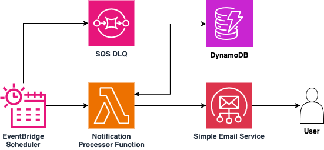

# Amazon EventBridge Scheduler to AWS Lambda to Amazon SES

This pattern demonstrates how to use Amazon EventBridge Scheduler to drive per-customer abandoned cart email notifications on an hourly cadence. A Lambda function, invoked by the scheduler, queries a DynamoDB GSI for customers with abandoned carts that have not yet been notified, sends each a personalised HTML email via Amazon SES, and marks the record as notified to prevent duplicate emails. The pattern includes idempotent notification logic, seed test data, a dead-letter queue for failed scheduler invocations, and least-privilege IAM policies scoped to the specific SES identity and DynamoDB table.

Learn more about this pattern at Serverless Land Patterns: https://serverlessland.com/patterns/eventbridge-scheduler-ses-abandoned-cart-notification

Important: this application uses various AWS services and there are costs associated with these services after the Free Tier usage - please see the [AWS Pricing page](https://aws.amazon.com/pricing/) for details. You are responsible for any AWS costs incurred. No warranty is implied in this example.

## Requirements

* [Create an AWS account](https://portal.aws.amazon.com/gp/aws/developer/registration/index.html) if you do not already have one and log in. The IAM user that you use must have sufficient permissions to make necessary AWS service calls and manage AWS resources.
* [AWS CLI](https://docs.aws.amazon.com/cli/latest/userguide/install-cliv2.html) installed and configured
* [Git Installed](https://git-scm.com/book/en/v2/Getting-Started-Installing-Git)
* [Terraform](https://developer.hashicorp.com/terraform/install) (>= 1.0) installed

### Prerequisites — Amazon SES Identity

This pattern sends emails through Amazon SES. You **must** have a verified SES identity (email address or domain) before deploying.

1. **Verify a sender email address** (or domain) in the [SES console](https://console.aws.amazon.com/ses/home#/verified-identities) or via the CLI:

    ```bash
    aws ses verify-email-identity --email-address noreply@yourdomain.com
    ```

2. **Check your inbox** and click the verification link sent by AWS.

3. **If your SES account is in sandbox mode** (the default for new accounts), you must also verify every **recipient** email address and ensure `ses:SendEmail` permissions include the recipient identity. For the seed test data included in this pattern:

    ```bash
    aws ses verify-email-identity --email-address recipient@example.com
    ```

    > **Note:** Replace `recipient@example.com` with the email address used in your seed test data (`cust-001` record).

    > **Note:** In sandbox mode, SES requires `ses:SendEmail` permission for both the sender and recipient identities. If your SES account has **production access** enabled, recipient verification and permissions are not required.

4. **Note your SES identity ARN** — you will need it during deployment:

    ```
    arn:aws:ses:{region}:{account-id}:identity/noreply@yourdomain.com
    ```

    You can retrieve it with:

    ```bash
    echo "arn:aws:ses:$(aws configure get region):$(aws sts get-caller-identity --query Account --output text):identity/noreply@yourdomain.com"
    ```

5. Confirm both identities show `"VerificationStatus": "Success"`:

    ```bash
    aws ses get-identity-verification-attributes \
      --identities noreply@yourdomain.com recipient@example.com
    ```

### Prerequisites — DynamoDB Table Population

This pattern deploys the DynamoDB table and seeds it with three test records for demonstration purposes. In a production environment, you will need a **separate system or mechanism** to populate the DynamoDB table with real customer data whenever a cart is abandoned. Common approaches include:

- An **API Gateway + Lambda** endpoint called by your e-commerce application when a cart is abandoned
- A **DynamoDB Streams** consumer that reacts to cart updates and sets the `CartAbandoned` flag
- A **Step Functions** workflow that monitors cart activity and marks carts as abandoned after a timeout period
- A direct **SDK write** from your application backend

The notification processor Lambda in this pattern only **reads** the table and **updates** the `NotificationSent` flag — it does not create or manage cart records.

**DynamoDB record schema expected by the Lambda function:**

| Attribute | Type | Description |
|---|---|---|
| `CustomerId` | String (Hash Key) | Unique customer identifier |
| `Email` | String | Customer email address |
| `CustomerName` | String | Customer display name |
| `CartAbandoned` | String (`"true"` / `"false"`) | Whether the cart is abandoned (GSI hash key) |
| `NotificationSent` | String (`"true"` / `"false"`) | Whether the notification email has been sent |
| `CartItems` | List of Maps | Items in the cart (`ItemName`, `Price`) |
| `CartTotal` | Number | Total cart value |
| `CartAbandonedAt` | String (ISO 8601) | Timestamp when the cart was abandoned |

## Architecture



The numbered steps below correspond to the labels in the architecture diagram:

1. **Amazon EventBridge Scheduler** fires on the configured schedule (default: every hour) and invokes the Notification Processor Lambda function.
2. If the scheduler fails to invoke the Lambda after 3 retries, the event is routed to an **SQS Dead-Letter Queue (DLQ)** for investigation.
3. The **Notification Processor Lambda** queries the **DynamoDB Global Secondary Index** (`CartAbandonedIndex`) for all records where `CartAbandoned = "true"` and filters for `NotificationSent = "false"`.
4. For each eligible record, the Lambda builds a personalised HTML email and sends it via **Amazon SES**, then updates the DynamoDB record to set `NotificationSent = "true"` with a `NotifiedAt` timestamp, ensuring no duplicate emails are sent.

## Deployment Instructions

1. Create a new directory, navigate to that directory in a terminal and clone the GitHub repository:

    ```bash
    git clone https://github.com/aws-samples/serverless-patterns
    ```

1. Change directory to the pattern directory:

    ```bash
    cd serverless-patterns/eventbridge-scheduler-ses-abandoned-cart-notification
    ```

1. Initialize Terraform:

    ```bash
    terraform init
    ```

1. Review the execution plan:

    ```bash
    terraform plan \
      -var="aws_region=us-east-1" \
      -var="prefix=cartnotify" \
      -var="ses_identity_arn=arn:aws:ses:us-east-1:123456789012:identity/noreply@yourdomain.com" \
      -var="sender_email=noreply@yourdomain.com"
    ```

    Replace the SES identity ARN, sender email, and region with your actual values.

1. Deploy the resources:

    ```bash
    terraform apply \
      -var="aws_region=us-east-1" \
      -var="prefix=cartnotify" \
      -var="ses_identity_arn=arn:aws:ses:us-east-1:123456789012:identity/noreply@yourdomain.com" \
      -var="sender_email=noreply@yourdomain.com"
    ```

    Type `yes` when prompted. Deployment takes approximately 1–2 minutes.

1. Note the outputs from the Terraform deployment process. These contain the resource names and ARNs used for testing:

    ```bash
    terraform output
    ```

## Verify Deployment

After `terraform apply` completes, verify the resources were created:

1. **Confirm the EventBridge schedule is active:**

    ```bash
    aws scheduler get-schedule --name $(terraform output -raw schedule_name)
    ```

2. **Confirm the DynamoDB table has seed data:**

    ```bash
    aws dynamodb scan --table-name $(terraform output -raw dynamodb_table_name) --select COUNT
    ```

    Expected: `Count: 3`

## Seed Test Data

| CustomerId | Email | CartAbandoned | NotificationSent | Expected Behaviour |
|---|---|---|---|---|
| `cust-001` | `recipient@example.com` | `true` | `false` | ✅ Will receive email |
| `cust-002` | `activecustomer@example.com` | `false` | `false` | ⏭️ Not abandoned — not queried |
| `cust-003` | `alreadynotified@example.com` | `true` | `true` | ⏭️ Already notified — skipped |

## Testing

1. **Invoke the Lambda function manually** (without waiting for the schedule):

    ```bash
    aws lambda invoke \
      --function-name <prefix>-notification-processor \
      --cli-binary-format raw-in-base64-out \
      --payload '{
        "source": "manual-test",
        "taskType": "abandoned-cart-notification"
      }' \
      /dev/stdout 2>/dev/null | jq .
    ```

    Expected response:

    ```json
    {
      "statusCode": 200,
      "body": "{\"invokedAt\": \"2025-01-15T12:00:05Z\", \"notificationsSent\": 1, \"skipped\": 1, \"errors\": 0}"
    }
    ```

2. **Check the recipient inbox** for the abandoned cart email. Check the spam/junk folder if it does not appear in the inbox.

3. **Verify the DynamoDB record was updated:**

    ```bash
    aws dynamodb get-item \
      --table-name cartnotify-abandoned-carts \
      --key '{"CustomerId": {"S": "cust-001"}}' \
      --query "Item.{NotificationSent:NotificationSent.S,NotifiedAt:NotifiedAt.S}" \
      --output table
    ```

    Expected:

    ```
    ──────────────────────────────────────────
    |               GetItem                  |
    +------------------+---------------------+
    | NotificationSent |     NotifiedAt      |
    +------------------+---------------------+
    |  true            | 2025-01-15T12:00:05Z|
    +------------------+---------------------+
    ```

4. **Verify idempotency** by invoking the Lambda again:

    ```bash
    aws lambda invoke \
      --function-name cartnotify-notification-processor \
      --cli-binary-format raw-in-base64-out \
      --payload '{"source": "idempotency-test"}' \
      /dev/stdout 2>/dev/null | jq .
    ```

    Expected — no duplicate emails sent:

    ```json
    {
      "statusCode": 200,
      "body": "{\"invokedAt\": \"...\", \"notificationsSent\": 0, \"skipped\": 2, \"errors\": 0}"
    }
    ```

5. **Reset the test record** to re-test:

    ```bash
    aws dynamodb update-item \
      --table-name cartnotify-abandoned-carts \
      --key '{"CustomerId": {"S": "cust-001"}}' \
      --update-expression "SET NotificationSent = :f REMOVE NotifiedAt" \
      --expression-attribute-values '{":f": {"S": "false"}}'
    ```

6. **Check Lambda logs** for detailed execution information:

    ```bash
    aws logs tail /aws/lambda/cartnotify-notification-processor --follow
    ```

7. **Check the DLQ** for any failed scheduler invocations:

    ```bash
    aws sqs get-queue-attributes \
      --queue-url $(terraform output -raw dlq_queue_url) \
      --attribute-names ApproximateNumberOfMessages
    ```

## Troubleshooting

| Symptom | Cause | Fix |
|---|---|---|
| `MessageRejected: Email address is not verified` | SES sandbox — recipient not verified | Run `aws ses verify-email-identity --email-address recipient@example.com` and click the verification link |
| `AccessDenied` on `ses:SendEmail` | SES identity ARN mismatch | Verify the `ses_identity_arn` variable matches your sender email exactly |
| Lambda returns `notificationsSent: 0` | All abandoned carts already notified | Reset with the `update-item` command in the Testing section |
| No items returned from GSI query | GSI not yet backfilled | Wait 30 seconds after deploy for the GSI to populate |
| Schedule never fires | Schedule expression typo | Run `aws scheduler get-schedule --name cartnotify-abandoned-cart-notify` |
| DLQ filling up | Lambda timeout or SES errors | Check CloudWatch logs and increase the Lambda timeout if needed |

## Cleanup

1. Delete the stack:

    ```bash
    terraform destroy \
      -var="aws_region=us-east-1" \
      -var="prefix=cartnotify" \
      -var="ses_identity_arn=arn:aws:ses:us-east-1:123456789012:identity/noreply@yourdomain.com" \
      -var="sender_email=noreply@yourdomain.com" \
      -auto-approve
    ```

2. Confirm all resources have been removed:

    ```bash
    aws dynamodb describe-table --table-name cartnotify-abandoned-carts 2>&1 | grep -q "ResourceNotFoundException" && echo "Table deleted" || echo "Table still exists"
    aws lambda get-function --function-name cartnotify-notification-processor 2>&1 | grep -q "ResourceNotFoundException" && echo "Lambda deleted" || echo "Lambda still exists"
    ```

3. (Optional) Remove the SES verified identities if no longer needed:

    ```bash
    aws ses delete-verified-email-identity --email-address noreply@yourdomain.com
    aws ses delete-verified-email-identity --email-address recipient@example.com
    ```

----
Copyright 2025 Amazon.com, Inc. or its affiliates. All Rights Reserved.

SPDX-License-Identifier: MIT-0