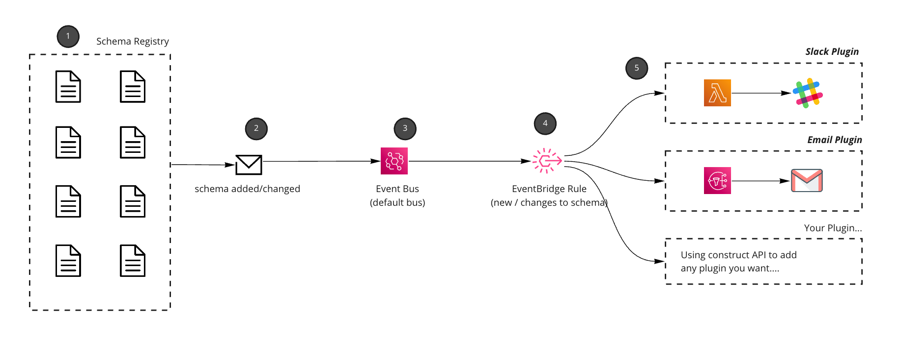
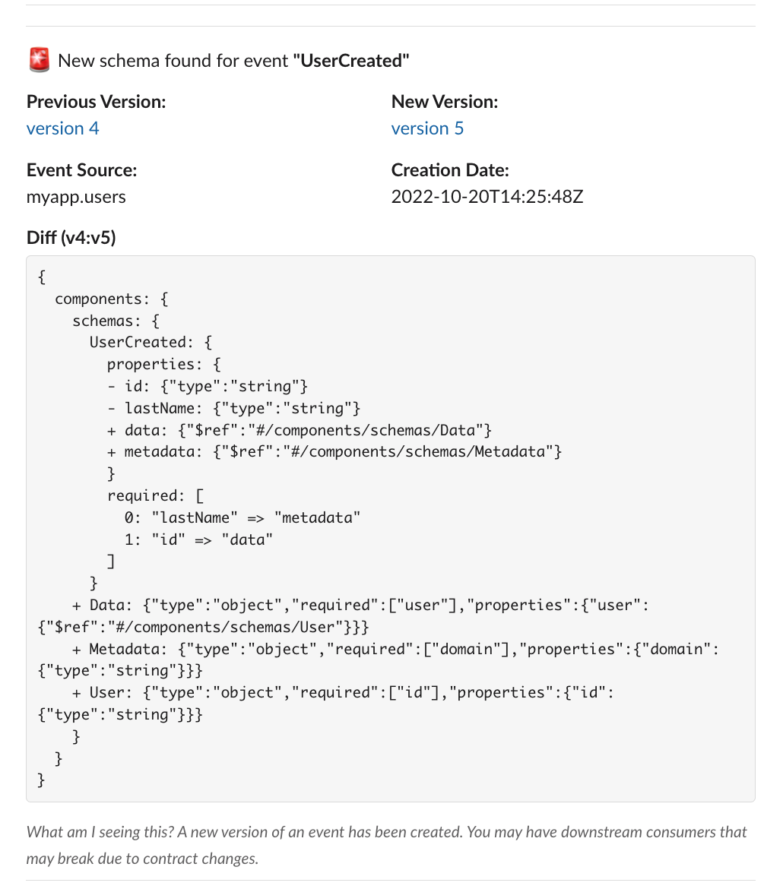
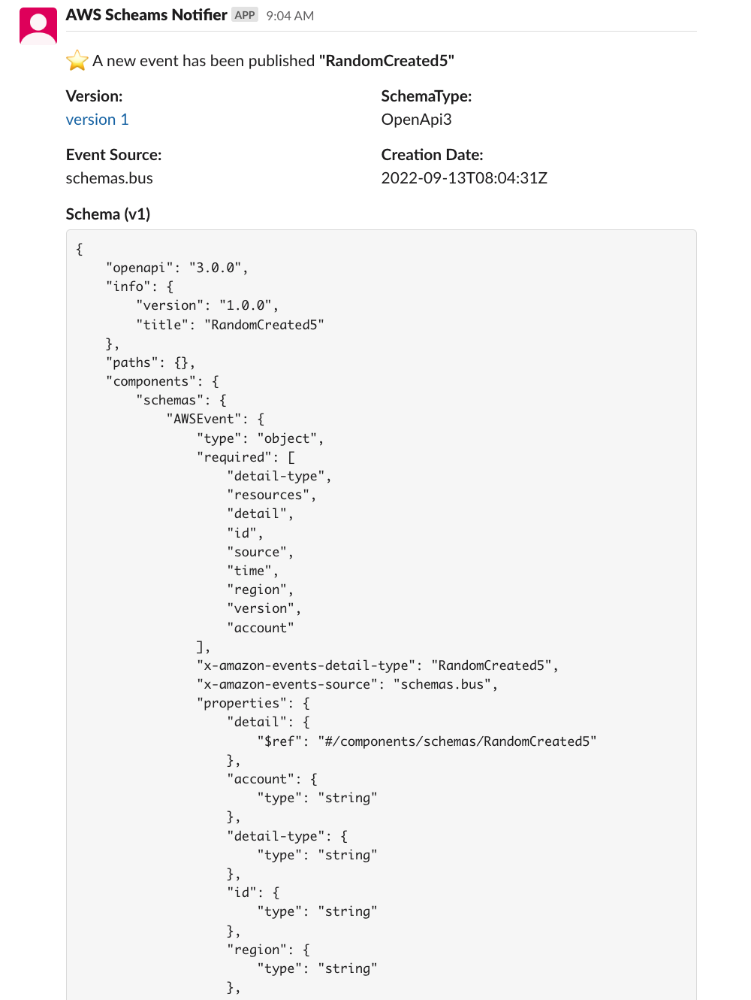

<div align="center">

<h1>📢 Notify consumers of schema changes with Schema Registry events</h1>

<hr />



  <h3>Features: Subscribe to new schemas created or schemas that change. Use plugins to integrate with slack, emails and more...</h3>

</div>

---

## Why listen to schema changes?

As your EDA application grow and you add more producers or consumers, it can be hard to track changes throughout your application. This pattern allows consumers to listen to changes in schemas with EventBridge, and get notified on them.

If you have pre-prod environments this could be useful to let consumers know of any coming changes.


## How it works

1. First you need a Schema Registry, you can either create your own or [turn on schema discovery for your EventBridge Bus](https://aws.amazon.com/blogs/compute/introducing-amazon-eventbridge-schema-registry-and-discovery-in-preview/).
1. By default the schema registry will publish events to your `default` event bus when schemas are created or updated. All accounts have a `default` event bus.
1. The `default` event bus will be used in this pattern. All `aws.schemas` events are published there.
1. This pattern will setup a rule onto your `default` event bus and listen to new or changed schema events (you decide with the notifer CDK pattern).
1. With the Plugin API, new targets are added to the changes and your target is triggered. You can notify people in slack, email or anything you want (you just need to create your own plugin)

---

## Getting Started with SchemaNotifier

_This plan to package up this construct and make it available as a package at some point, let me know if you would be interested in that!_

First clone the repo and then setup your construct `lib/notify-consumers-of-schema-changes-stack`

You will need to run `cdk deploy` with your `SLACK_API_KEY` and `SLACK_CHANNEL_ID`


```
npm run build && cdk deploy
```

The SchemaNotifier is a construct that will create eventbridge rules for you on your `default` bus, listening to any schema changes you specify.

**Arguments**

- type (required) -  ('All' | 'New' | 'Changes') - What type of schema changes are you interested in.
- sources (optional) - Array of strings that contain a list of EventBridge `sources` you want to listen to.
- schemas (optional) - Array of Schema Names you are interested in.
- plugins - Array of plugins you want to use to notify you of changes / new schemas.

(Only support Slack plugin at the moment as a POC, but you can add as many as you want)

### Listening for all schema changes for a EventBridge sources

This example shows you how to setup schema notifications for an EventBridge source. All sources that match this pattern will be picked up.

Using the example below you would be notified of all schema changes that belong to the source `myapp.users`.

```js
// listen for when schemas change for a given schema?
new SchemaNotifier(this, 'SchemaNotifier', {
  source: ['myapp.users']
  plugins: [// list of plugins]
});
```

### Listening for individual schema changes.

This example shows you how to setup a schema notification for a specific Schema. This can be good if you want to know changes to a particular event. 

In the example below you would be nofified of any schema changes for the event `UserCreated` and `UserSignedOut`.

```js
// listen for when schemas change for a given schema?
new SchemaNotifier(this, 'SchemaNotifier', {
  type: 'All'
  schemas: ['myapp.users@UserCreated', 'myapp.users@UserSignedOut']
  plugins: [// list of plugins]
});
```

---

## Plugins

### Using the Slack Plugin

- API_KEY (required) - API Key used to send messages to your slack channel. [Setting up Slack Bot instructions to get your API key.](https://api.slack.com/tutorials/tracks/getting-a-token)
- CHANNEL_ID  (required) - Location where to post your schema messages. 

```js
// listen for when schemas change for a given schema?
new SchemaNotifier(this, 'SchemaNotifier', {
  ...
  plugins: [
    new SlackNotifier({
      API_KEY: process.env.SLACK_API_KEY,
      CHANNEL_ID: process.end.SLACK_CHANNEL_ID,
    }),
  ],
  ...
});
```

### Example output from new schema versions. Version shown and diff.



### Example output from new schema found.


---

### Things to consider before using this pattern
- Plugins use AWS resources that you may be charged for.
