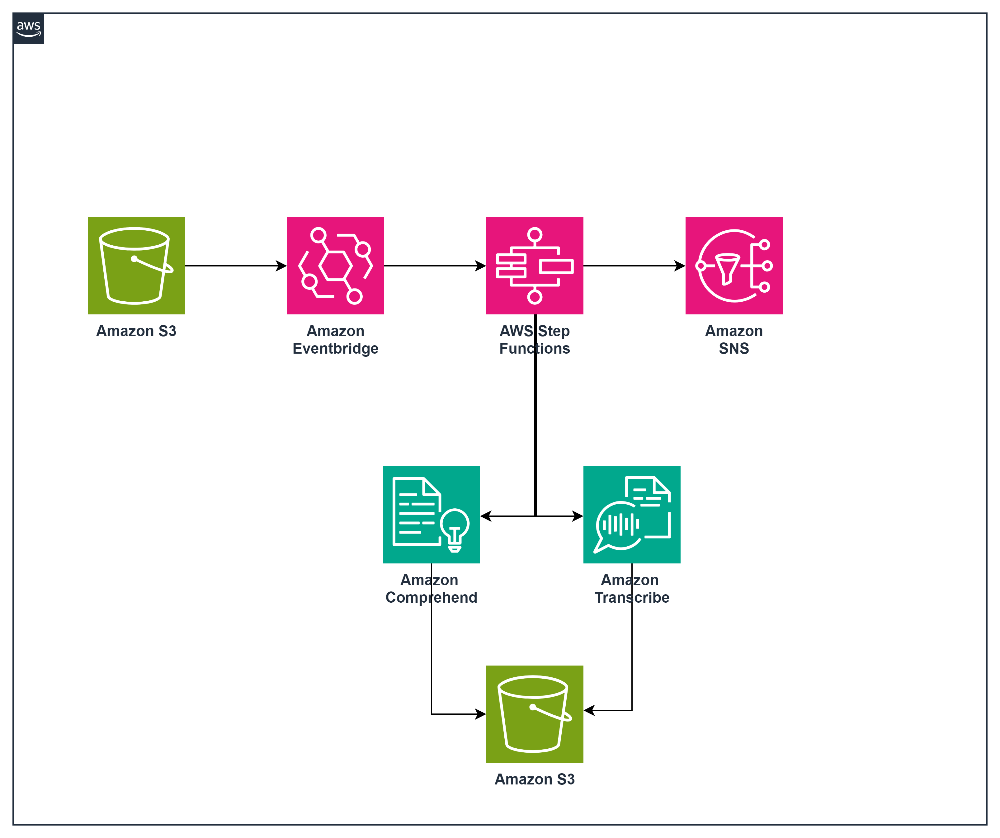

# Serverless Pattern: EventBridge to StepFunctions to SNS

This pattern provides an automated, scalable, and cost-effective solution for processing audio recordings, transcribing spoken words into text, and analyzing the sentiment of the transcription. This solution leverages AWS to handle audio files uploaded to an S3 bucket, initiating a state function workflow that transcribes and analyzes the audio and send out notifications via SNS. 

Important: this application uses various AWS services and there are costs associated with these services after the Free Tier usage - please see the [AWS Pricing page](https://aws.amazon.com/pricing/) for details. You are responsible for any AWS costs incurred. No warranty is implied in this example.

## Requirements

* [Create an AWS account](https://portal.aws.amazon.com/gp/aws/developer/registration/index.html) if you do not already have one and log in. The IAM user that you use must have sufficient permissions to make necessary AWS service calls and manage AWS resources.
* [AWS CLI](https://docs.aws.amazon.com/cli/latest/userguide/install-cliv2.html) installed and configured
* [Git Installed](https://git-scm.com/book/en/v2/Getting-Started-Installing-Git)
* [AWS Serverless Application Model](https://docs.aws.amazon.com/serverless-application-model/latest/developerguide/serverless-sam-cli-install.html) (AWS SAM) installed
* Verified Email Identity in Simple Email Service (SES), if email notification is required (for negative sentiment)

## Deployment Instructions

1. Create a new directory, navigate to that directory in a terminal and clone the GitHub repository:
    ``` 
    git clone https://github.com/aws-samples/serverless-patterns
    ```
2. Navigate to the directory where your SAM application is located. 

```
cd <SAM-directory>
sam validate 
```
3. Now, build the artifacts using SAM to package the deployment

```
sam build
```

4. Run through the guided deployment by running

```
sam deploy --guided 

```
During the prompts:

    * Enter a stack name

    * Enter the desired AWS Region

    * Allow SAM CLI to create IAM roles with the required permissions.

Once you have run `sam deploy --guided` mode once and saved arguments to a configuration file (samconfig.toml), you can use `sam deploy` in future to use these defaults.

5. Note the outputs from the SAM deployment process. These contain the resource names and/or ARNs which are used for testing.

## How it works



The SAM defines these AWS as part of the stack: 

*VoiceProcessingStateMachine:* Defines an AWS Step Function State Machine resource that is triggered by new objects created in an S3 bucket. 

*S3HostingBucket:* S3 bucket that hosts the audio file. It is also set up to send event notifications to EventBridge. 

*S3OutputBucket:* Another S3 bucket to store the transcription output. 

*SNSTopic:* An SNS Topic is created to publish system notifications. 


## Testing

Provide steps to trigger the integration and show what should be observed if successful.

*Prerequisites:* Ensure the AWS SAM application is deployed to your AWS Account. Confirm that Amazon SES is set up and the email address you use to receive emails is verified. 

1. Generate Audio file via Polly (positive) ``` aws polly synthesize-speech --output-format mp3 --voice-id <VoiceId> --text "<put your text here>" output.mp3 ```

1. Subscribe to SNS topic (as displayed in SAM output) and confirm via email ```aws sns subscribe --topic-arn <sns-topic-arn> --protocol email --notification-endpoint <replace_with_your_email_address>```

1. Copy audio file to S3 and trigger SFn ```aws s3 cp <replace_with_your_output_mp3> s3://<replace_with_your_s3_bucket_name_from_sam_output>```

1. Check for step function execution ```aws stepfunctions list-executions --state-machine-arn <replace_with_your_state_machine_arn_from_sam_output>```

1. Check for transcription output in S3 output bucket. In addition, you should see a system notification generated to the SNS subscription, as well. ```aws s3 ls s3://<replace_with_your_s3_output_bucket_name_from_sam_output>```

1. Repeat steps 1,3,4,5 for negative sentiment, as well. An email to your verified identity should show, as well as, the system notification.

## Cleanup
 
1. Delete the S3 files in the hosting and output buckets above.

1. Delete the stack, via SAM
    ```sam delete
    ```
1. Confirm the stack has been deleted
    ```bash
    aws cloudformation list-stacks --query "StackSummaries[?contains(StackName,'STACK_NAME')].StackStatus"
    ```
    
----
Copyright 2023 Amazon.com, Inc. or its affiliates. All Rights Reserved.

SPDX-License-Identifier: MIT-0