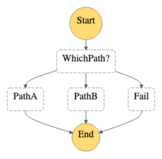

# EventBridge to Step Function

This pattern demonstrates executing a Step Function using an EventBridge rule.

In this example, the EventBridge rule specified in `main.tf` filters the events based upon the criteria in the `aws_cloudwatch_event_rule` block. When matching events are sent to EventBridge that trigger the rule, they are delivered as a JSON event payload (see "Example event payload from EventBridge to SQS" in the README) to the Step Function as an Input.

Learn more about this pattern at Serverless Land Patterns: https://serverlessland.com/patterns/eventbridge-sfn

Important: this application uses various AWS services and there are costs associated with these services after the Free Tier usage - please see the [AWS Pricing page](https://aws.amazon.com/pricing/) for details. You are responsible for any AWS costs incurred. No warranty is implied in this example.

## Requirements

* [Create an AWS account](https://portal.aws.amazon.com/gp/aws/developer/registration/index.html) if you do not already have one and log in. The IAM user that you use must have sufficient permissions to make necessary AWS service calls and manage AWS resources.
* [AWS CLI](https://docs.aws.amazon.com/cli/latest/userguide/install-cliv2.html) installed and configured
* [Git Installed](https://git-scm.com/book/en/v2/Getting-Started-Installing-Git)
* [Terraform](https://learn.hashicorp.com/tutorials/terraform/install-cli?in=terraform/aws-get-started) installed

## Deployment Instructions

1. Create a new directory, navigate to that directory in a terminal and clone the GitHub repository:
    ``` 
    git clone https://github.com/aws-samples/serverless-patterns
    ```
1. Change directory to the pattern directory:
    ```
    cd eventbridge-sfn-terraform
    ```
1. From the command line, initialize terraform to  to downloads and installs the providers defined in the configuration:
    ```
    terraform init
    ```
1. From the command line, apply the configuration in the main.tf file:
    ```
    terraform apply
    ```
1. During the prompts:
    * Enter yes
1. Note the outputs from the deployment process. These contain the resource names and/or ARNs which are used for testing.

## How it works

The template creates a shell Step Function, with a CloudWatch log group for log reporting of all events, that triggers based upon the criteria in the `aws_cloudwatch_event_rule` block and branches based on the value.

## Testing

1. Send an event for Path A to EventBridge:
    ```bash
    aws events put-events --entries file://event-A.json
    ```
1. Send an event for Path B to EventBridge:
    ```bash
    aws events put-events --entries file://event-B.json
    ```
1. Send an event for Path C to EventBridge, which should cause the Step Function to fail:
    ```bash
    aws events put-events --entries file://event-Fail.json
    ```

Go to the Step Function created by this template to view the new execution that ran.



You can also go to the CloudWatch Logs stream in the Log Group displayed in the output of the terraform deployment to check the results of the three events that triggered the Step Function.
## Cleanup
 
1. Change directory to the pattern directory:
    ```
    cd eventbridge-sfn-terraform
    ```
1. Delete all created resources
    ```bash
    terraform destroy
    ```
1. During the prompts:
    * Enter yes
1. Confirm all created resources has been deleted
    ```bash
    terraform show
    ```
----
Copyright 2022 Amazon.com, Inc. or its affiliates. All Rights Reserved.

SPDX-License-Identifier: MIT-0
