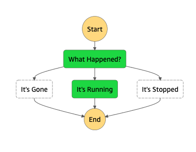

# EventBridge to Step Function

This pattern demonstrates executing a Step Function using an EventBridge rule.

Learn more about this pattern at Serverless Land Patterns: https://serverlessland.com/patterns/eventbridge-sfn

Important: this application uses various AWS services and there are costs associated with these services after the Free Tier usage - please see the [AWS Pricing page](https://aws.amazon.com/pricing/) for details. You are responsible for any AWS costs incurred. No warranty is implied in this example.

## Requirements

* [Create an AWS account](https://portal.aws.amazon.com/gp/aws/developer/registration/index.html) if you do not already have one and log in. The IAM user that you use must have sufficient permissions to make necessary AWS service calls and manage AWS resources.
* [AWS CLI](https://docs.aws.amazon.com/cli/latest/userguide/install-cliv2.html) installed and configured
* [Git Installed](https://git-scm.com/book/en/v2/Getting-Started-Installing-Git)
* [AWS Serverless Application Model](https://docs.aws.amazon.com/serverless-application-model/latest/developerguide/serverless-sam-cli-install.html) (AWS SAM) installed

## Deployment Instructions

1. Create a new directory, navigate to that directory in a terminal and clone the GitHub repository:
    ``` 
    git clone https://github.com/aws-samples/serverless-patterns
    ```
1. Change directory to the pattern directory:
    ```
    cd eventbridge-sfn
    ```
1. From the command line, use AWS SAM to deploy the AWS resources for the pattern as specified in the template.yml file:
    ```
    sam deploy --guided
    ```
1. During the prompts:
    * Enter a stack name
    * Enter the desired AWS Region
    * Allow SAM CLI to create IAM roles with the required permissions.

    Once you have run `sam deploy -guided` mode once and saved arguments to a configuration file (samconfig.toml), you can use `sam deploy` in future to use these defaults.

1. Note the outputs from the SAM deployment process. These contain the resource names and/or ARNs which are used for testing.

## How it works

The template creates a shell Step Function, with a CloudWatch log group for error reporting, that triggers on select EC2 instance state changes and branches based on the value.

## Testing

Launch an EC2 instance using the AWS Console (recommend using the Amazon Linux AMI and a t2.micro instance type).

Detailed instructions can be found in the AWS Quick Start Guide: https://docs.aws.amazon.com/quickstarts/latest/vmlaunch/welcome.html

Once the instance is running, go to the Step Function created by this template to view the new execution that ran.



From the EC2 console you can select the instance, select the "Instance state" dropdown menu, and stop it. Return to the Step Function and there will be a new execution listed showing "It's Stopped."

From the EC2 console again, select the "Instance state" dropdown menu and terminate the instance to clean up. A third execution will appear in the Step Function showing "It's Gone."

## Cleanup
 
1. Delete the stack
    ```bash
    aws cloudformation delete-stack --stack-name STACK_NAME
    ```
1. Confirm the stack has been deleted
    ```bash
    aws cloudformation list-stacks --query "StackSummaries[?contains(StackName,'STACK_NAME')].StackStatus"
    ```
----
Copyright 2021 Amazon.com, Inc. or its affiliates. All Rights Reserved.

SPDX-License-Identifier: MIT-0
