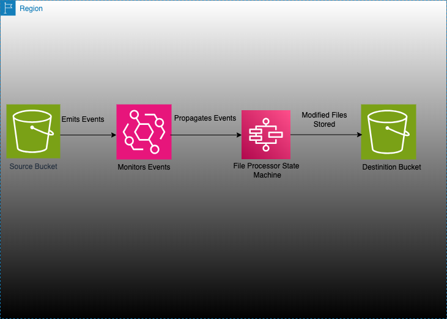
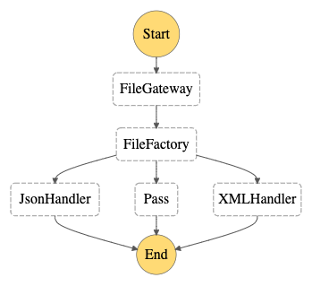

# AWS S3 --> AWS EventBridge -> AWS Step Functions -> AWS S3

This reference architecture is for a file processor workflow. This architecture follows the 2 design patterns to handle file processing workflow
1. ClaimCheck Pattern [https://learn.microsoft.com/en-us/azure/architecture/patterns/claim-check]
2. Event Driven Architecture [https://aws.amazon.com/event-driven-architecture/ ; https://microservices.io/patterns/data/event-driven-architecture.html]

Use Case/ Business Requirement(Hypothetical):

Its assumed that there has been a merger between 2 companies A and B.
A is now the parent company of B and would like to make a few things uniform in company B as per the regulations in comapny A.
One such example is all Developers in Company B would now be designated as Engineers as per the policy of company A. Hence all employee data stored in S3 is now getting updated
Another such example is based on activities performed by employees of particular department-id in comapny B, the parent company treats those employees as employees under Finance department else under Management Department and adds these modifications to the files stored in source S3 bucket.


As part of the pattern, upon deployment, it will go ahead and create a source S3 bucket. The source S3 bucket is configured such that it triggers cloudwatch events. Event rules are created in the default event bus to monitor on the source s3 bucket. Once any event is recieved upon object creation in S3, as per the rule, eventbridge forwards the event to AWS Step Functions. Step Functions use lambdas to determine the file type and then based on the file type Step Function forwards the event details to subsequent steps(lambdas) to handle(modify and upload) the file. The destination S3 bucket is also configured as part of the deployment and the bucket name is provided to the lambdas as environment variable

Important: In case this architecture is to be used for customer reference and for heavy use if we need to understand pricing please look into [AWS Pricing page](https://aws.amazon.com/pricing/) for details. You are responsible for any AWS costs incurred. No warranty is implied in this example.

## Architecture


## StateMachine Flow


## Requirements

* [Create an AWS account](https://portal.aws.amazon.com/gp/aws/developer/registration/index.html) if you do not already have one and log in. The IAM user that you use must have sufficient permissions to make necessary AWS service calls and manage AWS resources.
* [AWS CLI](https://docs.aws.amazon.com/cli/latest/userguide/install-cliv2.html) installed and configured
* [Git Installed](https://git-scm.com/book/en/v2/Getting-Started-Installing-Git)
* [Python Installed](https://www.python.org/downloads/macos/)
* [AWS CDK](https://docs.aws.amazon.com/cdk/v2/guide/cli.html)

## Deployment Instructions

1. Use 'aws configure' to set up your profile
2. Use 'export AWS_PROFILE=<your profile name>' if you have multiple profile and choose to use one for your current session
3. Use 'echo $AWS_PROFILE' to verify
4. Create a new directory, navigate to that directory in a terminal and clone the GitHub repository:
    ``` 
    git clone https://github.com/aws-samples/serverless-patterns
    ```
5. Change directory to the pattern directory:
    ```
    cd eventbridge-stepfunction-lambda-python-cdk/file-processing-workflow-cdk
    ```
6. Inside the `file-processing-workflow-cdk` directory run ` python -m venv venv` to create a virtual environment with required dependencies for this project
7. Run `source venv/bin/activate`
8. Run `python3 -m pip install -r requirements.txt`
9. Run `cdk bootstrap`

10. Run `cdk synth`

4. From the command line, use CDK to deploy the AWS resources for the pattern. You'll be prompted to approve security related changes during the deployment.
    ```
    cdk deploy
    ```
5. This command will take sometime to run. After successfully completing, it will print out a few output variables.  Your output should look something like this which contain the resource names which are used for testing.
```
Outputs:


IAM Statement Changes
┌───┬────────────────────────────────────────────────────────────────────────┬────────┬──────────────────────────┬────────────────────────────────────────────────────────────────────────┬───────────┐
│   │ Resource                                                               │ Effect │ Action                   │ Principal                                                              │ Condition │
├───┼────────────────────────────────────────────────────────────────────────┼────────┼──────────────────────────┼────────────────────────────────────────────────────────────────────────┼───────────┤
│ + │ ${BucketNotificationsHandlerXXXXXXXXXXXXXXXXXXXXXXXXXXXXXXXX/Role.Arn} │ Allow  │ sts:AssumeRole           │ Service:lambda.amazonaws.com                                           │           │
├───┼────────────────────────────────────────────────────────────────────────┼────────┼──────────────────────────┼────────────────────────────────────────────────────────────────────────┼───────────┤
│ + │ ${CapstoneLambdaBasicRole.Arn}                                         │ Allow  │ sts:AssumeRole           │ Service:lambda.amazonaws.com                                           │           │
├───┼────────────────────────────────────────────────────────────────────────┼────────┼──────────────────────────┼────────────────────────────────────────────────────────────────────────┼───────────┤
│ + │ ${CapstoneLambdaS3Role.Arn}                                            │ Allow  │ sts:AssumeRole           │ Service:lambda.amazonaws.com                                           │           │
├───┼────────────────────────────────────────────────────────────────────────┼────────┼──────────────────────────┼────────────────────────────────────────────────────────────────────────┼───────────┤
│ + │ ${DestinationBucket.Arn}/*                                             │ Allow  │ s3:*                     │ AWS:${CapstoneLambdaS3Role}                                            │           │
│   │ ${SourceBucket.Arn}/*                                                  │        │                          │                                                                        │           │
├───┼────────────────────────────────────────────────────────────────────────┼────────┼──────────────────────────┼────────────────────────────────────────────────────────────────────────┼───────────┤
│ + │ ${FileHandlerJSON.Arn}                                                 │ Allow  │ lambda:InvokeFunction    │ AWS:${StepFunctionExecutionRole}                                       │           │
│   │ ${FileHandlerXML.Arn}                                                  │        │                          │                                                                        │           │
│   │ ${FileTypeHandler.Arn}                                                 │        │                          │                                                                        │           │
├───┼────────────────────────────────────────────────────────────────────────┼────────┼──────────────────────────┼────────────────────────────────────────────────────────────────────────┼───────────┤
│ + │ ${FileProcessorStateMachine}                                           │ Allow  │ states:StartExecution    │ AWS:${FileProcessorStateMachine/EventsRole}                            │           │
├───┼────────────────────────────────────────────────────────────────────────┼────────┼──────────────────────────┼────────────────────────────────────────────────────────────────────────┼───────────┤
│ + │ ${FileProcessorStateMachine/EventsRole.Arn}                            │ Allow  │ sts:AssumeRole           │ Service:events.amazonaws.com                                           │           │
├───┼────────────────────────────────────────────────────────────────────────┼────────┼──────────────────────────┼────────────────────────────────────────────────────────────────────────┼───────────┤
│ + │ ${StepFunctionExecutionRole.Arn}                                       │ Allow  │ sts:AssumeRole           │ Service:states.amazonaws.com                                           │           │
├───┼────────────────────────────────────────────────────────────────────────┼────────┼──────────────────────────┼────────────────────────────────────────────────────────────────────────┼───────────┤
│ + │ *                                                                      │ Allow  │ s3:PutBucketNotification │ AWS:${BucketNotificationsHandlerXXXXXXXXXXXXXXXXXXXXXXXXXXXXXXXX/Role} │           │
└───┴────────────────────────────────────────────────────────────────────────┴────────┴──────────────────────────┴────────────────────────────────────────────────────────────────────────┴───────────┘
IAM Policy Changes
┌───┬────────────────────────────────────────────────────────────────────┬────────────────────────────────────────────────────────────────────────────────┐
│   │ Resource                                                           │ Managed Policy ARN                                                             │
├───┼────────────────────────────────────────────────────────────────────┼────────────────────────────────────────────────────────────────────────────────┤
│ + │ ${BucketNotificationsHandlerXXXXXXXXXXXXXXXXXXXXXXXXXXXXXXXX/Role} │ arn:${AWS::Partition}:iam::aws:policy/service-role/AWSLambdaBasicExecutionRole │
├───┼────────────────────────────────────────────────────────────────────┼────────────────────────────────────────────────────────────────────────────────┤
│ + │ ${CapstoneLambdaBasicRole}                                         │ arn:${AWS::Partition}:iam::aws:policy/service-role/AWSLambdaBasicExecutionRole │
├───┼────────────────────────────────────────────────────────────────────┼────────────────────────────────────────────────────────────────────────────────┤
│ + │ ${CapstoneLambdaS3Role}                                            │ arn:${AWS::Partition}:iam::aws:policy/service-role/AWSLambdaBasicExecutionRole │
├───┼────────────────────────────────────────────────────────────────────┼────────────────────────────────────────────────────────────────────────────────┤
│ + │ ${StepFunctionExecutionRole}                                       │ arn:${AWS::Partition}:iam::aws:policy/CloudWatchLogsFullAccess                 │
│ + │ ${StepFunctionExecutionRole}                                       │ arn:${AWS::Partition}:iam::aws:policy/AWSXrayWriteOnlyAccess                   │
└───┴────────────────────────────────────────────────────────────────────┴────────────────────────────────────────────────────────────────────────────────┘

Do you wish to deploy these changes (y/n)? y


```
## How it works

* As explained before this is a simple file processer workflow based on Claim Check Pattern and implemented using Event driven Architecture.
Once the project is fully deployed please upload one of the simple JSON or XML files from the sample_source_data directory under file-processing-workflow-cdk directory.
If a JSON file is uploaded in the source S3 bucket the Eventbridge triggers the StepFunction. The FileGateway step in Stepfunction determine the file type and forwards it to the JSONHandler(FileHandlerJSON lambda) which modiifies the "jobTitleName" tag value in the JSON from Developer to "Engineer" and uploaded to the the destination S3 bucket. 
If an XML file was uploaded then the XMLHandler(FIleHandlerXML lambda) step would handle the file and if the DEPARTMENT_ID tag was of 5346 then a new tag is introduced DEPARTMENT_NAME with value as Management else the new tags value would be Finance and eventually pushed to destination S3.

The Destination S3 bucket name is passed as environment variable to the lambda

## Testing

### Send an event to the event bus to trigger the Step Functions workflow
Upload the sample data in source S3 and verify the results as mentioned in destination S3.
Verify Lambda logs in Cloudwatch
Verify the Stepfunction Execution in the Stepfunction home page in AWS Console under "Executions" tab
Verify EventBridge metrics under Monitoring tab

### Making changes

You can customize the AWS Step Functions configuration by editing the code at `state_machine_definition.json`. To deploy changes, use the `cdk deploy` command.

## Cleanup
 
1. Delete the stack
    ```
    cdk destroy
    ```

    Output

    Are you sure you want to delete: FileProcessingWorkflowCdkStack (y/n)? y
    FileProcessingWorkflowCdkStack: destroying... [1/1]

 ✅  FileProcessingWorkflowCdkStack: destroyed


----
Copyright 2021 Amazon.com, Inc. or its affiliates. All Rights Reserved.

SPDX-License-Identifier: MIT-0
