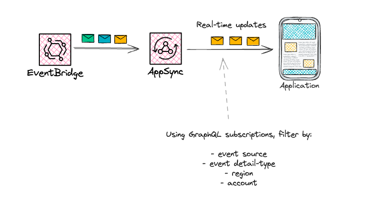

# EventBridge to AppSync (Realtime subscriptions)



This pattern creates a new GraphQL AppSync URL that can be subscribed to with events from EventBridge. EventBridge target to AppSync is configured.

Learn more about this pattern at Serverless Land Patterns: https://serverlessland.com/patterns/eventbridge-to-appsync-sam

Important: this application uses various AWS services and there are costs associated with these services after the Free Tier usage - please see the [AWS Pricing page](https://aws.amazon.com/pricing/) for details. You are responsible for any AWS costs incurred. No warranty is implied in this example.

## Requirements

* [Create an AWS account](https://portal.aws.amazon.com/gp/aws/developer/registration/index.html) if you do not already have one and log in. The IAM user that you use must have sufficient permissions to make necessary AWS service calls and manage AWS resources.
* [AWS CLI](https://docs.aws.amazon.com/cli/latest/userguide/install-cliv2.html) installed and configured
* [Git Installed](https://git-scm.com/book/en/v2/Getting-Started-Installing-Git)
* [AWS Serverless Application Model](https://docs.aws.amazon.com/serverless-application-model/latest/developerguide/serverless-sam-cli-install.html) (AWS SAM) installed

## Deployment Instructions

1. Create a new directory, navigate to that directory in a terminal and clone the GitHub repository:
    ``` 
    git clone https://github.com/aws-samples/serverless-patterns
    ```
1. Change directory to the pattern directory:
    ```
    cd eventbridge-to-appsync-sam
    ```
1. From the command line, use AWS SAM to deploy the AWS resources for the pattern as specified in the template.yml file:
    ```
    sam deploy --guided
    ```
1. During the prompts:
    * Enter a stack name
    * Enter the desired AWS Region
    * Allow SAM CLI to create IAM roles with the required permissions.

    Once you have run `sam deploy --guided` mode once and saved arguments to a configuration file (samconfig.toml), you can use `sam deploy` in future to use these defaults.

1. Note the outputs from the SAM deployment process. These contain the resource names and/or ARNs which are used for testing.

## How it works

1. New EventBus is created and a target on the EventBridge connects to an AppSync resource.
1. When publishing events that match the rule on the target these events are pushed to AppSync subscription.
1. Events are given to the AppSync subscriptions (real-time) using GraphQL subscriptions.
1. Using this GraphQL schema you can listen and filter for events in real time by account, region, detail-type and source.

## Testing

1. Deploy the application into your account
1. To to [AppSync in your console](https://us-west-2.console.aws.amazon.com/appsync/home)
1. Click **Queries** and setup a new subscription
    ```sh
    subscription listenBySource {
        subscribe(source: "app.orders") {
            id
            time
            account
            source
            detailType
            data
        }
    }
    ```
1. Trigger the event (example event in this repo)
    ```sh
     aws events put-events --entries file://event.json
    ```

1. See the event response in real time (in the AppSync console)
    ```sh
    ```


## Cleanup
 
1. Delete the stack
    ```bash
    sam delete
    ```
----
Copyright 2024 Amazon.com, Inc. or its affiliates. All Rights Reserved.

SPDX-License-Identifier: MIT-0