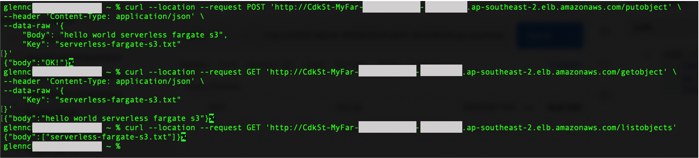

# AWS Fargate to Amazon S3

This project contains a sample AWS Cloud Development Kit (AWS CDK) template for deploying an AWS Fargate service running on an Amazon Elastic Container Service (ECS) cluster with an Application Load Balancer in-front. The AWS Fargate service has endpoints that provide examples to list and get objects from a bucket and put objects into a bucket. This template uses a custom image without having to pre-push the image to Amazon Elastic Container Registry (ECR) or another container library. This makes use of the in-built `ecs.ContainerImage.fromAsset` method. The custom image has a base route `/` for health checks, `/putobject` for adding objects, `/getobject` for retrieving the contents of a specified object, and `/listobjects` for listing all the files in a bucket. Environment variables like the the S3 bucket name and AWS region are passed to the image to enable it to put items to the S3 bucket.

This project also shows how to set up a S3 Gateway Endpoint to the VPC and configure additional bucket policies that require actions to come from the S3 Gateway Endpoint. This is in addition to the built-in `grantReadWrite` that CDK provides.

Learn more about this pattern at Serverless Land Patterns: https://serverlessland.com/patterns/cdk-fargate-s3.

Important: this application uses various AWS services and there are costs associated with these services after the Free Tier usage - please see the [AWS Pricing page](https://aws.amazon.com/pricing/) for details. You are responsible for any AWS costs incurred. No warranty is implied in this example.

Warning: As of this writing, there are known issues with the images built on Apple's M1 chip, which is based on the ARM architecture. You might encounter the following error log on ECS `standard_init_linux.go:228: exec user process caused: exec format error fargate`. More details can be found at [Stackoverflow 'exec user process caused: exec format error' in AWS Fargate Service](https://stackoverflow.com/questions/67361936/exec-user-process-caused-exec-format-error-in-aws-fargate-service)

## Requirements

- [Create an AWS account](https://portal.aws.amazon.com/gp/aws/developer/registration/index.html) if you do not already have one and log in. The IAM user that you use must have sufficient permissions to make necessary AWS service calls and manage AWS resources.
- [AWS CLI](https://docs.aws.amazon.com/cli/latest/userguide/install-cliv2.html) installed and configured
- [Git Installed](https://git-scm.com/book/en/v2/Getting-Started-Installing-Git)
- [AWS CDK](https://docs.aws.amazon.com/cdk/latest/guide/cli.html) installed and configured

## Deployment Instructions

1. Create a new directory, navigate to that directory in a terminal and clone the GitHub repository:
   ```bash
   git clone https://github.com/aws-samples/serverless-patterns
   ```
2. Change directory to the pattern directory:
   ```bash
   cd serverless-patterns/fargate-s3-cdk/cdk
   ```
3. Install dependencies:
   ```bash
   npm install
   ```
4. From the command line, configure AWS CDK:
   ```bash
   cdk bootstrap ACCOUNT-NUMBER/REGION # e.g.
   cdk bootstrap 1111111111/us-east-1
   cdk bootstrap --profile test 1111111111/us-east-1
   ```
5. Ensure that the bucket name is unique in [cdk-stack.ts](./cdk/lib/cdk-stack.ts)
6. From the command line, use AWS CDK to deploy the AWS resources for the pattern as specified in the `lib/cdk-stack.ts` file:
   ```bash
   cdk deploy
   ```
7. Note the outputs from the CDK deployment process. This contains the service endpoint that is used to make the GET and POST requests to the various endpoints.

## How it works

- The image is constructed directly from sources on disk when `cdk deploy` is executed
- The image is automatically pushed to Amazon ECR
- The VPC and subnets are created
- The ECS cluster is created
- The S3 bucket is created
- The custom resource is created to remove S3 bucket items when `cdk destroy` is executed
- The S3 Gateway Endpoint is created
- The bucket policy is created. This restricts access to only the S3 Gateway Endpoint
- Finally the Fargate Service and the Task Definitions are created. This also passes the environment variables (S3 bucket name and region) to the image

## Testing

Retrieve the Fargate Service endpoint from the `cdk deploy` output. Example of the output is:

```
CdkStack.MyFargateServiceServiceURL1234567D = http://CdkSt-MyFar-123456789ABC-123456789.ap-southeast-2.elb.amazonaws.com
```

For reference:


There are 3 endpoints that integrate with the S3 Bucket.

The first endpoint requires a POST request. This adds a file with string contents to the bucket. For example:

```bash
curl --location --request POST '<REPLACE WITH FARGATE SERVICE URL>/putobject' \
--header 'Content-Type: application/json' \
--data-raw '{
    "Body": "<REPLACE WITH FILE CONTENTS>",
    "Key": "<REPLACE WITH FILENAME>"
}'
# Example where filename is "serverless-fargate-s3.txt" and file content is "hello world serverless fargate s3"
curl --location --request POST 'http://CdkSt-MyFar-123456789ABC-123456789.ap-southeast-2.elb.amazonaws.com/putobject' \
--header 'Content-Type: application/json' \
--data-raw '{
    "Body": "hello world serverless fargate s3",
    "Key": "serverless-fargate-s3.txt"
}'
```

The second endpoint requires a GET request. This displays the string contents of a file in bucket. This can be used on the same file created after the first POST request. For example:

```bash
curl --location --request GET '<REPLACE WITH FARGATE SERVICE URL>/getobject' \
--header 'Content-Type: application/json' \
--data-raw '{
    "Key": "<REPLACE WITH FILENAME>"
}'
# Example where filename is "serverless-fargate-s3.txt"
curl --location --request GET 'http://CdkSt-MyFar-123456789ABC-123456789.ap-southeast-2.elb.amazonaws.com/getobject' \
--header 'Content-Type: application/json' \
--data-raw '{
    "Key": "serverless-fargate-s3.txt"
}'
```

The third endpoint requires another GET request. This time, it lists all files in the bucket. For example:

```bash
curl --location --request GET '<REPLACE WITH FARGATE SERVICE URL>/listobjects'
# Example
curl --location --request GET 'http://CdkSt-MyFar-123456789ABC-123456789.ap-southeast-2.elb.amazonaws.com/listobjects'
```

Running all the requests above should produce the following output:



## Cleanup

1. Delete the stack
   ```bash
   cdk destroy
   ```

2. Navigate to ECR in the AWS console and delete the container images created

---

Copyright 2021 Amazon.com, Inc. or its affiliates. All Rights Reserved.

SPDX-License-Identifier: MIT-0
