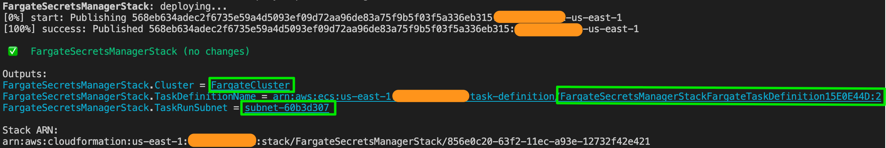
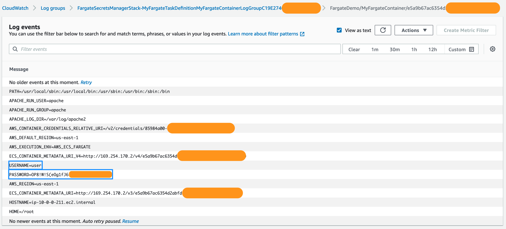

# AWS  Fargate, Secrets Manager

This project contains a sample AWS Cloud Development Kit (AWS CDK) template for deploying an AWS Fargate Task Definition, a Fargate Container, and a Secrets Manager secret.

Learn more about this pattern at Serverless Land Patterns: https://serverlessland.com/patterns/cdk-fargate-secrets-manager

Important: this application uses various AWS services and there are costs associated with these services after the Free Tier usage - please see the [AWS Pricing page](https://aws.amazon.com/pricing/) for details. You are responsible for any AWS costs incurred. No warranty is implied in this example.


## Requirements

- [Create an AWS account](https://portal.aws.amazon.com/gp/aws/developer/registration/index.html) if you do not already have one and log in. The IAM user that you use must have sufficient permissions to make necessary AWS service calls and manage AWS resources.
  - Ensure you have a default [AWS VPC](https://docs.aws.amazon.com/vpc/latest/userguide/vpc-getting-started.html) which contains at least one [public subnet](https://docs.aws.amazon.com/vpc/latest/userguide/VPC_Scenario2.html)
- [AWS CLI](https://docs.aws.amazon.com/cli/latest/userguide/install-cliv2.html) installed and configured, with a default profile that points to the AWS account to use
- [Git Installed](https://git-scm.com/book/en/v2/Getting-Started-Installing-Git)
- [Python 3.6 or later](https://www.python.org/downloads/)
- [pip and virtualenv](https://docs.aws.amazon.com/cdk/latest/guide/work-with-cdk-python.html#python-prerequisites)
- [Node and NPM](https://nodejs.org/en/download/) installed
- [AWS CDK](https://docs.aws.amazon.com/cdk/latest/guide/cli.html) installed and configured

## Deployment Instructions

1. Create a new directory, navigate to that directory in a terminal and clone the GitHub repository:
   ```bash
   git clone https://github.com/aws-samples/serverless-patterns
   ```
2. Change directory to the pattern directory:
   ```bash
   cd serverless-patterns/fargate-secretsmanager

3. From the command line, set Environment variables for your account and region:
   
   **Linux/Mac:**
    ```bash
    export CDK_DEFAULT_ACCOUNT=123456789012
    export CDK_DEFAULT_REGION=us-east-1
    ```
   **Windows:**
   ```powershell
   set CDK_DEFAULT_ACCOUNT=123456789012
   set CDK_DEFAULT_REGION=us-east-1
   ```
4. Create a virtual python environment:
   ```bash
   python3 -m venv .venv
   ```
5. Activate the virtual environment:
   
   **Linux/Mac:** 
   ```bash
   source .venv/bin/activate
    ```
   
   **Windows:**
   ```powershell
   .\source
   ```
6. Install dependencies:
   ```bash
   python3 -m pip install -r requirements.txt
   ```

7. From the command line, use AWS CDK to deploy the AWS resources for the pattern specified in `fargate_secretsmanager.py`:
   ```bash
   cdk deploy
   ```

## How it works

- Secrets Manager creates a randomly generated secret which will be injected into the container
- ECS attaches a default policy to the task execution role when a secret is specified for injection into the container
  - This default policy auto grants read access to the secret from the container via the following permissions:
     - `secretsmanager:GetSecretValue`
     - `secretsmanager:DescribeSecret`
- The task execution role doesn't require the `kms:decrypt` permission because the secret uses the default KMS key in the AWS account. A custom key, however, would require such permissions
- The Fargate Task definition, task execution role, container and Secrets Manager instance are all created when `cdk deploy` is executed
- The 
- The complete stack is removed when `cdk destroy` is executed


## Testing

1. From the `cdk deploy` command output, copy the output values for cluster, task definition and subnet to use in Step #2. Make sure to obtain the TaskDefinition along with revision number (as highlighted in green), not the entire ARN.



2. Execute the following command to run a Fargate task using your newly created Task Definition and Container, substituting the values from Step #1 for cluster, subnet ID and task definition, respectively.

```
aws ecs run-task --cluster <your-cluster-name> --network-configuration '{"awsvpcConfiguration": {"subnets":["<your-public-subnet>"],"assignPublicIp": "ENABLED"}}' --launch-type 'FARGATE' --task-definition <your-task-definition-and-revision>
```

3. Navigate to the AWS CloudWatch console for the log group created as part of the stack. Check that the logs contain the environment variables, including the injected username and password:




> **Note**: We ran the `printenv` command in the code for demo/testing purposes; to ensure the secret is being passed into the container's environment. Ensure that only trusted admins are able to exec into the container and have access to container/CloudWatch logs.


You should now be able to use the Secrets Manager secret without having to hardcode these values within the container code. For environment variables, consider using [AWS Systems Manager Parameter Store](https://docs.aws.amazon.com/systems-manager/latest/userguide/systems-manager-parameter-store.html) and for Secrets, consider using [AWS Secrets Manager](https://docs.aws.amazon.com/secretsmanager/latest/userguide/intro.html) to store all of your container variables.


## Cleanup 
1. Run ```cdk destroy```
2. Ensure a green checkmark appears that indicates the Stack was successfully brought down.

## Useful commands

 * `cdk ls`          list all stacks in the app
 * `cdk synth`       emits the synthesized CloudFormation template
 * `cdk deploy`      deploy this stack to your default AWS account/region
 * `cdk diff`        compare deployed stack with current state
 * `cdk docs`        open CDK documentation


Copyright 2021 Amazon.com, Inc. or its affiliates. All Rights Reserved.

SPDX-License-Identifier: MIT-0
