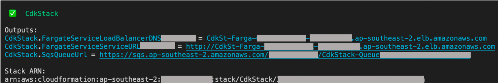
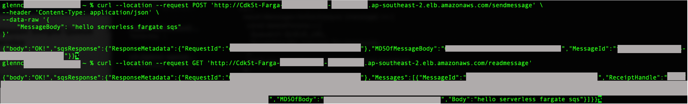

# AWS Fargate to Amazon SQS

This project contains a sample AWS Cloud Development Kit (AWS CDK) template for deploying an AWS Fargate service running on an Amazon Elastic Container Service (ECS) cluster with an Application Load Balancer in-front. The AWS Fargate service makes `sendMessage` and `receiveMessage` calls to an Amazon Simple Queue Service (SQS) queue. This template uses a custom image without having to pre-push the image to Amazon Elastic Container Registry (ECR) or another container library. This makes use of the in-built `ecs.ContainerImage.fromAsset` method. The custom image has a base route `/` for health checks, `/sendmessage` for adding to the queue and `/readmessage` for reading messages from the queue. Environment variables like the SQS Queue URL and AWS region are passed to the image to enable it to perform actions on the SQS Queue.

This project also shows how to set up an SQS Interface Endpoint to the VPC. A VPC Endpoint policy is created to only allow the Fargate task definition to perform actions through the VPC endpoint. In addition, an access policy is set on the SQS queue to deny requests that are not from the created Interface Endpoint.

Learn more about this pattern at Serverless Land Patterns: https://serverlessland.com/patterns/cdk-fargate-sqs.

Important: this application uses various AWS services and there are costs associated with these services after the Free Tier usage - please see the [AWS Pricing page](https://aws.amazon.com/pricing/) for details. You are responsible for any AWS costs incurred. No warranty is implied in this example.

Warning: As of this writing, there are known issues with the images built on Apple's M1 chip, which is based on the ARM architecture. You might encounter the following error log on ECS `standard_init_linux.go:228: exec user process caused: exec format error fargate`. More details can be found at [Stackoverflow 'exec user process caused: exec format error' in AWS Fargate Service](https://stackoverflow.com/questions/67361936/exec-user-process-caused-exec-format-error-in-aws-fargate-service)

## Requirements

- [Create an AWS account](https://portal.aws.amazon.com/gp/aws/developer/registration/index.html) if you do not already have one and log in. The IAM user that you use must have sufficient permissions to make necessary AWS service calls and manage AWS resources.
- [AWS CLI](https://docs.aws.amazon.com/cli/latest/userguide/install-cliv2.html) installed and configured
- [Git Installed](https://git-scm.com/book/en/v2/Getting-Started-Installing-Git)
- [AWS CDK](https://docs.aws.amazon.com/cdk/latest/guide/cli.html) installed and configured

## Deployment Instructions

1. Create a new directory, navigate to that directory in a terminal and clone the GitHub repository:
   ```bash
   git clone https://github.com/aws-samples/serverless-patterns
   ```
2. Change directory to the pattern directory:
   ```bash
   cd serverless-patterns/fargate-sqs-cdk/cdk
   ```
3. Install dependencies:
   ```bash
   npm install
   ```
4. From the command line, configure AWS CDK:
   ```bash
   cdk bootstrap ACCOUNT-NUMBER/REGION # e.g.
   cdk bootstrap 1111111111/us-east-1
   cdk bootstrap --profile test 1111111111/us-east-1
   ```
5. From the command line, use AWS CDK to deploy the AWS resources for the pattern as specified in the `lib/cdk-stack.ts` file:
   ```bash
   cdk deploy
   ```
6. Note the outputs from the CDK deployment process. This contains the service endpoint that is used to make GET and POST requests.

## How it works

- The image is constructed directly from sources on disk when `cdk deploy` is executed
- The image is automatically pushed to Amazon ECR
- The SQS queue is created
- The ECS cluster is created
- Networking resources are created
- Finally the Fargate Service and the Task Definitions are created. This also passes the environment variables (SQS queue URL and region) to the image

## Testing

Retrieve the Fargate Service endpoint from the `cdk deploy` output. Example of the output is:

```
CdkStack.MyFargateServiceServiceURL1234567D = http://CdkSt-MyFar-123456789ABC-123456789.ap-southeast-2.elb.amazonaws.com
```

For reference:



There are 2 endpoints that integrate with the SQS queue.

Make a POST request to the `/sendmessage` endpoint. This adds a message to the SQS queue. For example:

```bash
curl --location --request POST '<REPLACE WITH FARGATE SERVICE URL>/sendmessage' \
--header 'Content-Type: application/json' \
--data-raw '{
    "MessageBody": "hello serverless fargate sqs"
}'
# Example
curl --location --request POST 'http://CdkSt-MyFar-123456789ABC-123456789.ap-southeast-2.elb.amazonaws.com/sendmessage' \
--header 'Content-Type: application/json' \
--data-raw '{
    "MessageBody": "hello serverless fargate sqs"
}'
```

Make a GET request to the `/readmessage` endpoint. This retrieves the message from the queue. For example:

```bash
curl --location --request GET '<REPLACE WITH FARGATE SERVICE URL>/readmessage'
# Example
curl --location --request GET 'http://CdkSt-MyFar-123456789ABC-123456789.ap-southeast-2.elb.amazonaws.com/readmessage'
```

Running all the requests above should produce the following output:



[Extra] To verify that external requests are blocked by the SQS access policy, run the following command using the AWS CLI from a machine that is not within the VPC. This should return `An error occurred (AccessDenied) when calling the SendMessage operation: Access to the resource https://sqs.<region>.amazonaws.com/ is denied.`

```bash
aws sqs send-message --region <REPLACE WITH REGION> --queue-url <REPLACE WITH QUEUE URL> --message-body "Hello from Amazon SQS."
# Example
aws sqs send-message --region ap-southeast-2 --queue-url https://sqs.us-east-2.amazonaws.com/123456789012/ --message-body "Hello from Amazon SQS."
```

## Cleanup

1. Delete the stack
   ```bash
   cdk destroy
   ```

2. Navigate to ECR in the AWS console and delete the container images created

## Documentation and useful references

- [AWS SQS Developer Guide: Deny access if it isn't from a VPC endpoint](https://docs.aws.amazon.com/AWSSimpleQueueService/latest/SQSDeveloperGuide/sqs-creating-custom-policies-access-policy-examples.html#deny-not-from-vpc)
- [AWS SQS Developer Guide: Creating an Amazon VPC endpoint policy for Amazon SQS](https://docs.aws.amazon.com/AWSSimpleQueueService/latest/SQSDeveloperGuide/sqs-internetwork-traffic-privacy.html#sqs-vpc-endpoint-policy)
- [AWS SQS Developer Guide: Send a message to the queue using the AWS CLI](https://docs.aws.amazon.com/AWSSimpleQueueService/latest/SQSDeveloperGuide/sqs-sending-messages-from-vpc.html#sqs-vpc-tutorial-publish)
- [CDK documentation for ApplicationLoadBalancedFargateService](https://docs.aws.amazon.com/cdk/api/latest/docs/@aws-cdk_aws-ecs-patterns.ApplicationLoadBalancedFargateService.html)
- [CDK documentation for SQS](https://docs.aws.amazon.com/cdk/api/latest/docs/aws-sqs-readme.html)
- [AWS JavaScript SDK - SQS](https://docs.aws.amazon.com/AWSJavaScriptSDK/latest/AWS/SQS.html)

---

Copyright 2021 Amazon.com, Inc. or its affiliates. All Rights Reserved.

SPDX-License-Identifier: MIT-0