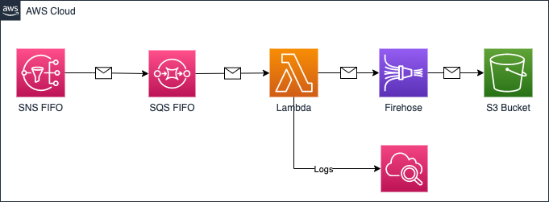

# Amazon FIFO SNS to Amazon FIFO SQS to AWS Lambda to Amazon Kinesis Firehose to Amazon S3

The Terraform template in this pattern allows you to connect an SQS FIFO queue to Firehose to process messages sent by an SNS FIFO topic and save the result to an S3 bucket using a Lambda function as a bridge to Firehose.

## Topology



### Deployed resources:
* S3 Bucket with blocked public access
* Firehose delivery stream with `extended_s3` as a destination
* FIFO SQS queue
* FIFO SNS Topic
* Lambda function in python
* Cloudwatch log group for Lambda function
* Required roles and policies 

Learn more about this pattern at Serverless Land Patterns: [serverlessland.com/patterns/sns-sqs-lambda-firehose-s3-terraform](https://serverlessland.com/patterns/sns-sqs-lambda-firehose-s3-terraform)

Important: this application uses various AWS services and there are costs associated with these services after the Free Tier usage - please see the [AWS Pricing page](https://aws.amazon.com/pricing/) for details. You are responsible for any AWS costs incurred. No warranty is implied in this example.

## Requirements

* [Create an AWS account](https://portal.aws.amazon.com/gp/aws/developer/registration/index.html) if you do not already have one and log in. The IAM user that you use must have sufficient permissions to make necessary AWS service calls and manage AWS resources.
* [AWS CLI](https://docs.aws.amazon.com/cli/latest/userguide/install-cliv2.html) installed and configured
* [Git](https://git-scm.com/book/en/v2/Getting-Started-Installing-Git) installed and configured
* [Terraform](https://learn.hashicorp.com/tutorials/terraform/install-cli)  installed

## Deployment Instructions

1. Create a new directory, navigate to that directory in a terminal and clone the GitHub repository:
```bash
git clone https://github.com/aws-samples/fifo-sns-sqs-lambda-firehose-s3
```
2. Change directory to the pattern directory:
```bash
cd serverless-patterns/fifo-sns-sqs-lambda-firehose-s3
```
3. Run the below command to initialize, download, and install the defined providers. In case you are not already familiar with the Terraform CLI, refer Terraform [documentation](https://www.terraform.io/cli/commands) to learn more about the various commands.
```bash
terraform init
```
4. Deploy the AWS resources for the pattern as specified in the `main.tf` file. Input variables are configured in `main.tf` as well. But, there are different ways to pass variables to the CLI.

```bash
terraform plan
```

Deploy:
```bash
terraform apply
```

6. Enter 'yes' hen prompted.

7. Note the output from the Terraform deployment process. These contain the resource names and/or ARNs which are used for testing.

## Testing

You can test the deployed pattern by sending a message using AWS console or using aws CLI by sending an SNS message

> please replace resource name by those provided by the terraform outputs

1. validate that there is no record file in the target bucket

```bash
aws s3 ls "s3://fifo-sns-sqs-lambda-firehose-s3-bucket-<YOUR-DEPLOYMENT-ID>" --recursive
```

2. Publish a new message to the topic (Please change the message ID for for each test because of the FIFO Topic and FIFO Queue use case)
```bash
aws sns publish --topic-arn arn:aws:sns:<YOUR-REGION-NAME>:<YOUR-ACCOUNT-ID>:fifo-sns-sqs-lambda-firehose-s3-topic-<YOUR-DEPLOYMENT-ID>.fifo --message-deduplication-id MSG-ID-1 --message-group-id MSG-GRP-1 --subject "TEST MESSAGE" --message "TESTING MESSAGE FROM CLI" --message-attributes '{"key1":{"DataType":"String","StringValue":"value1"}}'

{
    "MessageId": "c6e8c718-ed12-5a3b-a27a-9da5ac1f4eef",
    "SequenceNumber": "10000000000000008000"
}
```

3. Check the S3 bucket to validate that you  have a new record (please wait for at least 1 minute before doing the check -firehose delivery stream `buffer_interval` default value-)
```bash
aws s3 ls "s3://fifo-sns-sqs-lambda-firehose-s3-bucket-<YOUR-DEPLOYMENT-ID>" --recursive
2022-03-29 19:17:01  1672 2022/03/29/17/fifo-sns-sqs-lambda-firehose-s3-stream-<YOUR-DEPLOYMENT-ID>-1-2022-03-29-17-15-58-4c161535-d7d7-4ae8-b6b9-11ee2f4cd446
```

4. You can check cloudwatch log group as well to see the lambda's event logs
```bash
aws logs describe-log-streams --log-group-name '/aws/lambda/fifo-sns-sqs-lambda-firehose-s3-lambda-<YOUR-DEPLOYMENT-ID>'
{
    "logStreams": [
        {
            "logStreamName": "2022/03/29/[$LATEST]ace97fb61f154eb998090c7dbb4c218c",
            "creationTime": 1648574161717,
            "firstEventTimestamp": 1648574157592,
            "lastEventTimestamp": 1648574158945,
            "lastIngestionTime": 1648574161799,
            "uploadSequenceToken": "49623223228963219630688297264061931379053509364145981234",
            "arn": "arn:aws:logs:<YOUR-REGION-NAME>:xxxxxxxxxxx:log-group:/aws/lambda/fifo-sns-sqs-lambda-firehose-s3-lambda-<YOUR-DEPLOYMENT-ID>:log-stream:2022/03/29/[$LATEST]ace97fb61f154eb998090c7dbb4c218c",
            "storedBytes": 0
        }
    ]
}
```

```bash
aws logs get-log-events --log-group-name '/aws/lambda/fifo-sns-sqs-lambda-firehose-s3-lambda-<YOUR-DEPLOYMENT-ID>' --log-stream-name '2022/03/29/[$LATEST]ace97fb61f154eb998090c7dbb4c218c'
{
    "events": [
        {
            "timestamp": 1648574157592,
            "message": "START RequestId: 7591fa55-5523-5e8c-8daf-a0e815dd88ac Version: $LATEST\n",
            "ingestionTime": 1648574161799
        },
        {
            "timestamp": 1648574157593,
            "message": "event={\"Records\": [{\"messageId\": \"03ed01f6-27c6-4560-a3b1-4bd0e9be2f12\", \"receiptHandle\": \"AQEBsyZ2pC2LGgY/FfuOciKjogXCH6z3M+tCG03k5vB0B9SMddYTIijjotWXp+Mlh9NxILmr3Ts9fEKQqNAcVdUym1W7EpraHSy6Ia1sY2PL9qbMXXLCsnYSdOtPmXt1uM5qoGbbzjfMGUwMGRhOpZL2DxqFoV4IJxpc9TZ83Les9hpSXVy4WiSm/Gi5Acmw8fS4fGwGZUrkHgI0pfqQRwwbaPRUZRoWvkjBYU8cmsl34djJln1BAgWsVaRl3fop/m3vQGPC6UwEQQULfEsb5ja4lyw9zBH1uGhxAbuXMWrCea4UEBR0uFUkvLq4wdEnC8BmuoFMKVMVVB73I83VsD2oXA==\", \"body\": \"{\\n  \\\"Type\\\" : \\\"Notification\\\",\\n  \\\"MessageId\\\" : \\\"c6e8c718-ed12-5a3b-a27a-9da5ac1f4eef\\\",\\n  \\\"SequenceNumber\\\" : \\\"10000000000000008000\\\",\\n  \\\"TopicArn\\\" : \\\"arn:aws:sns:<YOUR-REGION-NAME>:xxxxxxxxxxx:fifo-sns-sqs-lambda-firehose-s3-topic-<YOUR-DEPLOYMENT-ID>.fifo\\\",\\n  \\\"Subject\\\" : \\\"TEST MESSAGE\\\",\\n  \\\"Message\\\" : \\\"TESTING MESSAGE FROM CLI\\\",\\n  \\\"Timestamp\\\" : \\\"2022-03-29T17:15:57.176Z\\\",\\n  \\\"UnsubscribeURL\\\" : \\\"https://sns.<YOUR-REGION-NAME>.amazonaws.com/?Action=Unsubscribe&SubscriptionArn=arn:aws:sns:<YOUR-REGION-NAME>:xxxxxxxxxxx:fifo-sns-sqs-lambda-firehose-s3-topic-<YOUR-DEPLOYMENT-ID>.fifo:06aa6509-19b1-4416-9099-68854a24b258\\\",\\n  \\\"MessageAttributes\\\" : {\\n    \\\"key1\\\" : {\\\"Type\\\":\\\"String\\\",\\\"Value\\\":\\\"value1\\\"}\\n  }\\n}\", \"attributes\": {\"ApproximateReceiveCount\": \"1\", \"SentTimestamp\": \"1648574157203\", \"SequenceNumber\": \"18868779057953519616\", \"MessageGroupId\": \"MSG-GRP-1\", \"SenderId\": \"AIDAWYJAWPFU7SUQGUJC6\", \"MessageDeduplicationId\": \"MSG-ID-1\", \"ApproximateFirstReceiveTimestamp\": \"1648574157203\"}, \"messageAttributes\": {}, \"md5OfBody\": \"6c76a5fbc05c0e6f12450412fd17eda9\", \"eventSource\": \"aws:sqs\", \"eventSourceARN\": \"arn:aws:sqs:<YOUR-REGION-NAME>:xxxxxxxxxxx:fifo-sns-sqs-lambda-firehose-s3-queue-<YOUR-DEPLOYMENT-ID>.fifo\", \"awsRegion\": \"<YOUR-REGION-NAME>\"}]}\n",
            "ingestionTime": 1648574161799
        },
        {
            "timestamp": 1648574158942,
            "message": "firehose.put_record.response={\"RecordId\": \"kOj4kIiJvGIdCJJ8zeSt/+k8h8UtLeRJXJjnHOzWjYqHChVweTTc1xiAk/YO6UMktOztOXvumLgPLB2+q4WhLCsecO1LwMRI44p2/7bvsSOzznFIiY3Zp1Sg3a0OZeQKshv1rRqQksGB/jyvOdbgB8Y7Kr1+TOP6o4PBELxIboJLu5cOOFIh5XOKIercG0v2BX1H7AnFXqhxy8pSj/Ow/XI63zo164Z5\", \"Encrypted\": false, \"ResponseMetadata\": {\"RequestId\": \"e8ba3831-f8f9-c7b5-b207-793f448d317e\", \"HTTPStatusCode\": 200, \"HTTPHeaders\": {\"x-amzn-requestid\": \"e8ba3831-f8f9-c7b5-b207-793f448d317e\", \"x-amz-id-2\": \"cRHV5ur/UONUdji8Fb9ZgAXWilshAFDC/hhq+EXi51FlScUgW+dn+Fesf4nxqIEPqw+KYARmAoHsHZBfPeLB456wNBAWDBKr\", \"content-type\": \"application/x-amz-json-1.1\", \"content-length\": \"257\", \"date\": \"Tue, 29 Mar 2022 17:15:58 GMT\"}, \"RetryAttempts\": 0}}\n",
            "ingestionTime": 1648574161799
        },
        {
            "timestamp": 1648574158945,
            "message": "END RequestId: 7591fa55-5523-5e8c-8daf-a0e815dd88ac\n",
            "ingestionTime": 1648574161799
        },
        {
            "timestamp": 1648574158945,
            "message": "REPORT RequestId: 7591fa55-5523-5e8c-8daf-a0e815dd88ac\tDuration: 1351.47 ms\tBilled Duration: 1352 ms\tMemory Size: 128 MB\tMax Memory Used: 65 MB\tInit Duration: 261.91 ms\t\n",
            "ingestionTime": 1648574161799
        }
    ],
    "nextForwardToken": "f/36764432259514369097377004316756648081944142504599814148/s",
    "nextBackwardToken": "b/36764432229341460843765071206258821259050909387008311296/s"
}
```

5. Download the record file from S3
```bash
aws s3 cp "s3://fifo-sns-sqs-lambda-firehose-s3-bucket-<YOUR-DEPLOYMENT-ID>/2022/03/29/17/fifo-sns-sqs-lambda-firehose-s3-stream-<YOUR-DEPLOYMENT-ID>-1-2022-03-29-17-15-58-4c161535-d7d7-4ae8-b6b9-11ee2f4cd446" .
download: s3://fifo-sns-sqs-lambda-firehose-s3-bucket-<YOUR-DEPLOYMENT-ID>/2022/03/29/17/fifo-sns-sqs-lambda-firehose-s3-stream-<YOUR-DEPLOYMENT-ID>-1-2022-03-29-17-15-58-4c161535-d7d7-4ae8-b6b9-11ee2f4cd446 to ./fifo-sns-sqs-lambda-firehose-s3-stream-<YOUR-DEPLOYMENT-ID>-1-2022-03-29-17-15-58-4c161535-d7d7-4ae8-b6b9-11ee2f4cd446
```

6. Display the record

```bash
cat fifo-sns-sqs-lambda-firehose-s3-stream-<YOUR-DEPLOYMENT-ID>-1-2022-03-29-17-15-58-4c161535-d7d7-4ae8-b6b9-11ee2f4cd446 | jq
```

```json
        
{
  "Records": [
    {
      "messageId": "03ed01f6-27c6-4560-a3b1-4bd0e9be2f12",
      "receiptHandle": "AQEBsyZ2pC2LGgY/FfuOciKjogXCH6z3M+tCG03k5vB0B9SMddYTIijjotWXp+Mlh9NxILmr3Ts9fEKQqNAcVdUym1W7EpraHSy6Ia1sY2PL9qbMXXLCsnYSdOtPmXt1uM5qoGbbzjfMGUwMGRhOpZL2DxqFoV4IJxpc9TZ83Les9hpSXVy4WiSm/Gi5Acmw8fS4fGwGZUrkHgI0pfqQRwwbaPRUZRoWvkjBYU8cmsl34djJln1BAgWsVaRl3fop/m3vQGPC6UwEQQULfEsb5ja4lyw9zBH1uGhxAbuXMWrCea4UEBR0uFUkvLq4wdEnC8BmuoFMKVMVVB73I83VsD2oXA==",
      "body": "{\n  \"Type\" : \"Notification\",\n  \"MessageId\" : \"c6e8c718-ed12-5a3b-a27a-9da5ac1f4eef\",\n  \"SequenceNumber\" : \"10000000000000008000\",\n  \"TopicArn\" : \"arn:aws:sns:<YOUR-REGION-NAME>:103886187339:fifo-sns-sqs-lambda-firehose-s3-topic-<YOUR-DEPLOYMENT-ID>.fifo\",\n  \"Subject\" : \"TEST MESSAGE\",\n  \"Message\" : \"TESTING MESSAGE FROM CLI\",\n  \"Timestamp\" : \"2022-03-29T17:15:57.176Z\",\n  \"UnsubscribeURL\" : \"https://sns.<YOUR-REGION-NAME>.amazonaws.com/?Action=Unsubscribe&SubscriptionArn=arn:aws:sns:<YOUR-REGION-NAME>:103886187339:fifo-sns-sqs-lambda-firehose-s3-topic-<YOUR-DEPLOYMENT-ID>.fifo:06aa6509-19b1-4416-9099-68854a24b258\",\n  \"MessageAttributes\" : {\n    \"key3\" : {\"Type\":\"String\",\"Value\":\"value3\"}\n  }\n}",
      "attributes": {
        "ApproximateReceiveCount": "1",
        "SentTimestamp": "1648574157203",
        "SequenceNumber": "18868779057953519616",
        "MessageGroupId": "MSG-GRP-3",
        "SenderId": "AIDAWYJAWPFU7SUQGUJC6",
        "MessageDeduplicationId": "MSG-ID-3",
        "ApproximateFirstReceiveTimestamp": "1648574157203"
      },
      "messageAttributes": {},
      "md5OfBody": "6c76a5fbc05c0e6f12450412fd17eda9",
      "eventSource": "aws:sqs",
      "eventSourceARN": "arn:aws:sqs:<YOUR-REGION-NAME>:103886187339:fifo-sns-sqs-lambda-firehose-s3-queue-<YOUR-DEPLOYMENT-ID>.fifo",
      "awsRegion": "<YOUR-REGION-NAME>"
    }
  ]
}
```

## Cleanup
 
1. Change to the below directory inside the cloned git repo:
```
cd serverless-patterns/fifo-sns-sqs-lambda-firehose-s3
```

2. Delete the resources
```bash
terraform destroy
```
3. Enter 'yes' hen prompted.

4. Check if all the resources were deleted successfully.
```bash
terraform show
```

----
Copyright Amazon.com, Inc. or its affiliates. All Rights Reserved.
SPDX-License-Identifier: MIT-0


