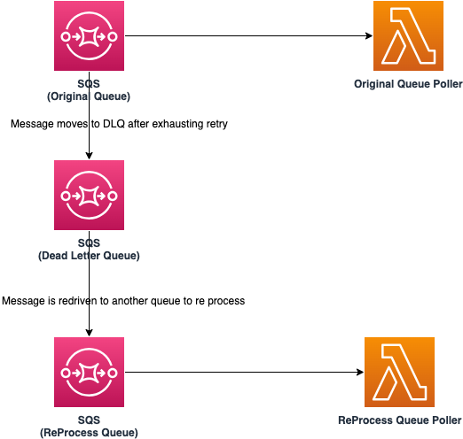
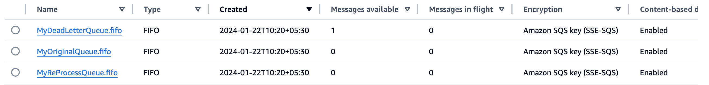
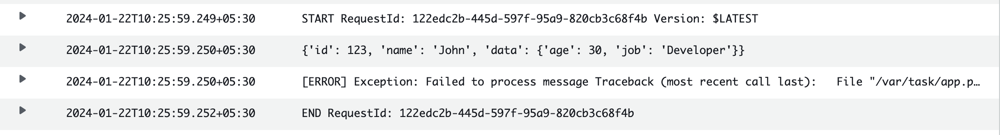
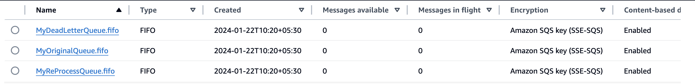
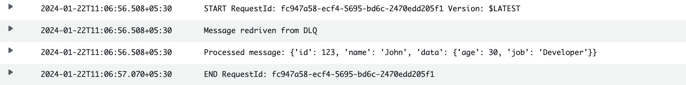

# Redrive SQS FIFO Queue messages from DLQ 

The pattern shows the redrive capability of Amazon SQS FIFO queues from a dead letter queue. The SAM template deploys two Amazon SQS FIO queues with DLQ, and two AWS Lambda functions to simulate the redrive capability of SQS.

Learn more about this pattern at Serverless Land Patterns:https://serverlessland.com/patterns/fifio-sqs-redrive

Important: this application uses various AWS services and there are costs associated with these services after the Free Tier usage - please see the [AWS Pricing page](https://aws.amazon.com/pricing/) for details. You are responsible for any AWS costs incurred. No warranty is implied in this example.

## Requirements

- [Create an AWS account](https://portal.aws.amazon.com/gp/aws/developer/registration/index.html) if you do not already have one and log in. The IAM user that you use must have sufficient permissions to make necessary AWS service calls and manage AWS resources.
- [AWS CLI](https://docs.aws.amazon.com/cli/latest/userguide/install-cliv2.html) installed and configured
- [Git Installed](https://git-scm.com/book/en/v2/Getting-Started-Installing-Git)
- [AWS Serverless Application Model](https://docs.aws.amazon.com/serverless-application-model/latest/developerguide/serverless-sam-cli-install.html) (AWS SAM) installed

## Deployment Instructions

1. Create a new directory, navigate to that directory in a terminal and clone the GitHub repository:
   ```
   git clone https://github.com/aws-samples/serverless-patterns
   ```
2. Change directory to the pattern directory:
   ```
   cd fifo-sqs-redrive
   ```
3. From the command line, use AWS SAM to deploy the AWS resources for the pattern as specified in the template.yml file:
   ```
   sam deploy --guided
   ```
4. During the prompts:
    * Enter a stack name
    * Enter `us-east-1` or any other supported AWS Region.
    * Allow SAM CLI to create IAM roles with the required permissions. Please keep all other options to default.
5. Make a note of the output, which will be used during testing.

## How it works

* This template creates two Amazon SQS queues - `MyOriginalQueue.fifo` and `MyReProcessQueue.fifo` along with DLQ `MyDeadLetterQueue.fifo`. 
* The template also creates two AWS Lambda functions `MyOriginalQueueFunction` and `ReProcessQueueFunction` to poll messages from `MyOriginalQueue.fifo` and `MyReProcessQueue.fifo` respectively through event source mapping.
* The Lambda function `MyOriginalQueueFunction` raises exception to simulate message processing failure. Hence the message moves to DLQ `MyDeadLetterQueue.fifo` once the retry is exhausted. 
* We then redrive the message from DLQ `MyDeadLetterQueue.fifo` to `MyReProcessQueue.fifo` using AWS CLI command.
* Message is successfully processed by `ReProcessQueueFunction` Lambda function.


Please refer to the architecture diagram below:



## Testing

1. Run the below aws cli command to push a JSON message into `MyOriginalQueue.fifo`. Please replace `{MyOriginalQueueUrl}` with the value received from the `sam deploy` command output and also replace `{your-region}` with your deployment region.
    ```bash
    aws sqs send-message --queue-url {MyOriginalQueueUrl}  --message-body '{"id":123,"name":"John","data":{"age":30,"job":"Developer"}}' --message-group-id "group1" --region {your-region}
    ```

   Sample output:
   ```bash
      {
         "MD5OfMessageBody": "2a33xxxxxxxxxxxxxd34a",
         "MessageId": "3809xxx-xxxx-xxxx-xxxx-exxxxb88b279",
         "SequenceNumber": "18883xxxxxxx616"
      }
   ```
2. Now, open [AWS SQS Console](https://console.aws.amazon.com/sqs), select your deployment region and validate the number of messages in `MyOriginalQueue.fifo`, `MyReProcessQueue.fifo` and `MyDeadLetterQueue.fifo` queues. You may have to refresh a few times while the message is being processed by `MyOriginalQueueFunction` AWS Lambda function. The message should be in the DLQ. PLease refer to the diagram below:
   


3. Also, validate from the Amazon CloudWatch log of `MyOriginalQueueFunction` that it failed to process the message due to an exception.
    


4. Now, let us redrive the message from `MyDeadLetterQueue.fifo` to `MyReProcessQueue.fifo` using the below aws cli command. Please replace `{MyOriginalQueueUrl}` and `{MyReProcessQueueArn}` with the value received from the `sam deploy` command output and also replace `{your-region}` with your deployment region.
    ```bash
    aws sqs start-message-move-task --source-arn {MyDeadLetterQueueArn} --destination-arn {MyReProcessQueueArn} --region {your-region}
    ```

   Sample output:
   ```bash
      {
         "TaskHandle": "eyJ0YXxxxxxxxxxxxxxxxxm8ifQ=="
      }
   ```


5. Again, let us validate the number of messages in `MyOriginalQueue.fifo`, `MyReProcessQueue.fifo` and `MyDeadLetterQueue.fifo` queues from [AWS SQS Console](https://console.aws.amazon.com/sqs). You may have to refresh a few times while the message is being processed by `ReProcessQueueFunction` AWS Lambda function. There should not be any messages in any of the queues now as the message got successfully reprocessed now. PLease refer to the diagram below:
   


6. Also, validate from the Amazon CloudWatch log of `ReProcessQueueFunction` that it processed the message successfully.
    


## Cleanup


1. Delete the stack
   ```bash
   sam delete
   ```

----
Copyright 2024 Amazon.com, Inc. or its affiliates. All Rights Reserved.

SPDX-License-Identifier: MIT-0
