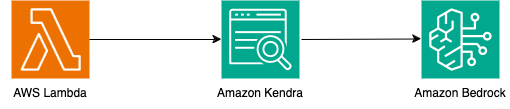

# AWS Lambda to Amazon Kendra to Amazon Bedrock

This pattern contains a sample AWS SAM stack that utilizes an AWS Lambda function to retrieve documents from an Amazon Kendra index and then pass it to Amazon Bedrock to generate a response. The pattern includes usage of the Amazon S3 data source connector. 

Important: this application uses various AWS services and there are costs associated with these services after the Free Tier usage - please see the AWS Pricing page for details. You are responsible for any AWS costs incurred. No warranty is implied in this example.

## Requirements
* [Create an AWS account](https://portal.aws.amazon.com/gp/aws/developer/registration/index.html) if you do not already have one and log in. The IAM user that you use must have sufficient permissions to make necessary AWS service calls and manage AWS resources.
* [AWS CLI](https://docs.aws.amazon.com/cli/latest/userguide/install-cliv2.html) installed and configured
* [Git Installed](https://git-scm.com/book/en/v2/Getting-Started-Installing-Git)
* [AWS Serverless Application Model](https://docs.aws.amazon.com/serverless-application-model/latest/developerguide/serverless-sam-cli-install.html) (AWS SAM) installed
* [Request Amazon Bedrock Model Access for Anthropic Claude models on Amazon Bedrock](https://docs.aws.amazon.com/bedrock/latest/userguide/model-access.html)
* [Create an S3 Bucket](https://docs.aws.amazon.com/AmazonS3/latest/userguide/creating-bucket.html) and [upload documents](https://docs.aws.amazon.com/AmazonS3/latest/userguide/upload-objects.html) that you want to be indexed. If you already have an S3 bucket with data that you want to crawl, you can skip this step.

## Deployment Instructions
1. Create a new directory, navigate to that directory in a terminal and clone the GitHub repository:
    ```
    git clone https://github.com/aws-samples/serverless-patterns
    ```
1. Change directory to the pattern directory:
    ```
    cd lambda-kendra-bedrock
    ```
1. From the command line, use AWS SAM to deploy the AWS resources for the pattern as specified in the template.yml file:
    ```
    sam deploy --guided --capabilities CAPABILITY_NAMED_IAM
    ```
1. During the prompts:

    * Enter a stack name
    * Enter the desired AWS Region
    * Enter one of the supported model IDs for Anthropic Claude on Bedrock from: `'anthropic.claude-instant-v1'`, `'anthropic.claude-3-sonnet-20240229-v1:0'`, `'anthropic.claude-3-haiku-20240307-v1:0'`, `'anthropic.claude-v2'`
    * Enter the S3 bucket name containing the contents you want to crawl. 
    * Enter Amazon Kendra edition: DEVELOPER_EDITION, ENTERPRISE_EDITION
    * Allow SAM CLI to create IAM roles with the required permissions.

    Once you have run `sam deploy --guided --capabilities CAPABILITY_NAMED_IAM` mode once and saved arguments to a configuration file (samconfig.toml), you can use `sam deploy` in future to use these defaults.*

1. Note the outputs from the SAM deployment process. These contain the resource names and/or ARNs which are used for testing.

# How it works
Please refer to the architecture diagram below:



Here's a breakdown of the steps:

**AWS Lambda:** Two AWS Lambda functions are created. `DataSourceSync` crawls and indexes the content. `InvokeBedrockLambda` invokes the specified model by passing the retrieved content from Amazon Kendra as context to the generative AI model.

**Amazon Kendra:** An Amazon Kendra index is created with a S3 data source connector. When a the `InvokeBedrockLambda` function is called, documents are retrieved from the Amazon Kendra index.

**Amazon Bedrock:** Documents retrieved from the Amazon Kendra index are sent to Amazon Bedrock which responds with a generated response.

## Testing

CLI Lambda invoke with test event:

```bash
aws lambda invoke --function-name INVOKE_LAMBDA_FUNCTION_ARN --payload '{"question": "Value" }' output.txt
```

The output.txt will contain the response generated by Amazon Bedrock.

Example JSON Lambda test event:

```
{
    "question": "Value"
}
```

## Cleanup

1. Delete the stack
    ```bash
    sam delete
    ```
----
Copyright 2023 Amazon.com, Inc. or its affiliates. All Rights Reserved.

SPDX-License-Identifier: MIT-0