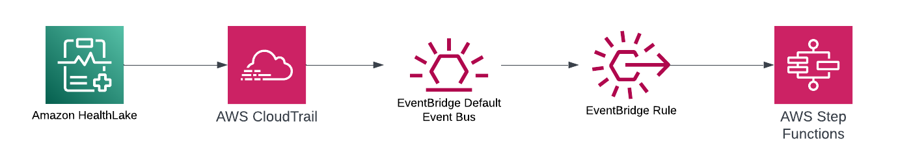
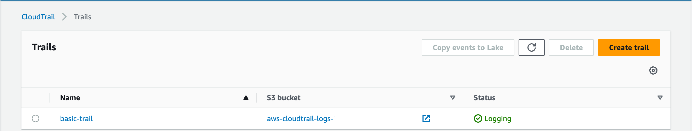
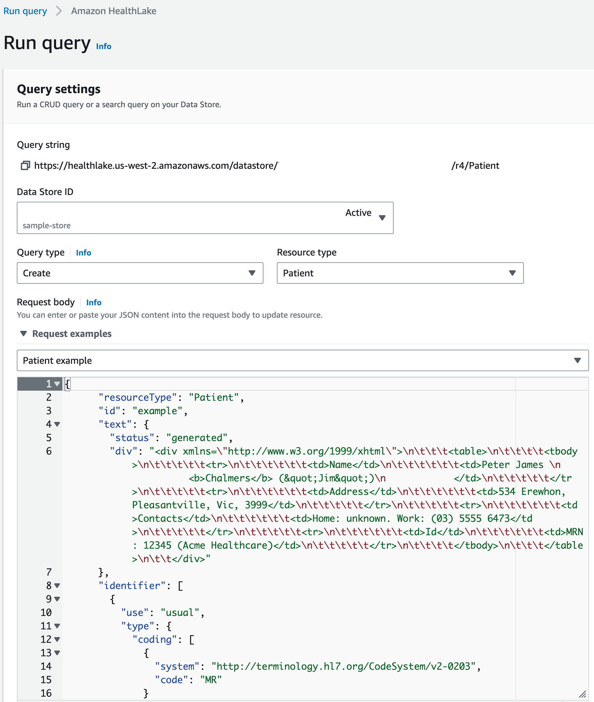
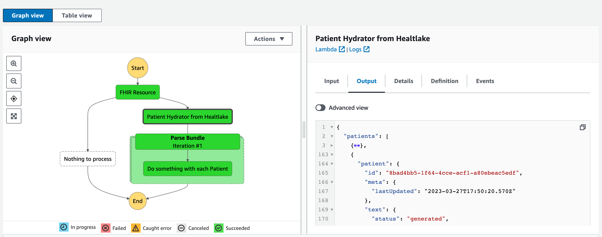

# HealthLake Change Data Capture Pattern

This pattern demonstrates how to handle changes in HealthLake that can be published into an Event-Driven Architecture ecosystem as a data change event.



When using this pattern, HealthLake becomes not only a consumer of data but also a producer. By adding this capability to HealthLake, it can be put in the center of a modern distributed Healthcare application and serve as an ingress and egress point.

Learn more about this pattern at Serverless Land Patterns: https://serverlessland.com/patterns/healthlake-cloudtrail-eventbridge-sfn-cdk

**Important**: this application uses various AWS services (including HealthLake) and there are costs associated with these services after the Free Tier usage - please see the [AWS Pricing page](https://aws.amazon.com/pricing/) for details. You are responsible for any AWS costs incurred. No warranty is implied in this example.

## Requirements

-   [Create an AWS account](https://portal.aws.amazon.com/gp/aws/developer/registration/index.html) if you do not already have one and log in. The IAM user that you use must have sufficient permissions to make necessary AWS service calls and manage AWS resources.
-   [AWS CLI](https://docs.aws.amazon.com/cli/latest/userguide/install-cliv2.html) installed and configured
-   [Git Installed](https://git-scm.com/book/en/v2/Getting-Started-Installing-Git)
-   [Node and NPM](https://nodejs.org/en/download/) installed
-   [AWS CDK](https://docs.aws.amazon.com/cdk/v2/guide/getting_started.html) (AWS CDK) installed
-   [Go Language](https://go.dev/doc/install) installed

## Deployment Instructions

1. Create a new directory, navigate to that directory in a terminal and clone the GitHub repository:

```
git clone https://github.com/aws-samples/serverless-patterns
```

2. Change directory to the pattern directory:

```
cd healthlake-change-data-capture
```

3. Install the project dependencies

```
npm install
```

4. Deploy the stack to your default AWS account and region

```
make deploy
```

5. **Wait a bit**. Deploying a Healthlake datastore might take 20 - 30 minutes. You only encounter this on the first deployment and subsequent changes will not require this

## How it works

This pattern is designed to demonstrate how to turn AWS HealthLake into a publisher of events so that it can be integrated into an Event-Driven Architecture. It leverages several "serverless" services to achieve this.

Once the pattern is deployed to AWS, you will have the following resources created with the described capabilities

-   HealthLake Datastore v4 - this is an FHIR-compliant datastore that will hold Patient-centric Healthcare data [AWS HealthLake](https://aws.amazon.com/healthlake/)
-   EventBridge Rule - Rule on the default bus that will listen to API-recorded events that happen against the HealthLake. **For this to work, a CloudTrail must be enabled on the account**
-   State Machine that will receive events published from the EventBridge Rule as a target. The State Machine will "hydrate" the changed Patients and prepare them for publishing
-   SQS - acts as a Dead Letter Queue for failed attempts at publishing to the State Machine Target from the EventBridge Rule
-   Two Lambda Functions are written in Go that will be executed in the State Machine

#### How to create a CloudTrail

Visit the AWS Console and navigate to CloudTrail. When you "Create Trail" it will look like this



## Testing in the AWS Console

After running `make deploy` POST a record into the HealthLake store.

-   Visit the AWS Console and search for HealthLake.
-   Click View Datastores
-   Run Query
    -   Pick the datastore
    -   Select create resource
    -   Select patient as the resource
    -   Use the sample patient resource



Visit the State Machine Executions and there will be an execution that looks like this



## Cleanup

1. Delete the stack

```bash
make destroy
```

## Documentation

-   [AWS EventBridge CDK Documentation](https://docs.aws.amazon.com/cdk/api/v2/docs/aws-cdk-lib.aws_events-readme.html)
-   [AWS HealthLake](https://aws.amazon.com/healthlake/)
-   [AWS Cloudtrail](https://aws.amazon.com/cloudtrail/)
-   [Golang Lambda](https://docs.aws.amazon.com/lambda/latest/dg/golang-handler.html)

---

Copyright 2023 Amazon.com, Inc. or its affiliates. All Rights Reserved.

SPDX-License-Identifier: MIT-0
