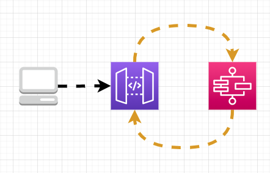

# HTTP API to Step Function to HTTP API to Step Function...

This pattern demonstrates executing a Step Function using an API Gateway that will then invoke the same API Gateway to invoke that very Step Function again, and so on.



Don't actually use this.

Learn more about this pattern at Serverless Land Patterns: https://serverlessland.com/patterns/httpapi-sfn-httpapi-sfn

Important: this application uses various AWS services and there are costs associated with these services after the Free Tier usage - please see the [AWS Pricing page](https://aws.amazon.com/pricing/) for details. You are responsible for any AWS costs incurred. No warranty is implied in this example.

## Requirements

* [Create an AWS account](https://portal.aws.amazon.com/gp/aws/developer/registration/index.html) if you do not already have one and log in. The IAM user that you use must have sufficient permissions to make necessary AWS service calls and manage AWS resources.
* [AWS CLI](https://docs.aws.amazon.com/cli/latest/userguide/install-cliv2.html) installed and configured
* [Git Installed](https://git-scm.com/book/en/v2/Getting-Started-Installing-Git)
* [AWS Serverless Application Model](https://docs.aws.amazon.com/serverless-application-model/latest/developerguide/serverless-sam-cli-install.html) (AWS SAM) installed

## Deployment Instructions

1. Create a new directory, navigate to that directory in a terminal and clone the GitHub repository:
    ``` 
    git clone https://github.com/aws-samples/serverless-patterns
    ```
1. Change directory to the pattern directory:
    ```
    cd httpapi-sfn-httpapi-sfn
    ```
1. From the command line, use AWS SAM to deploy the AWS resources for the pattern as specified in the template.yml file:
    ```
    sam deploy --guided
    ```
1. During the prompts:
    * Enter a stack name
    * Enter the desired AWS Region
    * Allow SAM CLI to create IAM roles with the required permissions.

    Once you have run `sam deploy -guided` mode once and saved arguments to a configuration file (samconfig.toml), you can use `sam deploy` in future to use these defaults.

1. Note the outputs from the SAM deployment process. These contain the resource names and/or ARNs which are used for testing.

## How it works

The template creates an API Gateway, a Step Function, and a shared IAM role (the state machine requires a role to be assigned even though it is only executing an API).

## Testing

The execution endpoint is available in the outputs from the created stack. Start the Rube Golberg machine by making an empty `POST` request:

```shell
curl -X POST ${ExecuteApi Output}
```

Open CloudWatch in the AWS console and watch the show by following:
- ApiGateway > ApiId > {ApiId Output} > Count, Sum, 1 minute
- States > Execution Metrics > {StepFunctionArn Output} > ExecutionsStarted, Sum, 1 minute

**Tear down the stack to stop it.**

## Cleanup
 
1. Delete the stack
    ```bash
    aws cloudformation delete-stack --stack-name STACK_NAME
    ```
1. Confirm the stack has been deleted
    ```bash
    aws cloudformation list-stacks --query "StackSummaries[?contains(StackName,'STACK_NAME')].StackStatus"
    ```
----
Copyright 2021 Amazon.com, Inc. or its affiliates. All Rights Reserved.

SPDX-License-Identifier: MIT-0
