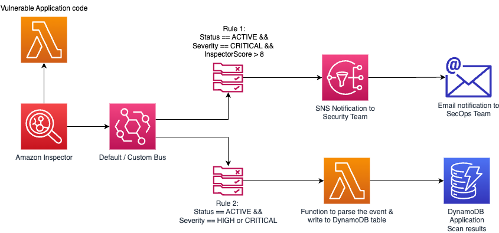

# Optimized Vulnerability Management: Streamling Amazon Inspector findings with Amazon EventBridge rules for multiple targets

Amazon Inspector is an automated vulnerability management service that continually scans AWS workloads for software vulnerabilities and unintended network exposure.  

Effective vulnerability management requires prioritizing severity to ensure prompt resolution. Give greater attention to critical severities over low ones. Remember that not every severity demands immediate attention, and not all severities can be disregarded as low. Therefore, it is recommended to organize vulnerability management based on severity. For example, critical and high severities should trigger an additional workflow to promptly notify the SecOps team for action, while the remaining severities can be logged and monitored by the development and operations team for resolution.

In this pattern, you will learn on how to create the custom Amazon EventBridge rules and define the targets based on the severity of the identified vulnerability. This can also be extended to integrate with Amazon QuickSight for reporting and analytics or to integrate with 3rd party ITSM tools.

Learn more about this pattern at Serverless Land Patterns: https://serverlessland.com/patterns/lambda-inspector-eventbridge-multi-destinations

To enable the Events onto EventBridge you will need to use Amazon Inspector and [turn on scanning for Lambda functions](https://aws.amazon.com/blogs/security/perform-continuous-vulnerability-scanning-of-aws-lambda-functions-with-amazon-inspector/).

Important: this application uses various AWS services and there are costs associated with these services after the Free Tier usage - please see the [AWS Pricing page](https://aws.amazon.com/pricing/) for details. You are responsible for any AWS costs incurred. No warranty is implied in this example.

## Requirements

- [Create an AWS account](https://portal.aws.amazon.com/gp/aws/developer/registration/index.html) if you do not already have one and log in. The IAM user that you use must have sufficient permissions to make necessary AWS service calls and manage AWS resources.
- [AWS CLI](https://docs.aws.amazon.com/cli/latest/userguide/install-cliv2.html) installed and configured
- [Git Installed](https://git-scm.com/book/en/v2/Getting-Started-Installing-Git)
- [AWS Serverless Application Model](https://docs.aws.amazon.com/serverless-application-model/latest/developerguide/serverless-sam-cli-install.html) (AWS SAM) installed
- [Other alternative would be to use Cloud9](https://aws.amazon.com/cloud9/)
- [Enable Amazon Inspector](https://aws.amazon.com/blogs/security/perform-continuous-vulnerability-scanning-of-aws-lambda-functions-with-amazon-inspector/)

## Deployment Instructions

1. Create a new directory, navigate to that directory in a terminal and clone the GitHub repository:
   ```
   git clone https://github.com/aws-samples/serverless-patterns
   ```
2. Change directory to the pattern directory:
   ```
   cd lambda-inspector-eventbridge-multi-destinations
   ```
3. From the command line, use AWS SAM to build and deploy the AWS resources for the pattern as specified in the template.yml file:
   ```
   sam build;
   sam deploy --guided
   ```
4. During the prompts:

   - Enter a stack name
   - Enter the desired AWS Region
   - Allow SAM CLI to create IAM roles with the required permissions.

5. Note the outputs from the SAM deployment process. These contain the resource names and/or ARNs which are used for testing.

6. Now subscribe and confirm your email address to the SNS topic listed in the output section. 

## How it works


Amazon Inspector will run scans against your Lambda functions, if the vulnerability is detected an event (by AWS) is raised to default event bus.The two Eventbridge rules created will listen to specific events, once captured, they will reach the specifcied target to take the defined action. 

The integration with DynamoDB facilitates the storage of events requiring in-depth investigation, while also triggering notifications for findings categorized as CRITICAL. The versatility of this concept extends to the possibility of integrating the DynamoDB table with web applications or leveraging analytics to enhance the insights extracted from DynamoDB.

If you would like to learn how to enable Amazon Inspector for Lambda at single and multi account level, then do so by following this blog. [Enable Amazon Inspector in single and multi account](https://aws.amazon.com/blogs/security/perform-continuous-vulnerability-scanning-of-aws-lambda-functions-with-amazon-inspector/)

## Testing 
1. Navigate to the AWS SNS Service dashboard to subscribe and confirm the email address to receive the notifications. [Step by step guide](
https://docs.aws.amazon.com/sns/latest/dg/sns-email-notifications.html)

2. For the testing purpose, let's add vulnernable packages to the AWS Lambda function to be picked by Amazon Inspector. 
Please make sure #1 is complete to receive the email notification.

```
echo -e 'requests==2.20.0\npython-jwt==3.3.3' > test-package-vulnerability/requirements.txt;
sam build;
sam deploy
```
Once you have run `sam deploy --guided` mode once and saved arguments to a configuration file (samconfig.toml), you can use `sam deploy` in future to use these defaults.

## Validation
1. Amazon Inspector will report the findings for the lambda vulnerable-lambda-fn
2. In the DynamoDB table, there should be 2 records for vulnerabilities with severity Critical and High.
2. In the inbox of the subscribed email address, there should be an email for the severity Critical and score greater than 8.

Opportunities are endless from here, as you can integrate with AWS services or the 3rd party ITSM services for tracking.

## Delete stack

```
sam delete
```
---

Copyright 2023 Amazon.com, Inc. or its affiliates. All Rights Reserved.

SPDX-License-Identifier: MIT-0
