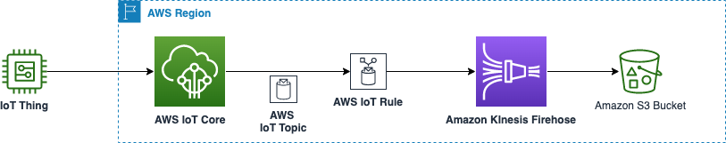

# AWS IoT Core to Amazon Kinesis Data Firehose to Amazon Simple Storage Service (Amazon S3)

This pattern contains a sample AWS CDK stack to create an IoT Rule with a Kinesis Data Firehose action with a Amazon S3 bucket as the destination.



When a message is published to the IoT topic defined in the IoT Rule, this message will be delivered to Kinesis Data Firehose stream. The Kinesis Data Firehose stream is configured to deliver to an Amazon S3 bucket using [dynamic partitioning](https://docs.aws.amazon.com/firehose/latest/dev/dynamic-partitioning.html). 

Learn more about this pattern at Serverless Land Patterns: https://serverlessland.com/patterns/iot-firehose-s3-cdk

Important: this application uses various AWS services and there are costs associated with these services after the Free Tier usage - please see the [AWS Pricing page](https://aws.amazon.com/pricing/) for details. You are responsible for any AWS costs incurred. No warranty is implied in this example.

## Requirements

* [Create an AWS account](https://portal.aws.amazon.com/gp/aws/developer/registration/index.html) if you do not already have one and log in. The IAM user that you use must have sufficient permissions to make necessary AWS service calls and manage AWS resources.
* [AWS CLI](https://docs.aws.amazon.com/cli/latest/userguide/install-cliv2.html) installed and configured
* [Git Installed](https://git-scm.com/book/en/v2/Getting-Started-Installing-Git)
* [Node and NPM](https://nodejs.org/en/download/) installed
* [AWS Cloud Development Kit](https://docs.aws.amazon.com/cdk/latest/guide/cli.html) (AWS CDK) installed

## Deployment Instructions

1. Clone the project to your local working directory

   ```sh
   git clone https://github.com/aws-samples/serverless-patterns/ 
   ```

2. Change the working directory to this pattern's directory

   ```sh
   cd serverless-patterns/iot-firehose-s3-cdk
   ```
3. Set up the stack in your AWS account and region. 
- Change the working directory to the stack 

   ```sh
   cd iot-kfh-s3
   ```
- Deploy the stack to your default AWS account and region. 

   ```sh
   cdk deploy
   ```
## How it works

The CDK app deploys the resources and the IAM permissions required to run the application. 

## Testing

You can test the pattern using AWS Console.

### Using AWS Console

Log into the AWS Console, browse to AWS IoT Core:

1. In the AWS IoT Core Console, in the `Test` section (left-side pane), select the `MQTT test client`. 

2. Then under `Publish to a topic`, in the Topic filter field enter this: `device/data` (with this stack you can use any topic structure), type the following custom message:
```sh
{
   "deviceId" : "AABBCCDDEEFF",
   "timestamp": 1659568019,
   "temperature" : 79,
   "humidity" : 95
}
```
Then click the `Publish` button.
`deviceId` and `timestamp` fields in the message are mandatory since the CDK stack has configured the Kinesis Data Firehose dynamic partitioning to use these fields.
You can generate a new/different value for `timestamp` and then click publish button. You should test by publishing the message a few more times - each time you should change the `timestamp` field, and optionally vary the `temperature` and `humidity` fields.

3. Open the Amazon S3 Console, and navigate to the S3 bucket created by the stack. Kinesis Data Firehose has been configured in this stack to buffer data for 120 seconds before writing it to S3 bucket. You should see the following (or similar depending on the `timestamp` value and the message content) folder structure in the S3 bucket:

```json
Amazon S3 > Buckets > <bucketName> > AABBCCDDEEFF/ 2022/ 08/ 03/ 23/
```
In the directory above you should be able to download the file with your messages and view them in a text editor.

## Cleanup
 
Run the given command to delete the resources that were created. It might take some time for the CloudFormation stack to get deleted. See the Notes section in [README](./README.md)

```sh
cdk destroy
```

## Roadmap

1. Include a simulated IoT device sending MQTT messages to AWS IoT Core using [AWS IoT Device SDK v2 for Python](https://github.com/aws/aws-iot-device-sdk-python-v2)
2. Support for using [`aws-kinesisfirehose-s3`](aws-kinesisfirehose-s3) solution construct.

## Resources
1. [AWS IoT Rule Actions](https://docs.aws.amazon.com/iot/latest/developerguide/iot-rule-actions.html)
2. [Dynamic Partitioning in Kinesis Data Firehose](https://docs.aws.amazon.com/firehose/latest/dev/dynamic-partitioning.html)

----
Copyright Amazon.com, Inc. or its affiliates. All Rights Reserved. 

SPDX-License-Identifier: MIT-0
