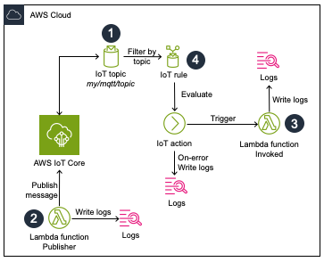

# AWS Lambda to AWS IoT Core

This pattern deploys an AWS Lambda function, which publishes a message to an AWS IoT Core topic. The topic is watched by a rule which will trigger an action when the condition is met. The action calls an AWS Lambda function.

Learn more about this pattern at Serverless Land Patterns: https://serverlessland.com/patterns/iot-lambda-pub-receiver-cdk

Important: this application uses various AWS services and there are costs associated with these services after the Free Tier usage - please see the [AWS Pricing page](https://aws.amazon.com/pricing/) for details. You are responsible for any AWS costs incurred. No warranty is implied in this example.

## Requirements

* [Create an AWS account](https://portal.aws.amazon.com/gp/aws/developer/registration/index.html) if you do not already have one and log in. The IAM user that you use must have sufficient permissions to make necessary AWS service calls and manage AWS resources.
* [AWS CLI](https://docs.aws.amazon.com/cli/latest/userguide/install-cliv2.html) installed and configured
* [Git Installed](https://git-scm.com/book/en/v2/Getting-Started-Installing-Git)
* [AWS Cloud Development Kit (AWS CDK) installed](https://docs.aws.amazon.com/cdk/v2/guide/getting_started.html)

## Architecture diagram


This CDK stack creates an AWS IoT Core setup with a publisher-receiver pattern using Lambda functions. 
Here's a breakdown of the main components:

1. An IoT MQTT topic named "my/mqtt/topic"

1. Publisher Lambda Function, written in Python and using ARM64 architecture, has permissions to publish messages to the specified MQTT topic (1). Its environment variables include the MQTT topic region and name.

1. Receiver Lambda Function, also in Python and using ARM64 architecture, has permissions to receive messages from the MQTT topic.

1. IoT Topic Rule, named "ProcessIoTMessages, uses SQL version 2016-03-23 to select all messages from the MQTT topic. It triggers the receiver Lambda function when messages arrive and it includes error logging to CloudWatch Logs.

## Deployment Instructions

1. Create a new directory, navigate to that directory in a terminal and clone the GitHub repository:
    ``` 
    git clone https://github.com/aws-samples/serverless-patterns
    ```
1. Change directory to the pattern directory:
    ```
    cd iot-lambda-pub-receiver-cdk
    ```
1. Install dependencies
    ```bash
    npm install
    ```
1. From the command line, use AWS SAM to deploy the AWS resources for the pattern as specified in the template.yml file:
    ```
    cdk deploy
    ```

2. Note the outputs from the CDK deployment process. These contain the IoT endpoint address which is not relevant if you have only one account. However, in multi-accounts deployment, especially when the IoT resources are not in the same as the lambdas, then the endpoint address has to be specified in the functions' code.

## Testing

Provide steps to trigger the integration and show what should be observed if successful.

## Cleanup
 
Run the given command to delete the resources that were created. It might take some time for the CloudFormation stack to get deleted.

```bash
cdk destroy
```
----
Copyright 2024 Amazon.com, Inc. or its affiliates. All Rights Reserved.

SPDX-License-Identifier: MIT-0
