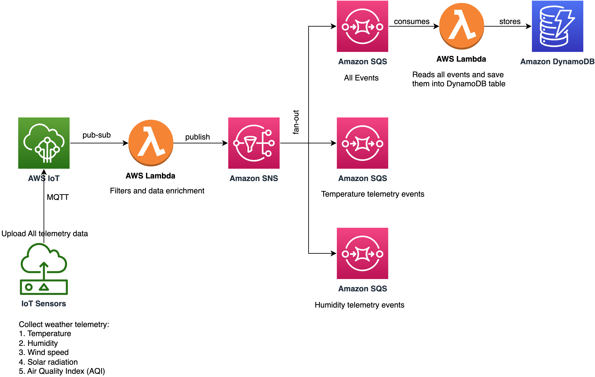
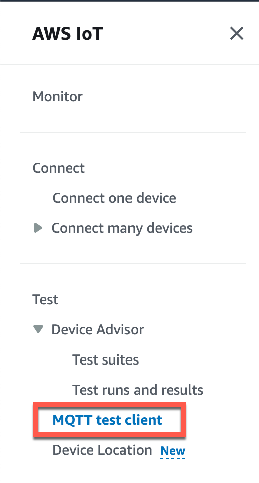
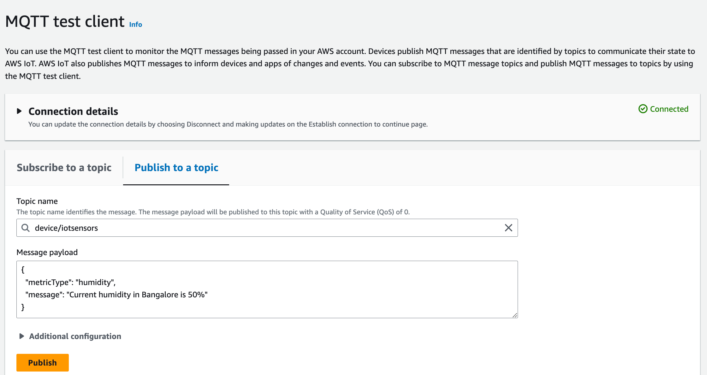
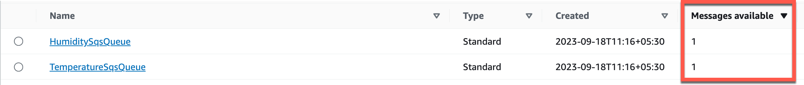
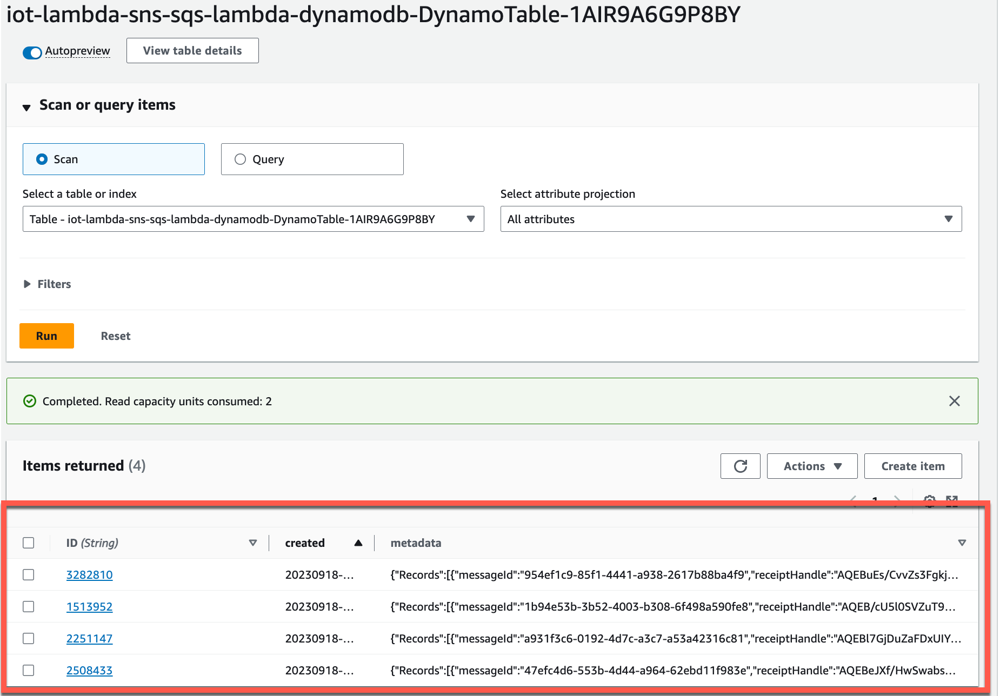

# IoT Even Processing through AWS Serverless Services

The SAM template deploys an IoT Thing, an event processor Lambda function, an SNS topic, three SQS fanout queues, a consumer Lambda function, a DynamoDB table and the IAM permissions required to run the application. When an IoT event is sent to an IoT topic, the event processor Lambda function is invoked. The event processor Lambda function to poll this event, filters out the events that are not required and publishes the required events to a SNS topic. There is an SNS-SQS fan out pattern using subscription filter policy. The events from SNS topics moves to the respective SQS queues depnding on the filter policy. The consumer Lambda function reads from the SQS queue and stored the event in a DynamoDB table. 

Learn more about this pattern at Serverless Land Patterns: https://serverlessland.com/patterns/iot-lambda-sns-sqs-lambda-dynamodb/.

Important: this application uses various AWS services and there are costs associated with these services after the Free Tier usage - please see the [AWS Pricing page](https://aws.amazon.com/pricing/) for details. You are responsible for any AWS costs incurred. No warranty is implied in this example.

## Requirements

* [Create an AWS account](https://portal.aws.amazon.com/gp/aws/developer/registration/index.html) if you do not already have one and log in. The IAM user that you use must have sufficient permissions to make necessary AWS service calls and manage AWS resources.
* [AWS CLI](https://docs.aws.amazon.com/cli/latest/userguide/install-cliv2.html) installed and configured
* [Git Installed](https://git-scm.com/book/en/v2/Getting-Started-Installing-Git)
* [AWS Serverless Application Model](https://docs.aws.amazon.com/serverless-application-model/latest/developerguide/serverless-sam-cli-install.html) (AWS SAM) installed

## Deployment Instructions

1. Create a new directory, navigate to that directory in a terminal and clone the GitHub repository:
    ``` 
    git clone https://github.com/aws-samples/serverless-patterns
    ```
1. Change directory to the pattern directory:
    ```
    cd iot-lambda-sns-sqs-lambda-dynamodb
    ```
1. From the command line, use AWS SAM to build and deploy the AWS resources for the pattern as specified in the template.yml file:
    ```
    sam build
    sam deploy --guided
    ```
1. During the prompts:
    * Enter a stack name
    * Enter the desired AWS Region
    * Allow SAM CLI to create IAM roles with the required permissions.

    Once you have run `sam deploy -guided` mode once and saved arguments to a configuration file (samconfig.toml), you can use `sam deploy` in future to use these defaults.

1. Note the outputs from the SAM deployment process. These contain the resource names and/or ARNs which are used for testing.

## How it works

When message events are sent to a IoT topic, this event will trigger a Lambda function and the event flows through rest of the chain of AWS serverless services. Please refer to the architecture diagram for the event flow.


### Testing

The easiest way to test is using the MQTT test client.

1. In the [AWS IoT console](https://console.aws.amazon.com/iot/home), in the left menu, choose MQTT test client from under the Test section.



2. In the MQTT test client page, select the **Publish to a topic** tab and add the created topic name: `device/iotsensors`



3. Add one of the below message payloads: 
   
   Example payload 1:
    ```bash
    {
        "MetricType": "Temperature",
        "MetricValue": "18 C",
        "Location": "Bangalore"
    }
   ``` 
   Example payload 2: 
   ```bash
    {
        "MetricType": "Humidity",
        "MetricValue": "78%",
        "Location": "Bangalore"
    }
   ``` 
   Example payload 3: 
   ```bash
    {
        "MetricType": "WindSpeed",
        "MetricValue": "20 km/hr",
        "Location": "Bangalore"
    }
   ``` 

4. Click in **Publish** to send the event. After the event has been sent, the created the IoT event processor Lambda will be triggered and the event will flow through the data pipeline.


5. Go to the [AWS SQS Console](https://console.aws.amazon.com/sqs/v2/home) page and search for the queue with name `HumiditySqsQueue` and `TemperatureSqsQueue` and validate the number of messages based on number of the times events where published on AWS IoT console. Please note `MetricType` attribute in the IoT even payload determines the filter and routing logic.


6. Go to the [AWS DynamoDB Console](https://console.aws.amazon.com/dynamodbv2/home) page and search for the DynamoDB table with name `iot-lambda-sns-sqs-lambda-dynamodb-DynamoTable-*`. Investigate the items in the DynamoDB table. It should contain both the temperature and humidity event data. 



7. The above validates the end to pipeline is workign fine. For troubleshooting, please checks the CloudWatch logs for Lambda funcrtions. 

## Cleanup
 
1. Delete the stack
    ```bash
    aws cloudformation delete-stack --stack-name STACK_NAME
    ```
2. Confirm the stack has been deleted
    ```bash
    aws cloudformation list-stacks --query "StackSummaries[?contains(StackName,'STACK_NAME')].StackStatus"
    ```
----
Copyright 2021 Amazon.com, Inc. or its affiliates. All Rights Reserved.

SPDX-License-Identifier: MIT-0
