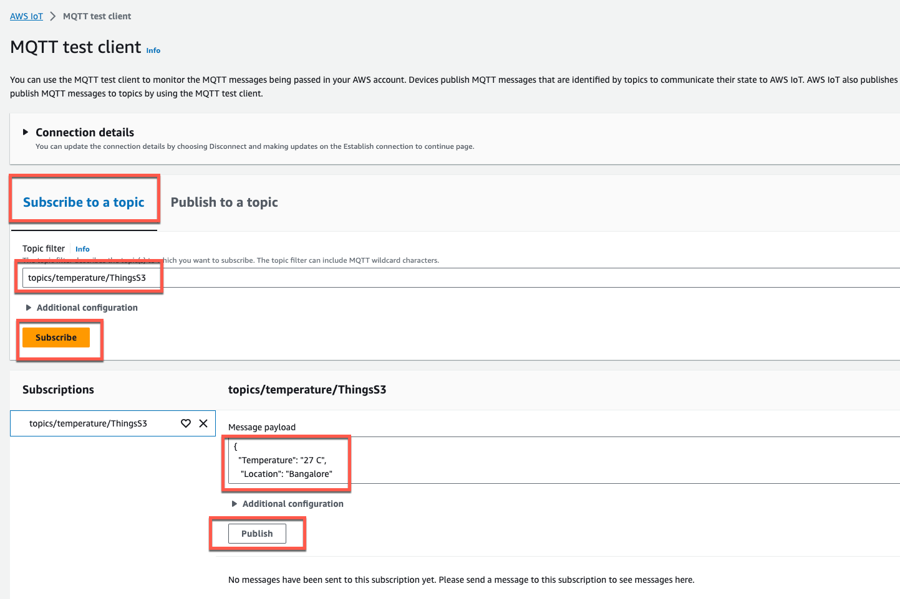

# AWS IoT to S3

This pattern explains how to put data to Amazon Simple Storage Service (S3) using AWS IoT Topic Rules.

Learn more about this pattern at [Serverless Land Patterns](https://serverlessland.com/patterns/iot-s3).

Important: this application uses various AWS services and there are costs associated with these services after the Free Tier usage - please see the [AWS Pricing page](https://aws.amazon.com/pricing/) for details. You are responsible for any AWS costs incurred. No warranty is implied in this example.

## Requirements

* [Create an AWS account](https://portal.aws.amazon.com/gp/aws/developer/registration/index.html) if you do not already have one and log in. The IAM user that you use must have sufficient permissions to make necessary AWS service calls and manage AWS resources.
* [AWS CLI](https://docs.aws.amazon.com/cli/latest/userguide/install-cliv2.html) installed and configured
* [Git Installed](https://git-scm.com/book/en/v2/Getting-Started-Installing-Git)
* [AWS Serverless Application Model](https://docs.aws.amazon.com/serverless-application-model/latest/developerguide/serverless-sam-cli-install.html) (AWS SAM) installed

## Deployment Instructions

1. Create a new directory, navigate to that directory in a terminal and clone the GitHub repository:
    ```
    git clone https://github.com/aws-samples/serverless-patterns
    ```
1. Change directory to the pattern directory:
    ```
    cd iot-s3
    ```
1. From the command line, use AWS SAM to deploy the AWS resources for the pattern as specified in the template.yml file:
    ```
    sam deploy --guided
    ```
1. During the prompts:
    * Enter a stack name
    * Enter the desired AWS Region
    * Allow SAM CLI to create IAM roles with the required permissions.

    Once you have run `sam deploy --guided` once and saved arguments to a configuration file (samconfig.toml), you can use `sam deploy` in future to use these defaults.

## How it works

When message events are sent to a subscribed IoT topic, this event is pushed to S3. Please refer to the architecture diagram for the event flow.


## Testing

The easiest way to test is using the MQTT test client.

1. In the [AWS IoT console](https://console.aws.amazon.com/iot/home), in the left menu, choose MQTT test client from under the Test section.


2. In the MQTT test client page, select the **Subscribe to a topic** tab and add the Topic filter: `topics/temperature/ThingsS3`



3. Add the below message payloads and click on **Publish** button: 

    ```bash
    {
        "Temperature": "18 C",
        "Location": "Bangalore"
    }
   ``` 
4. Add the Topic filter: `topics/humidity/ThingsS3`

5. Add the below message payloads and click on **Publish** button: 

   ```bash
    {
        "Humidity": "78%",
        "Location": "Bangalore"
    }
   ``` 

6. IoT Rule Action pushes these events to Amazon S3.


7. Go to the [Amazon S3 Console](https://s3.console.aws.amazon.com/s3/home?region=eu-west-1) page and search for bucket with name `iot-s3-mys3bucket-*`. Navigate inside the bucket and validate that events are pushed to the bucket. Download the object contents and validate the content.


## AWS Documentation
- [AWS IoT SQL Reference](https://docs.aws.amazon.com/iot/latest/developerguide/iot-sql-reference.html?icmpid=docs_iot_console)
- [AWS IoT SQL - FROM Clause](https://docs.aws.amazon.com/iot/latest/developerguide/iot-sql-from.html)
- [AWS IoT Rule Actions](https://docs.aws.amazon.com/iot/latest/developerguide/iot-rule-actions.html)
- [CloudFormation - AWS::IoT::TopicRule](https://docs.aws.amazon.com/AWSCloudFormation/latest/UserGuide/aws-resource-iot-topicrule.html)
- [AWS IoT Quotas](https://docs.aws.amazon.com/general/latest/gr/iot-core.html)

## Cleanup

1. Delete the stack
    ```bash
    sam delete
    ```

----
Copyright 2021 Amazon.com, Inc. or its affiliates. All Rights Reserved.

SPDX-License-Identifier: MIT-0

