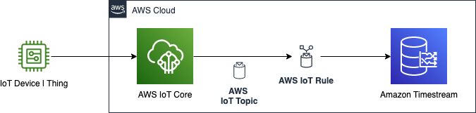

# AWS IoT Core to Amazon Timestream

This pattern contains a sample AWS CDK stack to create an IoT Rule with a Timestream action. 



When a message is published to the IoT topic defined in the IoT Rule, this message will be delivered to the specified Timestream database and table in the IoT Rule. 
Learn more about this pattern at Serverless Land Patterns: https://serverlessland.com/patterns/iot-timestream-cdk

Important: this application uses various AWS services and there are costs associated with these services after the Free Tier usage - please see the [AWS Pricing page](https://aws.amazon.com/pricing/) for details. You are responsible for any AWS costs incurred. No warranty is implied in this example.

## Requirements

* [Create an AWS account](https://portal.aws.amazon.com/gp/aws/developer/registration/index.html) if you do not already have one and log in. The IAM user that you use must have sufficient permissions to make necessary AWS service calls and manage AWS resources.
* [AWS CLI](https://docs.aws.amazon.com/cli/latest/userguide/install-cliv2.html) installed and configured
* [Git Installed](https://git-scm.com/book/en/v2/Getting-Started-Installing-Git)
* [Node and NPM](https://nodejs.org/en/download/) installed
* [AWS Cloud Development Kit](https://docs.aws.amazon.com/cdk/latest/guide/cli.html) (AWS CDK) installed

## Deployment Instructions

1. Clone the project to your local working directory

   ```sh
   git clone https://github.com/aws-samples/serverless-patterns/ 
   ```

2. Change the working directory to this pattern's directory

   ```sh
   cd serverless-patterns/iot-timestream-cdk
   ```
3. Set up the stack in your AWS account and region. 
- Change the working directory to the stack 

   ```sh
   cd iot-timestream
   ```
- Deploy the stack to your default AWS account and region. 

   ```sh
   cdk deploy
   ```
## How it works

The CDK app deploys the resources and the IAM permissions required to run the application. 
Review the [README](./iot-timestream/README.md) (the `Notes` section specially) in the `iot-timestream` folder for additional information.

## Testing

You can test the pattern using AWS Console.

### Using AWS Console

1. To simplify the testing process - use two browser windows side-by-side.
2. Log into the AWS Console, browse to Amazon Timestream in of the browser windows
3. Navigate to the Query Editor in Timestream console, copy & paste the following query in the `Query Editor` window, and click `Run`

   ```sh
   SELECT * FROM "iotTimestreamDatabase"."iotTimestreamTable" ORDER BY time DESC LIMIT 5 
   ```
4. This query is using the default database and table name defined the [config.json](./iot-timestream/config.json). If you have changed, you will have to modify the query before running it.
5. This is the first time running the query without any data being sent, and hence it should return zero records. 
6. Open the AWS IoT Console in the second browser window.
7. In the AWS IoT Core Console, in the `Test` section (left-side pane), select the `MQTT test client`. 
8. First under the `Subscribe to a topic` subscribe to `#` topic.
9. Then under `Publish to a topic`, in the Topic filter field enter this: `dt/` (do not miss the slash after the dt), type the following custom message:

   ```sh
   {
      "deviceId" : "AABBCCDDEEFF",
      "timestamp": 1660241724000,
      "temperature" : 63.25,
      "humidity" : 95.11
   }
   ```
Use a site such as [Epoch Converter](https://www.epochconverter.com/) to UTC timestamp in milliseconds and update the value to reflect the time when you are testing.
Then click the `Publish` button.
`deviceId` and `timestamp` fields in the message are mandatory since the CDK stack has configured the IoT rule action and Timestream to use these fields.
You can generate a new/different value for `timestamp` and change the values of then click publish button. You should test by publishing the message a few more times - each time you should change the `timestamp` field, and optionally vary the `temperature` and `humidity` fields (use 2 digits after the decimal point).

10. Switch to the Timestream query editor window, and run the query from Step 3 above again. You should be able to see data in the `Rows returned` section of the `Query Editor`

## Cleanup
 
Run the given command to delete the resources that were created. It might take some time for the CloudFormation stack to get deleted. See the Notes section in [README](./README.md)

```sh
cdk destroy
```

## Roadmap

1. Include a simulated IoT device sending MQTT messages to AWS IoT Core using [AWS IoT Device SDK v2 for Python](https://github.com/aws/aws-iot-device-sdk-python-v2)

## Resources
1. [AWS IoT Rule Actions](https://docs.aws.amazon.com/iot/latest/developerguide/iot-rule-actions.html)
2. [Timestream Action](https://docs.aws.amazon.com/iot/latest/developerguide/timestream-rule-action.html)
3. [Amazon Timestream and AWS IoT Core](https://docs.aws.amazon.com/timestream/latest/developerguide/IOT-Core.html)

----
Copyright Amazon.com, Inc. or its affiliates. All Rights Reserved. 

SPDX-License-Identifier: MIT-0
