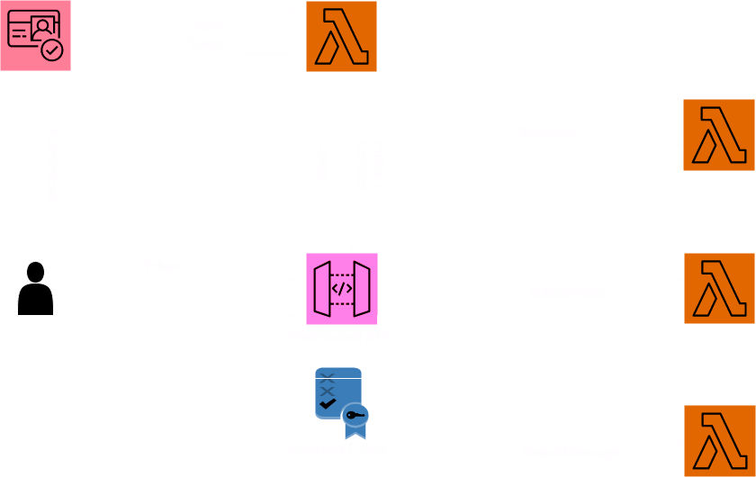

# Serverless JWT Authorizer for Websocket APIGW using Lambda Authorizer


This serverless pattern allows users to Authenticate/Authorizer using Cognito Token via Lambda Authorizer for API Gateway websocket API. 

Learn more about this pattern at Serverless Land Patterns: https://serverlessland.com/patterns/jwt_authorizer_websocket_api_lambda_authorizer

Important: this ready-to-use application uses various AWS services and there are costs associated with these services after the Free Tier usage - please see the [AWS Pricing page](https://aws.amazon.com/pricing/) for details. You are responsible for any AWS costs incurred. No warranty is implied in this example.

## Requirements:

* [Create one account](https://portal.aws.amazon.com/gp/aws/developer/registration/index.html) if you do not already have, create the account and log in. The IAM user that you use must have sufficient permissions to make necessary AWS service calls and manage AWS resources.
* [AWS CLI](https://docs.aws.amazon.com/cli/latest/userguide/install-cliv2.html) installed and configure default profile with credentials for the individual account as below :
```
[default]
```
* [Git Installed](https://git-scm.com/book/en/v2/Getting-Started-Installing-Git)
* [SAM Installed](https://docs.aws.amazon.com/serverless-application-model/latest/developerguide/install-sam-cli.html)
* [Cognito User Pool](https://docs.aws.amazon.com/cognito/latest/developerguide/cognito-user-identity-pools.html)
* [Wscat Installed](https://docs.aws.amazon.com/apigateway/latest/developerguide/apigateway-how-to-call-websocket-api-wscat.html)

## Deployment Instructions

1. Create a new directory, navigate to that directory in a terminal and clone the GitHub repository:
    ``` 
    git clone https://github.com/aws-samples/serverless-pattern
    ```
1. Change directory to the pattern directory:
    ```
    cd jwt_authorizer_websocket_api_lambda_authorizer
    ```
1. From the command line, use AWS SAM to deploy the AWS resources for the pattern as specified in the template.yml file:
    ```
    sam deploy --guided
    ```
1. During the prompts:

   Enter the Stack Name
    - Enter a value:

   Enter the region in which you want to deploy the stack
    - Enter a value: *{enter the region for deployment}*

   Enter User Pool Id
    - Enter a value:

   Enter Client Id:
    - Enter a value: *{Client id of the app created in user pool}*


1. Note the outputs from the deployment process. It contain the full url link which can be used for testing.

## Testing
1. Get the Authorization token for your user pool

1. Run the following websocket command to invoke the websocket Rest API:
```
wscat -c wss://<apiId>.execute-api.<region>.amazonaws.com/prod/ -H Authorization:Xyz
```

2. Observe the output of the above command, if it shows connected then you are able to successfully connected to the websocket API using JWT token. 

## Cleanup
 
1. Change directory to the pattern directory:
    ```
    cd serverless-patterns/jwt_authorizer_websocket_api_lambda_authorizer
    ```
1. Delete all created resources in same account.
    ```
    sam delete --stack-name <stackname>
    ```

----
Copyright 2024 Amazon.com, Inc. or its affiliates. All Rights Reserved.

SPDX-License-Identifier: MIT-0
