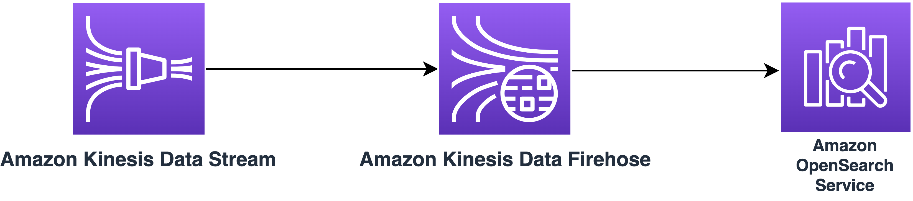
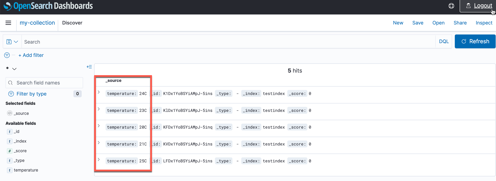

# Amazon Kinesis Data Streams to Amazon API Gateway via Amazon Kinesis Data Firehose

This sample project demonstrates how to send data received by Kinesis Data Streams to Amazon OpenSearch via Kinesis Data Firehose.

Learn more about this pattern at: https://serverlessland.com/patterns/kinesis-data-firehose-firehose-opensearch-sam.

Important: this application uses various AWS services and there are costs associated with these services after the Free Tier usage - please see the [AWS Pricing page](https://aws.amazon.com/pricing/) for details. You are responsible for any AWS costs incurred. No warranty is implied in this example.

## Requirements

* [Create an AWS account](https://portal.aws.amazon.com/gp/aws/developer/registration/index.html) if you do not already have one and log in. The IAM user that you use must have sufficient permissions to make necessary AWS service calls and manage AWS resources.
* [AWS CLI](https://docs.aws.amazon.com/cli/latest/userguide/install-cliv2.html) installed and configured
* [Git Installed](https://git-scm.com/book/en/v2/Getting-Started-Installing-Git)
* [AWS Serverless Application Model](https://docs.aws.amazon.com/serverless-application-model/latest/developerguide/serverless-sam-cli-install.html) (AWS SAM) installed
* Need to have an IAM user with admin rights with sign-in access to the AWS Console

## Deployment Instructions

1. Create a new directory, navigate to that directory in a terminal and clone the GitHub repository:
    ```
    git clone https://github.com/aws-samples/serverless-patterns
    ```
2. Change directory to the pattern directory:
    ```
    cd kds-kdf-opensearch
    ```
3. From the command line, use AWS SAM to deploy the AWS resources for the pattern as specified in the template.yml file:
    ```
    sam deploy --guided
    ```
4. During the prompts:
    * Enter a stack name
    * Enter the desired AWS Region
    * Enter an Admin User Arn
    * Allow SAM CLI to create IAM roles with the required permissions.

    Once you have run `sam deploy --guided` mode once and saved arguments to a configuration file (samconfig.toml), you can use `sam deploy` in future to use these defaults.

## How it works

This SAM template creates a Kinesis Data Stream, Kinesis Data Firehose and Amazon OpenSearch Serverless collection. Kinesis Data Firehose is configured with Kinesis Data Stream as source and Amazon OpenSearch as destination. When a message is pushed to Kinesis Data Stream the same is replicated to OpenSearch suing Kinesis Data Firehose. If any messages that can not be processed by Kinesis Data Firehose the same is sent to S3 bucket. Please refer to the architecture diagram for the event flow.
 

## Testing

1. Execute the below command a few times by replacing `<MyKDSName>` with the value received from the output of the `sam deploy --guided`.
  ```
  aws kinesis put-record --stream-name <MyKDSName> --partition-key 001 --data $(echo -n "{\"temperature\" : \"25C\"}" | base64)
  ```
2. Take the `<OpenSearchCollectionDashboard>` URL from the SAM deploy output and login using the IAM user credential. If you are already logged in using a different user, you may have to open a browser in private/ incognito mode to login.
3. You may have to wait for a couple of minutes for data replication to happen and the proceed with the index creation and visualisation of the data on OpenSearch. You should be able to validate the data as below:
    

## AWS Documentation

- [Kinesis Data Stream to Amazon Kinesis Data Firehose integration](https://docs.aws.amazon.com/firehose/latest/dev/writing-with-kinesis-streams.html)
- [Kinesis Data Firehose with OpenSearch Destination](https://docs.aws.amazon.com/firehose/latest/dev/create-destination.html#create-destination-elasticsearch)
- [OpenSeach Dashboard](https://docs.aws.amazon.com/opensearch-service/latest/developerguide/dashboards.html)

## Cleanup

1. Delete the stack
    ```bash
    sam delete
    ```
